# Алгоритмы и структуры данных

1) Сортировки
2) Деревья
3) Графы
4) Хэширование
5) Шифрование

Асимптотический анализ
    Верхняя оценка (O-большое)
    Усредненная оценка (омега)
    Нижняя оценка (Тета)

Базовые структуры данных
    Массив
    Связный список/Двухсвязный список
    Деревья
    Хеш-таблица
    Бинарная куча
    Очередь/стек/Двухсторонная очередь
    Граф

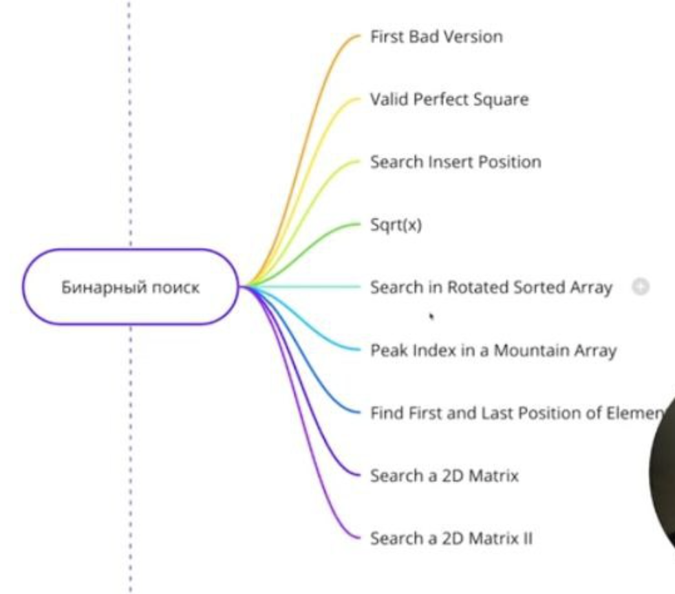

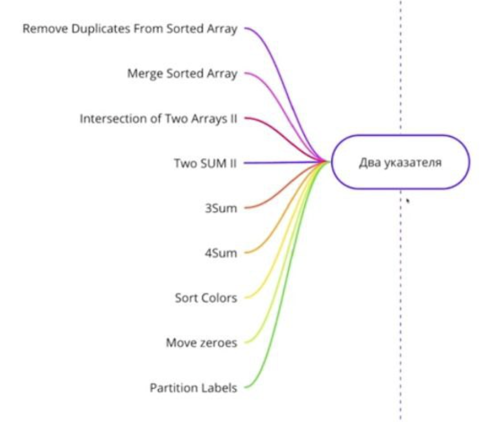

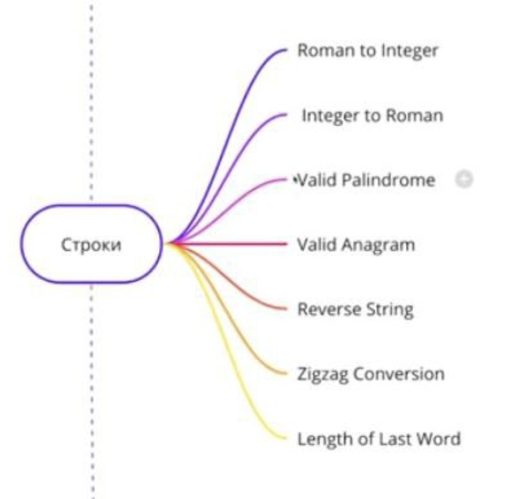

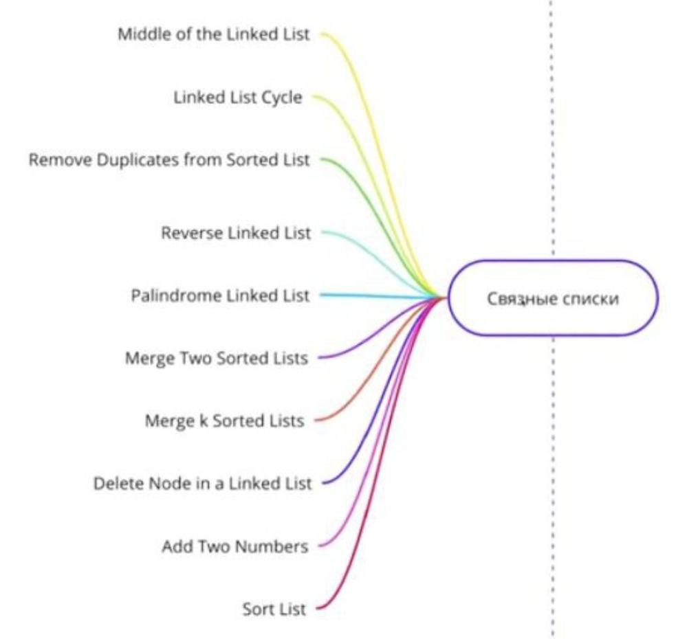

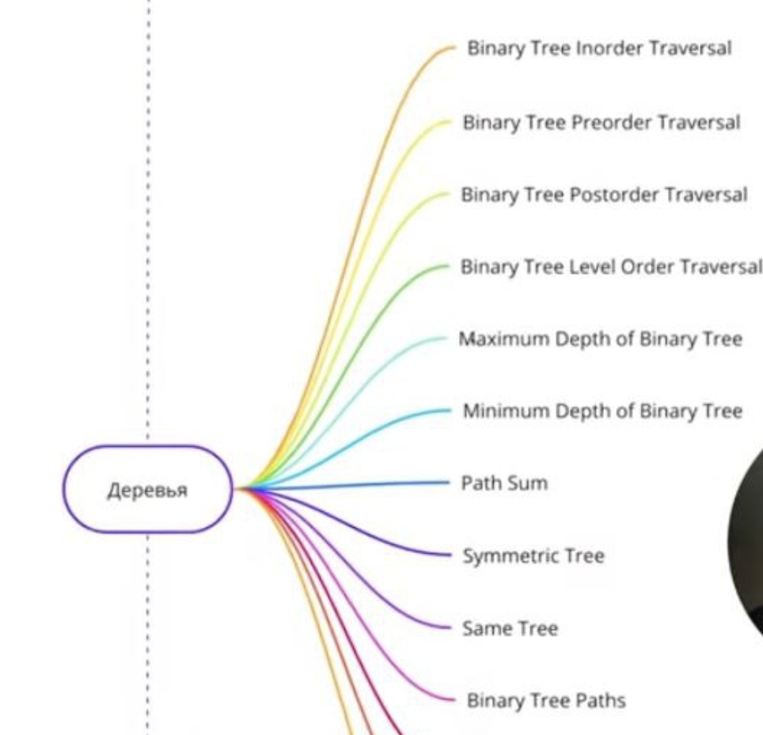

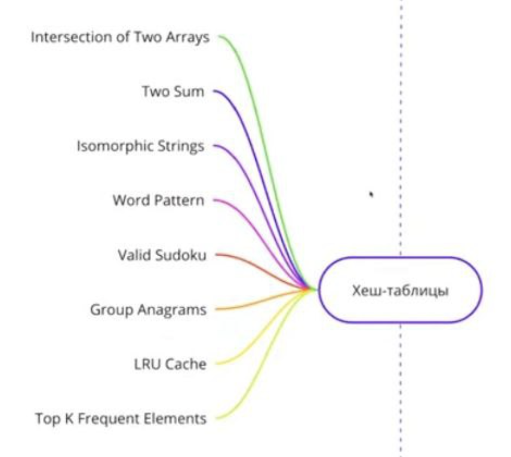

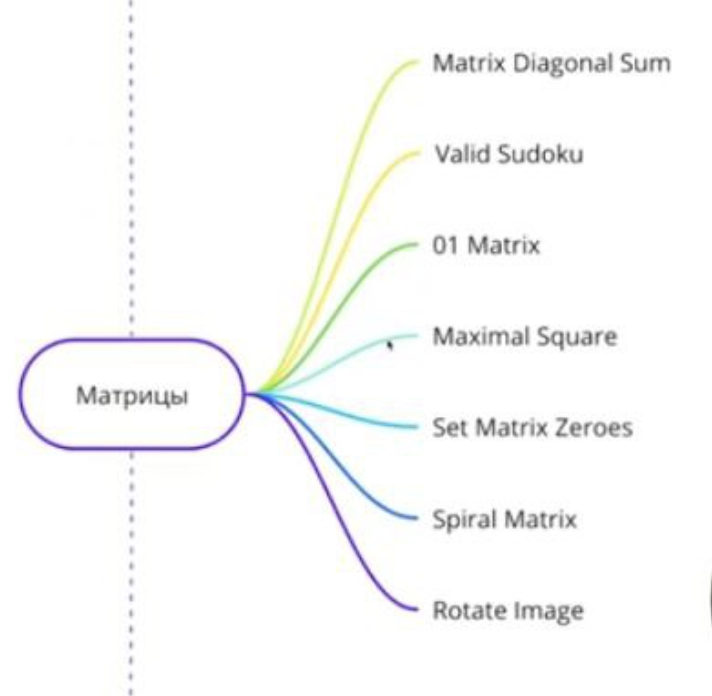

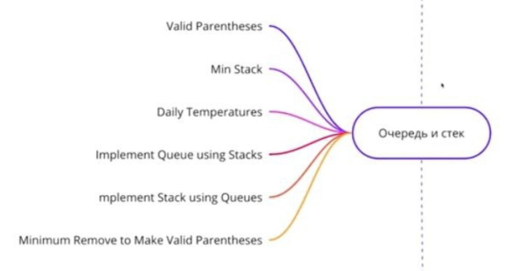

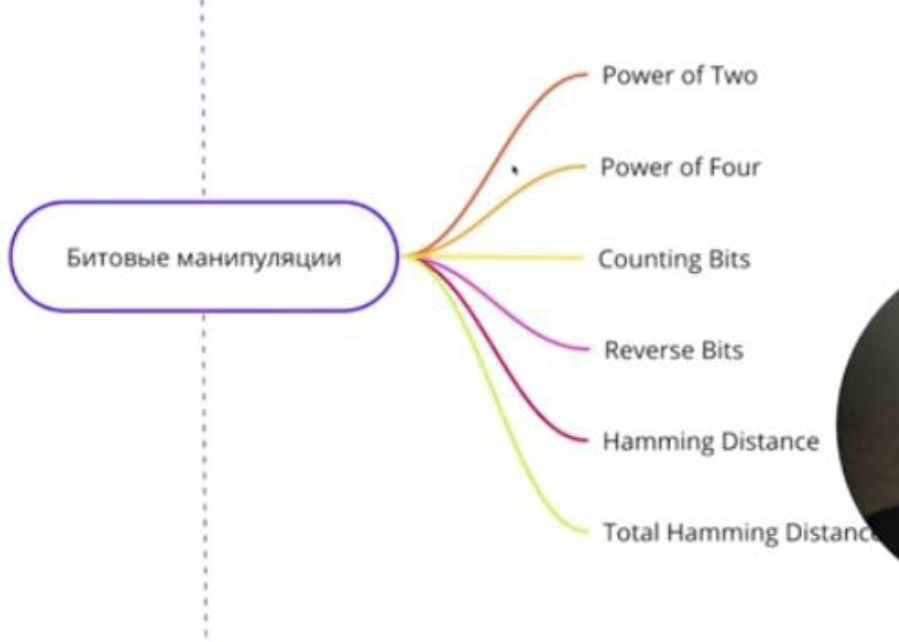

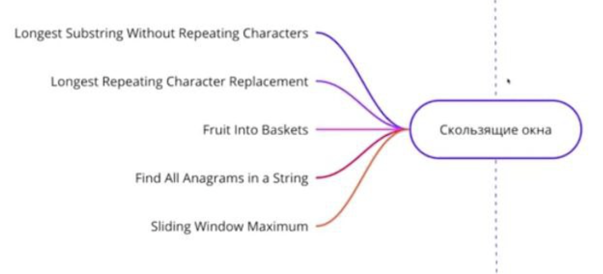

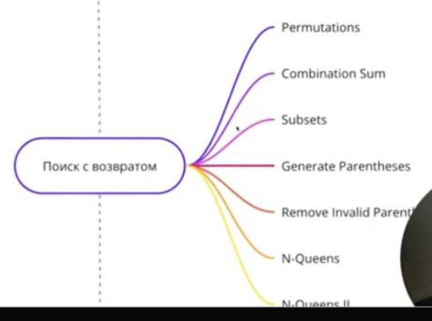

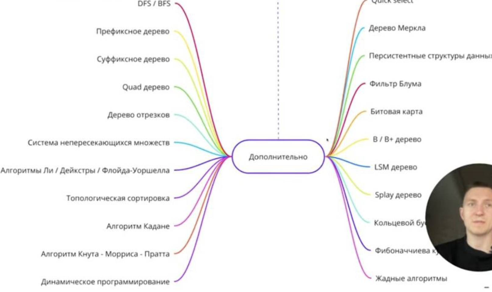