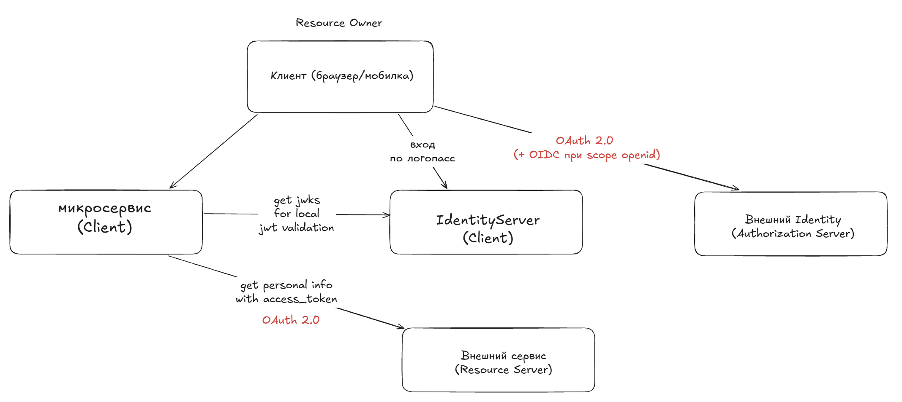
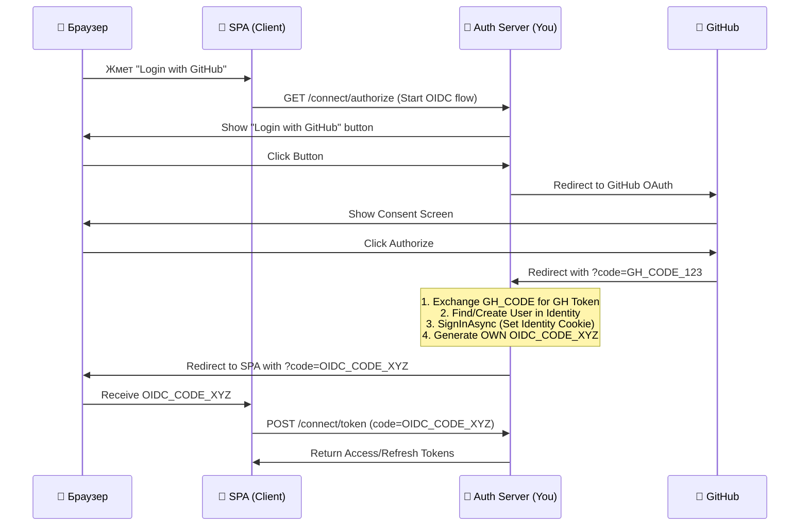

# Auth

Вопросы, связанные с аутентификацией, авторизацией, OAuth, OIDC

## Базовый глосссарий

Аутентифиция - процедура проверки подлинности пользователя, устройства или программы, которая подтверждает, что они действительно те, за кого себя выдают

Авторизация - процесс определения и предоставления прав доступа пользователю или системе на выполнение определенных действий после подтверждения его личности

JWT - компактный открытый стандарт (RFC 7519) для безопасной передачи данных в виде JSON-объектов между сторонами

Access Token - цифровой ключ (обычно jwt), который заменяет логин и пароль при подтверждении вашей личности и прав доступа к сайтам, приложениям или API

Refresh Token - специальный тип учетных данных, который используется для получения нового access token (токена доступа) без необходимости заново вводить логин и пароль

ID Token - цифровой документ в виде JWT, который подтверждает факт успешной аутентификации пользователя и содержит базовые данные о нем. Ключевой элемент OIDC протокола

Authorization Code Flow - самый популярный и безопасный рабочий процесс в протоколе OAuth 2.0, который позволяет приложению получить доступ к данным пользователя на стороннем сервере без передачи самого пароля, использующий вместо этого временный код авторизации authorization code

PKCE Proof Key for Code Exchange - специальное расширение протокола авторизации OAuth 2.0, которое защищает приложения от перехвата кода авторизации. Использует передачу от Client в authorization server хеша от специального code_verifier

Client Credentials Flow - метод авторизации в стандарте OAuth 2.0, который используется для взаимодействия между серверами (приложениями), когда конечный пользователь не участвует в процессе.

Claim - отдельная пара «ключ-значение», которая содержит определенную информацию о пользователе или самом токене и передается внутри полезной нагрузки (payload)

Scope - поле (claim) в полезной нагрузке токена, которое определяет список разрешенных прав, областей видимости или действий для пользователя или клиента

Audience - поле (claim) в payload токена, которое указывает получателя или целевой ресурс (например, конкретный микросервис или API), для которого этот токен предназначен

UserInfo Endpoint - защищенный стандартизированный HTTP-метод в протоколе OIDC, который возвращает информацию об аутентифицированном пользователе

Discovery Document (.well-known/openid-configuration) - стандартный JSON-файл с метаданными сервера авторизации, который позволяет клиентским приложениям автоматически узнавать все необходимые настройки для работы с протоколом OpenID Connect

JWKS (JSON Web Key Set) - стандартизированный набор публичных криптографических ключей в формате JSON, который используется микросервисами и приложениями для проверки подлинности и целостности токенов

State - это случайная уникальная строка, которую клиентское приложение генерирует перед отправкой запроса на авторизацию

Реплей-атака (атака повторного воспроизведения) — это кибератака, при которой злоумышленник перехватывает легитимные данные или сетевой запрос, а затем отправляет их повторно, чтобы выдать себя за другого человека или совершить несанкционированное действие

Nonce (number used once) -  это одноразовая случайная строка, которая используется внутри протокола OpenID Connect. Защита от атак повторного воспроизведения (replay attack) и подделки ID-токена (JWT)

Opaque Token - токен, который выглядит как случайная строка (например, a3f8...). В отличие от JWT, его нельзя «прочитать» на стороне Resource Server без обращения к Authorization Server

Token Revocation -  Механизм принудительного завершения сессии до истечения срока действия токена.

BFF (Backend for Frontend) - Архитектурный паттерн, при котором между вашим SPA/React-приложением и API появляется тонкий бэкенд-сервис.

Back-Channel Logout - когда пользователь нажимает «Выйти» в Identity Server (или другом приложении, использующем тот же SSO), Identity Server сам отправляет HTTP POST запрос вашему приложению.

Claims Transformation - Процесс преобразования «сырых» claims из внешнего провайдера во внутренние claims вашей системы.

## OAuth и OIDC

### OAuth 2.0

OAuth - стандарт авторизации, который позволяет приложению получать ограниченный доступ к данным пользователя на другом сервисе без передачи логина и пароля

Простыми словами: делегирование прав (вы разрешаете одному сайту зайти под вашим аккаунтом на другом сервисе); безопасность (стороннее приложение не видит пароль, а получает токен доступа access token); ограничение (доступ выдается только к определенным данным scopes и на ограниченное время)

### Основные компоненты OAuth

Владелец ресурса (resouce owner) - вы, пользователь, у которого есть аккаунт с данными
Клиент (client) - приложение, которое запрашивает доступ к вашим данным
Сервис авторизации (authorization server) - сервер, который проверяет вашу личность и выдает токен (Yandex.ID, VK.ID)
Сервер ресурсов (resource server) - сервер, который хранит и предоставляет защищенные данные, к которым клиент хочет получить доступ.

### OIDC (OpenID Connect)

OIDC - протокол аутентификации, который позволяет приложению подтверждать личность пользователя и получить базовые данные о нем с помощью сервера авторизации

Надстройка над OAuth 2.0: протокол использует целиком рамки OAuth 2.0, но нужен для аутентификации
Добавляется scope openid. Именно наличие этого scope говорит Authorization Server: «Клиент хочет не просто данные, он хочет убедиться, кто перед ним».
В обычном OAuth на выходе вы получаете только Access Token. В OIDC вместе с ним (или вместо него, в зависимости от flow) приходит ID Token.
ID Token - jwt, который содержит подписанную информацию о пользователе (имя, почта, id). Но надо понимать, что OAuth нужен для получения функций во внешнем resource server, а OIDC для идентификации пользователя из внешней системы и сопоставления с пользователем текущей системы. Он предназначен только для Client, а не для Resource Server.

### Заблуждения про OAuth и OIDC

OAuth служит для получения доступа к ресурсам внешней системы и НЕ служит для аутентификации.

OIDC служит для получения верифицированной информации о пользователе (идентификации/аутентификации) и, как следствие, может использоваться вашим приложением для аутентификации пользователя.

Однако ни один из них не заменяет сессию в вашем приложении — после получения данных от провайдера ваш бэкенд обязан создать свою собственную сессию (свой JWT, куку, запись в БД) и использовать её для всех последующих запросов.

## OAuth flows

Authorization code flow - Пользователь авторизуется у провайдера, получает временный код, а бэкенд обменивает этот код на токены, используя client_secret

Implicit Flow - устаревший метод. Редирект с Auth Server сразу в клиентское приложение с access_token

Client Credential Flow (m2m) - Клиент (приложение) аутентифицируется сам по себе, используя свой client_id и client_secret. Наш бэкенд делает вызов Auth Server с Client_id и client_secret и grant_type=client_credentials. Auth server выдает access_token, с которым можно ходить в resource server

Resource Owner Password Credentials Flow - к auth server делается запрос с grant_type=password, логином, паролей, client_id и client_secret. В ответ получаем access_token

Device Authorization Flow (для устройств без браузера) - Устройство показывает код, пользователь вводит его на другом устройстве (смартфон, компьютер) и авторизует доступ.

Refresh Token Flow - когда истекает access_token, клиент использует refresh token, чтобы получить новый без повторного захода пользователя.

## Стандартные enpoints

connect/authorize - authorization code flow, это точка куда клиент (SPA, мобилка, другой сервис) перенаправляет пользователя для аутентификации
Параметры запроса: client_id, redirect_uri, response_type=code, scope, state, nonce.
Результат: После успешного логина сервер редиректит обратно на redirect_uri с временным кодом авторизации. Этот код потом обменивается на токен.

connect/token - принимает код авторизации (или credentials для M2M) и выдаёт реальные токены.
Параметры запроса: grant_type, code (для auth code flow), client_id, client_secret, code_verifier (PKCE).
Результат: JSON-ответ с access_token, refresh_token, id_token (если был scope openid).

connect/logout - завершает сессию пользователя на стороне Identity Server.

connect/userinfo - возвращает claims о пользователе в формате JSON.
Требование: Требует валидный access_token в заголовке Authorization: Bearer ....
Зачем нужен: Альтернатива чтению данных из ID Token. Полезен, когда:

## m2m виды авторизации

1. Static Api key

2. Client Credential Flow (OAuth 2.0)

3. Mutual TLS (mTLS)

Аутентификации на уровне транспортного протокола. Обе стороны предъявляют друг другу X.509-сертификаты. Сервер проверяет сертификат клиента перед тем, как даже начать обрабатывать HTTP-запрос. Часто используется в связке с Client Credentials Flow (токен выдается только если сертификат валиден).

4. JWT Assertion / Private Key JWT

Вместо передачи client_secret по сети, клиент подписывает специальный JWT своим приватным ключом и отправляет его как assertion на токен-эндпоинт. Сервер проверяет подпись публичным ключом клиента.

5. Signed Webhooks / HMAC Signature

Партнер отправляет вам данные (webhook) и добавляет заголовок с HMAC-подписью payload'а, используя общий секрет. Вы пересчитываете HMAC на своей стороне и сравниваете.

## Разбор таблиц

# Пример

TODO:

identity server - C#
микросервисы (client) - C# + go
авторизация через вк как identity server + сделать апи вызов в вк как к resource server (OAuth)