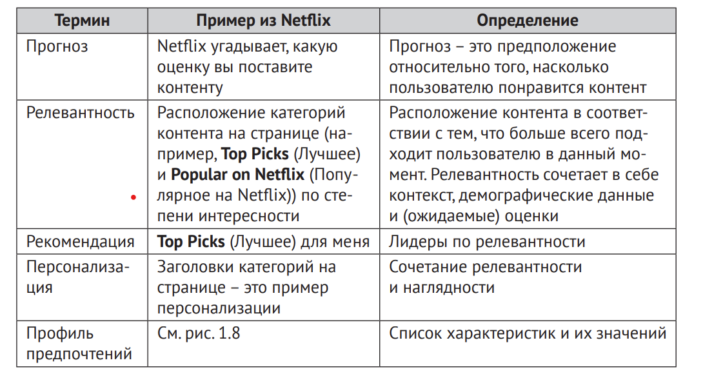
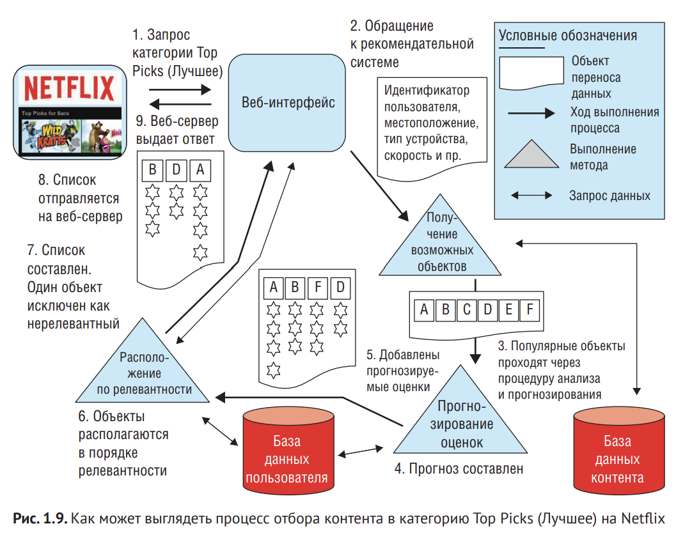
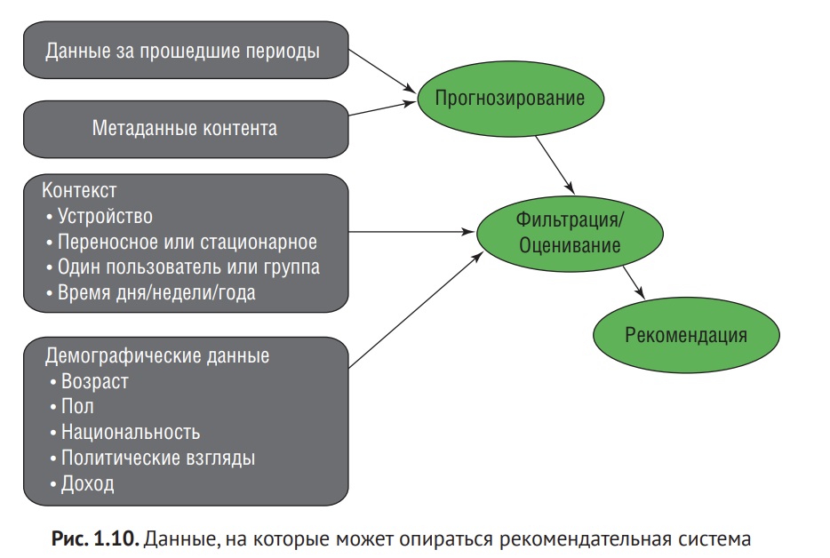
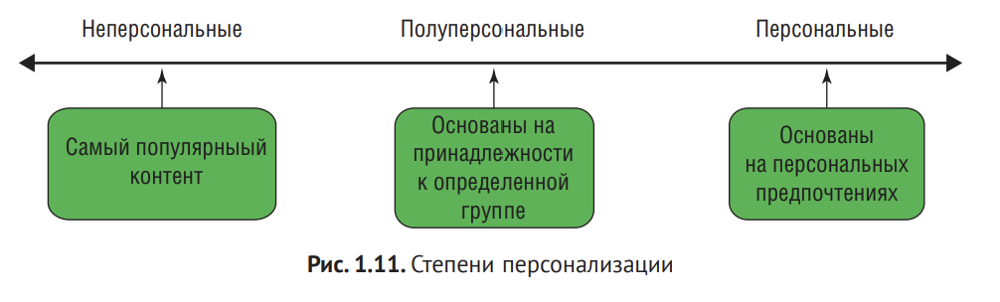
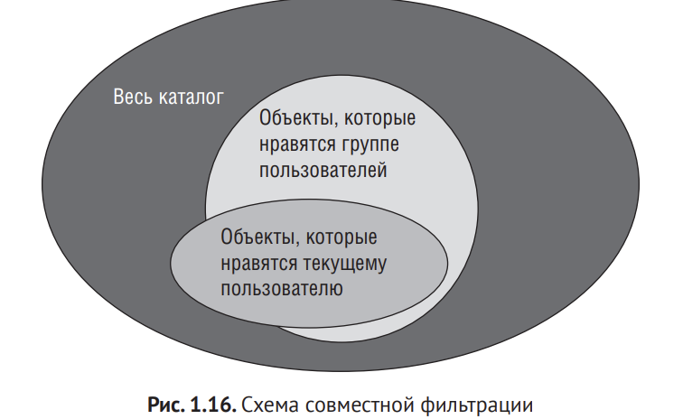
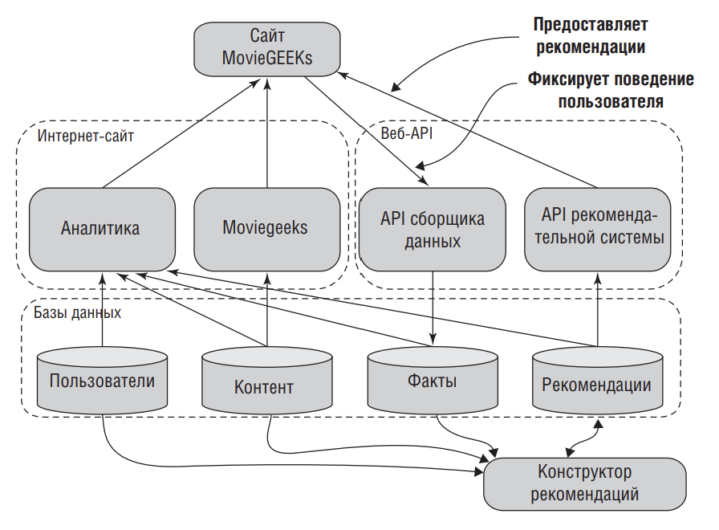
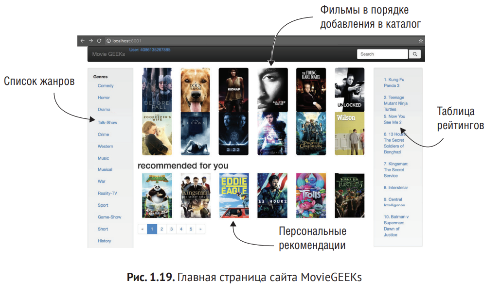
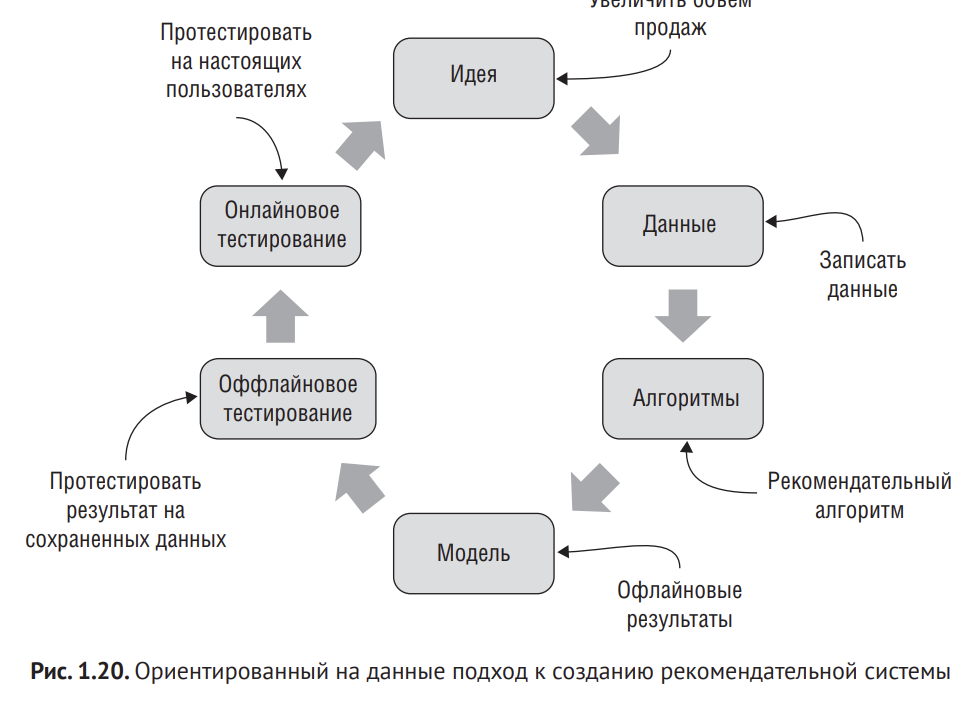

# Глава 1. Что такое рекомендательная система?

Вопросы: 

1. Какую задачу пытается выполнить рекомендательная система?

2. Что такое персональные и неперсональные рекомендации?

3. Разберемся с терминологией, позволяющую описывать рекомендательные системы.


## 1.1 Рекомендации в реальной жизни

1. Не стоит путать рекомендательные системы с рекламой.
Реклама - рекламные брошюры, которые приходят на почту.
Неперсональная рекомандация - список десяти самых популярных фильмов, которые показывают в кино на этой неделе.
Таргетированная реклама - на ТВ много внимания уделяется тому,чтобы вставить рекламный блок в подходяющий материал. 
Релевантная реклама (максимально таргетированная) - "Женщине, летящей в Брюссель, будет интересна реклама хороших часов или, например, финансового журнала. Семья, отправившаяся в отпуск, возможно, заинтересуется рекламой солнцезащитного крема 
или сервиса аренды машин".

Вышеописанные примеры призваны показать, что пользователь может 
не  видеть разницы между рекламой и  рекомендациями. Но  на самом деле разница в предназначении: рекомендация выдается на основе: вкусов пользователя (если он достаточно активен), вкусов других пользователей и того, что чаще всего ищет этот человек. Реклама работает только на благо рекламодателя и  обычно навязывается получателю. Различие может быть очень размытым. В  этой книге я называю рекомендацией все то, что строится на основании полученных данных

### 1.1.1. Рекомендательные системы дома в интернете

Сайт со списком 10 самых популярных хлебопечек - **неперсональные рекомендации.**

Сайт с товарами для дома или с билетами на концерты предлагает вам рекомендации, ориентируясь на демографические данные или на ваше текущее местоположение - это **полуперсональные рекомендации.**

**Персональные рекомендации** можно увидеть, например, на сайте Amazor, где пользователи видят рекомендации в персональном разделе. Персональные рекомендации нужны, поскольку людям интересны не только популярные товары, но и те, которые не входят в число наиболее популярных или продаваемых, а также те, которые находятся на **длинном хвосте**.

### 1.1.2. Длинный хвост

Понятие ввел Крис Андерсон в своей статье для журнала Wired в 2004 году, после чего в 2006 написал книгу. В статье он описал новую бизнес-модель, которая часто встречается в инете. Основная идея заключается в том, что если у вас магазин не в инете, у вас ограниченной пространство для хранения и, что еще важнее, ограниченно пространство для демонстрации товара покупателям. Также у вас ограниченный круг покупателей, поскольку людям приходится идти в магазин. 
Вам приходится торговать только популярными товарам. Но если у вас интернет-магазин, в вашем распоряжении место для бесконечного количества товаров, поскольку плата за него невысока, или, если вы продаете цифровой контекнт, складное пространство лдя него бесконечно. 

```Суть экономики «длинного хвоста» сводится к тому, что можно получать доход, продавая много разных товаров, каждый из них – лишь по нескольку экземпляров множеству разных людей.```

Но как пользователи найдут то, что им нужно? И тут на сцену выходят рекомендательные системы. Именно они помогают людям находить различные вещи, о существовании которых даже не догадывались.

### 1.1.3. Рекомендательная система Netflix


Стартовая страница представляет сосбой панель с названиями категорий, например Top Picks (Самое интересное), Drama и Popular on Netflix. Верхняя категория - мои просмотры. Netflix уделяет большое внимание этой категории, поскольку она показывает не только то, что я посмтрел и что смотрю сейчас, но и то, что меня (хотя бы в какой то степени) заинтересовало.

### Рекомендации

Четвертая категория - Лучшее, которая отражает мои предпочтения. Сюда входит все то, что большинство людей назвали бы рекомендациями. Здесь показан контент, которые, по прогнозам рекомендательной системы Netflix, я захочу посмотреть в ближайшее время. 

### Категории и разделы

Вернемся к категории Top Picks (Лучшее) на Netflix. Если навести курсор на один из предложенных фильмов или сериалов, появится более подробная информация о  контенте. Наряду с  всплывающим описанием отобразится предполагаемая оценка, которую я, по прогнозу рекомендательной системы, скорее всего, дам этому контенту. Логично предположить, что все видео из категории Top Picks будут с высокими оценками. Однако, просматривая рекомендации, можно встретить варианты с прогнозом 
на низкие оценки.

Netflix формирует рекомендации множеством разных способов, и можно найти множество возможных объяснений тому, почему Netflix рекомендует контент, 
который, по собственным же прогнозам сервиса, получит от пользователя невысокую оценку. Одна из причин, возможно, заключается в том, что Netflix ставит 
разнообразие превыше точности попадания. Другая вероятная причина заключается в том, что, пусть я и не поставлю фильму максимальное количество звезд, 
вдруг именно этот фильм сейчас подходит под мое настроение. Кроме того, это 
первый признак, что Netflix не придает этим оценкам большого значения.

Рекомендательная система Netflix также пытается предлагать контент, который будет актуален в определенное время или при определенных условиях. Например, воскресное утро больше подходит для просмотра мультфильмов и комедий, а вечер – для просмотра «серьезных» сериалов, таких как Форс-мажоры.

**Продвижение** – это один из способов склонить чашу весов в ту или иную сторону при составлении рекомендаций. Например, Netflix хочет, чтобы я обратил 
внимание на сериал «Форс-мажоры», потому что это новый контент, а значит, его 
ценность выше. Netflix продвигает новый контент. Под новизной можно понимать, 
что этот контент только появился или мелькнул в новостях. В главе 6 мы подробно поговорим о продвижении, поскольку именно продвижение начинает интересовать многих владельцев сайтов, как только система отлажена и запущена.

```
Обратится к пользователю за помощью при составлении профиля предпочтений – это достаточно распространенный прием, к  которому прибегают системы при формировании рекомендаций для новых пользователей. Но, как часто бывает, между тем, что пользователям нравится, по их словам, и тем, что им нравится на самом деле, существует большая разница
```

### 1.1.4. Определение рекомендательное системы



**Рекомендательная система** подбирает и предлагает пользователю релевантный контент, основываясь на своих знаниях о пользователе, контенте и взаимодействии пользователя и контента.



Изучив рис. 1.9 легко понять, что при работе с рекомендательными системами необходимо учитывать многие аспекты. В этом описании отсутствуют этапы сбора данных и построения моделей. Большинство рекомендательных систем пытаются тем или иным образом применять данные, показанные на рис. 1.10.

Кроме того, рис.  1.9 иллюстрирует еще один факт, который необходимо учитывать: прогнозирование оценок/рейтингов  – это всего лишь одна из множества задач рекомендательной системы. Другие факторы также могут оказывать существенное влияние на то, что именно система будет показывать пользователю. В данной книге очень много внимания уделяется прогнозированию оценок, и это важный аспект, даже если вам показалось, что я не придаю ему большого значения.



## 1.2. Таксономия рекомендательных систем

Таксономия позволяет описать систему по следующим параметрам: специализация, задача, контекст, степень персонализации, 
чьи мнения, конфиденциальность и  надежность, интерфейс и  алгоритмы.

### 1.2.1. Специализация

Это тип рекомендуемого контекнта. В случае Netflix специализация - это фильмы и телесериалы, но специализация может быть абсолютно любой: подборки контента в виде плейлистов, советы по применению цифровых обучающих курсов, работа, книги, машины, продукты, отдых, путешествия или даже знакомства.

От специализации также зависит степень последствия ошибок. Например, если мы рекомендуем мызыку, то если мы ошибемся, то ничего плохого не произойдет, но если мы рекомендуем опекунскую семью то последствия ошибок могут быть огромными.

### 1.2.2. Задача

Задача двухсторонняя - для Netflix она заключается и для провайдера и для покупателя. Покупатель хочет находить подходяющий контент, который будет интересно посмотреть в определенное время. Провайдер же хочет подтолкнуть покупателя каждый месяц платить за подписку.

Также задача может быть вспомогательной: например Нетфликс хочет, чтобы вы не так часто смотрели новинки (потому что они больше платят праводобладателям за это) и чаще смотрели кино производства нетфликс.

### 1.2.3. Контекст

Это условия, в которых пользователь получает рекомендацию. В нашем случае это может быть устройство, местоположении, время дня, а также то, чем человек сейчас занят. Есть ли у пользователя изучить рекомендации или ему нужно быстро принять решения? Контекст может также включать в себя погоду и даже настроение пользователя!

Например, поиск кафе через Гугл Карты. Сидит ли человек в офисе и ищет хорошую кофейню или стоит на улице, когда начинается дождь? 

### 1.2.4. Степень персонализации

Степень персонализации рекомендаций бывает самой разной, от применения наиболее обобщенных данных до изучения информации о конкретном пользователе



1. Неперсональные

Список наиболее популярных объектов считается неперсональной рекомендацией: расчет здесь на то, что данному пользователю понравятся те же объекты, что и большинству других. К неперсональным рекомендациям также
относится выстраивание объектов в списке по дате их появления,например когда самыми первыми отображаются наиболее новые объекты. Любой человек, который взаимодействует с рекомендательной системой, видит те же 
рекомендации, что и остальные люди. Сюда же можно отнести спецпредложения в кафе, когда посетителям предлагаются алкогольные напитки в пятницу вечером, капучино по утрам и поздний завтрак утром в выходные.

2. Полуперсональные и частично персональные

Деление пользователей по группам. Пользователей можно разбить на группы по множеству разных признаков: по возрасту, по национальности или характерному признаку - наприме, бизнесмены и студенты, водители автомобилей и велосипедисты.

**Пример:** система, предназначенна для продажи билетов на мероприятия, рекомендует шоу-программы, основываясь на стране или городе пребывания поьзователя. 

**Еще один пример:** если пользователь слушает музыку на смартфоне, система может попытаться определеить, перемещается ли устройство или нет. Если да, то, возможно, человек занимается спортом или едет на машине или велосипеде. Если устройство неподвижно, пользователь, вероятно, сидит на диване и ему подойдет несколько иная музыка.

Подобная рекомендательная система не знает ничего лично о вас, для нее вы являетесь частью определенной группы или сегмента. Другие люди, входяющие в эту группу, получат те же рекомендации, что и вы.

3. Персональные

Они базируются на данных о конкретном пользователе, а именно на информации о том, каким образом пользователь взаимодействовал с системой ранее. Так формируются рекомендации специально для данного пользователя.

Большинство рекомендательных система при составлении персональных рекомендаций также учитывает принадлежность пользователя к группе и популярность контента. Пример персональных рекомендаций можно увидеть на сайте Amazon, где в личном кабинете присутствует раздел "Рекомендуется вам". Главная страница сервиса Netflix - тоже персональные рекомендации.

Обычно сайты комбинируют различны типы рекомендаций.

### 1.2.5. Чье мнение

Экспертные рекомендательные системы формируют блок рекомендаций на основе ассоциативных правил, составленных вручную специалистами. Эти системы рекомендуют хорошие вина, книги и подобные вещи и применяются в областях, где, как правило, необходимо быть экспертом, чтобы давать советы.

Однако дни экспертных систем практически на исходе, пэотому сейчас параметр чьи мнения утратил свою актуальность.
Почти все сайты опираются на мнение большинства.

### 1.2.6. Конфиденциальность и надежность

Многие люди считают рекомендации своеобразной разновидностью манипуляций, поскольку с их помощью людям предлагают такие варианты товаров и услуг, на которые те с большей вероятностью согласятся, чем на предложения из случайной подборки. Тот факт, что благодаря рекомендациям магазины продают больше товаров и услуг, вызывает у людей ощущение, что ими манипулируют. Но если при этом просмотр фильма принесет удовольствие, а не навеет скуку, то я не возвражаю. 

```Манипуляция - это не столько сам факт того, что вам предлагают определенный объект, сколько мотив, для чего это делается.```

```В тот момент, когда рекомендации обладают властью влиять на решение, они становятся мишенью для спамеров, мошенников и других лиц, желающих повлиять на наши решения из далеко не лучших побуждений.```

**Надежность** - это показатель того, насколько пользователь доверяет рекомендациям, в противовес тому, чтобы расценивать их как рекламу или попытки манипуляции.

### 1.2.7. Интерфейс

Интерфейс рекомендательной системы отображает тип ввода и вывода данной системы.

**Ввод**

Пользователь сервиса Netflix, с некоторых пор могут указывать, нравится им контент или не нравится, выставляя оценки и обозначая предпочитаемые жанры и темы. Эти данные могут служить в качестве ввода для рекомендательной системы.

В Netflix тип ввода - явный. Неявный вид предполагает, что система пытается установить наши вкусы, опираясь на то, как вы с ней взаимодействуете. 

**Вывод**

К разновидностям вывода относятся прогнозы, рекомендации или фильтрация. Например, Netflix прогнозирует оценки, составляет персональный набор предложений и отображает популярный контент, как правило, в виде списка 10 лидирующих объектов.

Если рекомендации естественным образом вписаны в страницу, это органичная подача. Расположенные рядами категории контента в сервисе Netflix - это пример органичных рекомендаций: Netflix не указывает, что это рекомендации. Это обычная часть сайта.

Некоторые системы объясняют предоставляемые рекомендации. Это системы, применяющие принцип "белого ящика". Те системы, которые свои рекомендации не объясняют, построены на принципе "черного ящика". Это важное различие, поскольку не каждый алгоритм предусматривает возможность отследить процесс принятия решения до самых его истоков.

При выборе тима рекомендательной системы (построенной по принципу "белого ящика" или "черного ящика") нужно принимать во внимание особенности каждого из алгоритмов. Чем больше объяснений потребуется от системы, тем проще алгоритм. Часто решение можно проанализировать, чем выше качество рекомендации, тем сложнее объяснение. Эта проблема известна как **компромисс между точностью модели и сложностью интерпретации модели**.

В последнее время рекомендательные системы получили очень широкое 
распространение, поэтому в нашем распоряжении множество примеров. 
Чаще всего рекомендательные системы заточены под фильмы, музыку, книги, новости, исследовательские статьи и вообще под большинство товаров. Но рекомендательные системы применяются также и во многих других сферах, включая финансовые услуги, страхование жизни, цифровые данные, поиск работы, т. е., по сути, везде, где требуется сделать выбор. В этой книге в качестве примеров приводятся в основном сайты, но с другими платформами 
тоже вполне можно работать.


### 1.2.8. Алгоритмы

В этой книге приводится несколько алгоритмов. Алгоритмы можно разделить на 2 группы по типу данных, на основе которых они формируют рекомендации. Алгоритмы, которые опираются на данные о предыдущих сеансах работы пользователя с системой, называются **совместной фильтрацией.** Алгоритмы, которые при составлении рекомендаций анализируют метаданные контента и пользовательские профили, называются **контентной фильтрацией.** Сочетание этих двух типов образуют гибридные рекомендательные системы.

**Совместная фильтрация**



На рисунке представлен один из способов реализации совместной фильтрации. Внешний контур - это весь каталог. Контур посередине - это группа людей, которые приобрели/воспользоватлись одними и теми же объектами. Рекомендательная система рекомендует объекты из малого овала (на переднем плане) исходя из того, что если пользователям нравится то же самое, что и текущему пользователю, то текущему пользователю понравятся и остальные объекты, заинтересовавшие данную группу. Группа определяется путем поиска соответствий между тем, что понравилось отдельным пользователям, и тем, что понравилось текущему пользователю. В этом случае в рекомендации попадет тот пласт контента, который упускает текущий пользователь (та часть средней окружности, которая не попадает в овал, включающий заинтересовавшие текущего пользователя объекты).

Существует множество способов формирования рекомендаций на основе 
совместной фильтрации. Простой способ описан в главе 8, а способ посложнее – в главе 11, где мы поговорим об алгоритмах факторизации матриц

**Контентная фильтрация**

Контентная фильтрация опирается на метаданные объектов из вашего каталога. Например, Netflix пользуется описаниями фильмов. В зависимости от алгоритма система может формировать рекомендации путем подбора объектов, аналогичных тем, которые понравились пользователю ранее, путем сопоставления объектов с данными из пользовательского профиля, либо, если пользователь не задействован, путем поиска схожих объектов из всего контента. При наличии пользовательского профиля система анализирует каждый профиль, в котором указаны категории контента. Если бы сервис Netflix применял контекстную фильтрацию, он мог бы составлять пользовательские профили с разбивкой по жанрам – например, триллеры, комедии, драмы и новинки – и указывать рейтинг каждого из жанров. В этом варианте фильм попадает в рекомендации, только если его рейтинг соответствует рейтингу, указанному пользователем.

**Пример:** Пользователю Томасу понравились фильмы «Стражи галактики», «Интерстеллар» и сериал «Игра престолов». Каждому он дал оценку по пятибалльной шкале. 

Можно интерпретировать эти оценки. С опорой на эту информацию составляется профиль Томаса, в котором научной фактастике дана оценка 3, а приключениям 4. Для подбора и рекомендации других фильмов просматривается каталог и выделяются те фильмы, которые соответствуют профилю Томаса.

**Гибридная рекомендательная система**

И у совместной, и у контентной фильтрации есть сильные и слабые стороны. Для нормального функционирования совместной фильтрации от пользователей должна стабильно поступать обратная связь, а контентная фильтрация подразумевает наличие подробного описания у каждого объекта. Часто рекомендации формируются на основе результатов работы этих двух алгоритмов и анализа данных другого типа, например удаленность от какой-либо 
локации или время суток.

## 1.3. Машинное обучение и Netflix Prize

Рекомендательные системы превратилось в междисциплинарное мероприятие, в котором огромную роль играют различные информационные технологии, включая машинное обучение, интеллектуальный анализ данных, поиск информации и даже человеко-компьютерное взаимодействие. Машинное обучение и интеллектуальный анализ данных позволяют вычислительной машине строить прогнозы на основе изучения примеров того, что прогнозируется. Следовательно эти же возможности прознозирования могут участвовать в формировании рекомендаций.

## 1.4. Интернет-сайт MovieGEEKs

Чтобы придумать какую-нибудь рекомендательную систему, необходимо собрать данные и понять, как все устроено, а для этого недостаточно просто смотреть на цифры и читать конспект.

**Представьте себе,** что у вас есть клиент, которые хочет продавать DVD-диски через интернет.

### 1.4.1. Оформление и характеристики

Для начала необходимо обозначить несколько базовых идей оформления. 
На главной странице сайта должно присутствовать следующее:

1. область с обложками фильмов

2. обзор каждого фильма, для прочтения которого не требуется переходиить на следующую страницу

3. рекомендации, как можно более персонализированные

4. меню со списком жанров

Для каждого фильма нужна собственная страница, на которой должны быть:

1. Киноафиша

2. Описание

3. Рейтинг

Для каждой категории должна быть веделена собственная страница, отображающая:

1. Ту же структуру, что и главная страница

2. Рекомендации по данной категории

### 1.4.2. Архитектура

Для разработки данного сайт будет применяться язык программирования Python и фреймворк Django. Django позволяет разбить проект на несколько отдельных приложений. На рисунке показана высокоуровневая архитектура и дан пример того, какие приложения участвуют в создании сайта.



1. MovieGEEKs - это основная часть сайта. Здесь клиентская логика (HTML, CSS, JS), ориентирована на получение данных о фильмах

2. Аналитика - капитанский мостик, откуда можно контролировать все процессы. Эта часть опирается на данные из всех баз. Об аналитике рассказывается в главе 4

3. Сборщик данных - отвечает за отслеживание шаблонов поведения пользователя и сохраняет их в базу фактов. Журнал фактов описан в главе 2.

4. Рекомендации - сердце всех системы. Отсюда рекомендации поступают на сайт MovieGEEKs. Об этой части рассказывается в главе 5 и далее в книге.

5. Конструктор рекомендаций - занимается предварительным составлением рекомендаций, на базе которых формируются тщательно проработанные рекомендации для пользователя. Разбираться с конструктором рекомендаций мы начнем с главы 7.



## 1.5. Создание рекомендательной системы

Прежде чем двигаться дальше, давайте посмотрим, как создается рекомендательная система. Предположим, что у вас уже есть готовая платформа – например, сайт или приложение – и вам нужно просто добавить туда рекомендательную систему. В этом случае весь процесс будет выглядеть примерно так, 
как показано на рис. 1.20.



Сначала у  вас появляется желание увеличить объем продаж и  возникает идея, что достичь этого можно с помощью рекомендательной системы. Вы начинаете собирать данные о поведении пользователей и на основе этих данных 
создаете алгоритм, при выполнении которого запускается модель. Эту модель можно также считать функцией, которая, получив идентификационные данные пользователя, просчитает рекомендации.

Вы опробуете эту модель на ретроспективных данных, чтобы проверить, можно ли с  их помощью спрогнозировать поведение пользователя в  будущем. Например, если у вас есть данные о покупках пользователей в прошлом 
месяце, вы можете создать модель на основе данных за первые три недели и посмотреть, насколько хорошо она спрогнозирует поведение пользователя за последующие три недели того месяца, за который у вас собраны данные. Возможно, такая модель предугадает, какиетовары купили пользователи, даже точнее, чем это сделала бы базовая рекомендательная система, которая может просто выполнять метод, выдающий наиболее популярные товары. В случае успеха можно испытать этот метод на группе пользователей и проверить, есть ли изменения к лучшему. Если есть, тогда метод работает и может 
применяться, в ином случае необходимо вернуться назад и доработать его.

Теперь вы уже должны понимать, что такое рекомендательная система, в  каких данных она нуждается и  что она может дать на выходе. Зная основные принципы работы рекомендательных систем, можно переходить к главе 2, в которой говорится о том, как собирать данные о пользователях.

### Резюме

1. Сервис Netflix с  помощью рекомендаций обеспечивает персональный подход к  каждому пользователю и  помогает пользователям находить контент, который им понравится.

2. В широкое понятие «рекомендательная система» входит множество различных компонентов и методов

3. Прогноз и рекомендация – это не одно и то же. Прогнозирование – это попытка угадать, какую оценку пользователь даст тому или иному контенту, а рекомендация – это список объектов,соответствующих вкусам пользователя

4. Контекст рекомендации – это все, что происходит вокруг пользователя (окружающая пользователя обстановка) в момент формирования рекомендации. Объекты, которые, возможно, по прогнозу, получат не самые высокие оценки, могут попасть в рекомендации, если вписываются в контекст

5.  Описанная в данной главе таксономия может пригодиться, когда вы изучаете другие рекомендательные системы или пытаетесь разработать собственную. К  данной таксономии не  мешает обратиться, перед тем как начинать работу над своей рекомендательной системой.
