# Глава 2. Поведение пользователя, и как собирать о нем данные

Факты - данные, отражающие вкусы пользователя.

Явные (оценки и лайки), неявные (активно фиксируется в процессе наблюдения за пользователем).

## 2.1. Как Netflix собинает факты, пока вы пользуетесь сервисом

Если вы начали прокручивать контент в категории Драма - возможно вы любите драмы и хотите посмотреть, что еще есть в этой категории.

Если я вижу фильм, который кажется мне интересным, я могу навести на него курсор и прочитать описание. Более того, если это описанием меня заинтриговало, я могу щелкнуть по нему и перейти на страницу фильма. Если и сейчас все понравилось, я могу добавить это в "Смотреть позже"

Если человек начал просмотр, но не досмотрел до конца, это плохой знак для фильма. Если же он досмотрел фильм, и при этом потом еще раз посмотрел фильм, то это очень хорошо для фильма!

**Часто оказывается, что задача совсем в другом**

Иногда сайты хотят заставить людей купить товары, даже если это не совсем те товары, которые им нужны. Тут все зависит от того, насколько тесно товар связан с сайтом. Если это допустим Amazon, который выставляет от других производителей футболки, то никто не обвинит Amazon, в том, что пришла плохая футболка.

Сайте, которые зарабатывают на подписке, работают иначе. 
Mofibo (mofibo.com), книжный стриминговый сервис на датском, шведском и голландском языках, предлагает рекомендации как источник вдохновения и новых открытий, но с описанием – для Mofibo важно, чтобы читатель знал, что это за книга, прежде чем начнет ее читать. Дело в том, что Mofibo выплачивает отчисления каждый раз, когда читатель открывает новую книгу (не за страницу, а за всю книгу в целом), и, хотя сервис Mofibo заинтересован в том, чтобы вы читали как можно больше, он также стремится сократить количество книг, за которые ему придется платить.

### 2.1.1. Какие факты собирает Netflix

Воспроизведем события действий пользователя:

1. Прокрутил контекнт в категории с драмами (ИД 2)

2. Навел курсов на один из фильмов (ИД 41335), чтобы прочитать описание

3. Щелкнул курсором на фильм, чтобы получить более подробное описание (ИД 41335)

4. Начал смотреть фильм (ИД 41335)

Оценим события: 

Каждое событие воспринимается, как опорный факт, поскольку они помогают выяснить интересы пользователя.

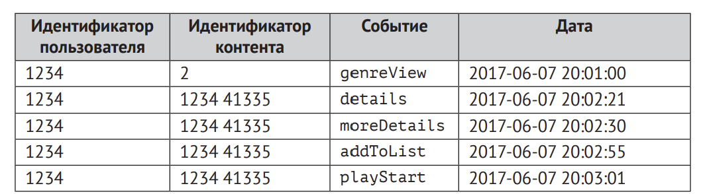

Таблица показывает, в каком виде эти факты мог зафиксировать Netflix.

Вероятно еще были бы другие столбцы: тип устройства, место, погода, время - вся эта информация может стать ключом к пониманию того, какой контент окружает пользователя.

**Сборщик фактов** применяется, для того чтобы собирать данные. 

**Рассмотрим другой возможный сценарий: сайт по продаже садового инвентаря**

Есть коллега, которые все свое свободное время тратил на то, чтобы найти в интернете какой-нибудь садовый трактор или еще что-нибудь, работающее на бензине и пригодное для работы в саду. Представим, что он открывает сайт и делает следующее:

1. Выбрал категорию Садовый трактор

2. Щелкнул по зеленому монстру, который способен перетаскивать деревья

3. Щелкнул по перечню характеристик, чтобы посмотреть, деревья какого размера эта штука может перетаскивать

4. Купил монстра

Эти события аналогичны процессу выбора фильма. Пусть даже покупка дорогого товара - это более значительное действие, чем просмотр фильма, но я надеюсь, вы уловили суть.

## 2.2. Поиск полезных данных о поведении пользователя

В идеале рекомендательная система должна собирать все данные о пользователе в момент, когда тот взаимодействует с контентом – вплоть до оценки мыслительной активности, уровня адреналина в  крови при изучении того или иного объекта, а также того, насколько сильно потеют ладони человека.
Чем больше растет наше присутствие в интернете, тем более реалистичным становится этот сценарий.

**Влияние контента на отношение к системе в целом**

Задача важна, поскольку она определяет возможную стратегнию формирования рекомендаций, а также список объектов, которые вы будете рекомендовать.

Возьмем, **к примеру**, фильм: если вы посмотрели плохой фильм на Netflix, вы делаете определенный вывод о качестве контента на нем, и соотствественно, недовольны самой площадкой. Если на Amazon вы покупаете плохой товар, вы плохо думаете о производителе, а не о сайте. А вот если вы ищете там этот диск с фильмом и не находите, тогда, вероятно, ваше мнение об Amazon станет хуже.

Задача Netflix заключается в том, чтобы показывать хорошие фильмы, которые вам понравятся. Amazon показывает товары, которые можно купить, а понравились они вам или нет – это не так важно. Amazon тратит много ресурсов на то, чтобы побудить покупателей написать отзыв и оценить товар, поэтому не совсем честно будет сказать, что ему все равно. Но для большей наглядности я скажу именно так.

### 2.2.1. Как узнать мнение посетителя

Этапы взаимодействия покупателя с товаром:

1. Покупатель смотрит. Как и в обычном магазине, покупатель осматривается, чтобы понять, что тут есть, без какой-либо конкретной цели. На этом этапе нужно обращать внимание на то, где останавливается покупатель и у чему проявляет интерес.

2. Покупатель заинтересовался одним или несколькими товарами. Может быть он знал с самого начала, что ему нужно, и искал именно это, а может быть товар ему понравился случайно.

3. Покупатель добвляет товар в корзину или список, намереваясь купить его

4. Покупатель приобретает товар

5. Покупатель пользуется товаром. Например, смотрит фильм или читает книгу. Если это путешествие, отправляется.

6. Покупатель оценивает товар. Иногда покупатели возвращаются в магазин/на сайт, чтобы оценить товар

7. Покупатель перепродает товар или избавляется от него другим способом. 

### 2.2.2. Что нужно узнать по поведению обозревателя в магазине

**Обозреватель**  – это посетитель, который просматривает контент.

Как я  уже сказал ранее, обозревателю нужно показать как можно 
больше товаров, и  рекомендации должны отражать эту задачу.
Если вам удалось установить, что посетитель является обозревателем, вы можете, держа в уме эту информацию, формировать такие рекомендации, которые соответствуют «обозревательскому» настроению человека.

Также есть смысл отслеживать, к чему из увиденного обозреватель не проявил никакого интереса. Но можете ли вы быть уверены на 100%, что просмотр страницы (товара) – это всегда хороший знак?

**Просмотр страницы**

Просмотр страницы на коммерческом сайте может означать многое. Это может быть сигналом о том, что посетитель (или обозреватель) заинтересовался. Но  может быть и  так, что человек не  может найти нужную ему страницу или просто щелкает по всем ссылкам подряд без разбору. В последнем случае большое количество щелчков  – это не  хорошо. Потерявшийся пользователь проявляет себя большим количеством кликов и отсутствием конверсий.

**Длительность просмотра страницы**

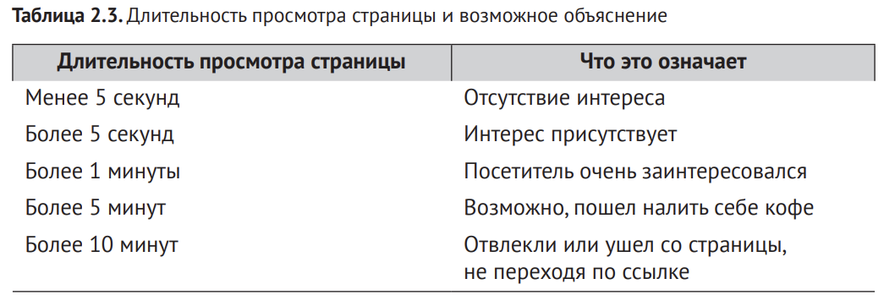

**Щелчки по ссылкам с подробностями**

На интернет-сайтах часто присутствуют ссылки на подробную информацию. Это удобно посетителям, которые получают возможность быстро просмотреть контент или, в случае заинтересованности, развернуть описание. Еще вариант – пользователь может прокрутить страницу вниз, чтобы прочитать отзывы или технические характеристики. Если пользователь совершает одно из этих действий, это говорит о его заинтересованности

**Ссылки на социальные сети**

Также можно разместить кнопку перехода в  социальные сети для тех людей, которым что-нибудь понравилось настолько, что они решили поделиться своими впечатлениями с  остальными. Контролировать 
происходящее на Facebook, в Twitter или в других социальных сетях не получится, но вы сможете зафиксировать сам факт того, что посетитель поделился информацией о том или ином контенте.

**Сохранить на потом**

Возможность сохранить что-то на потом, когда пользователь добавляет объекты в свой список, – это мощный ресурс. Если посетитель нашел для себя что-то интересное, очень уместно предоставить ему возможность сохранить эту вещь на потом.

А еще лучше создать список желаний, раздел Избранное или Посмотреть позже – в зависимости от типа контента. К другим признакам заинтересованности относятся скачивание брошюры, просмотр видео о каком-то элементе контента или подписка на новостную рассылку по определенной тематике.

**Поисковые запросы**

По словам Netflix, каждый раз, когда человек пользуется поиском, свидетельствует о неудаче со стороны рекомендательной системы, поскольку говорит о том, что люди не нашли ничего интересного для 
себя в рекомендациях. Не знаю, могу ли я с этим согласиться, ведь нередко 
я пользуюсь поиском, когда кто-нибудь из знакомых посоветует фильм, непохожий на то, что я обычно смотрю. Так или иначе, поисковые слова лучше 
всего подскажут, что нужно посетителю

Даже если система не  может дать пользователю тот контент, который он 
ищет, фиксировать подобные события все же следует. Если пользователь ищет 
фильм, вы узнаете, что ему интересен подобный контент. Зная это, рекомендательная система сможет предложить человеку что-то похожее

Связь поисковых слов и дальнейших действий пользователя
Еще один момент, который может стать пищей для размышлений, связан с поисковыми запросами (то, что пользователь печатает в поисковом поле). Имеет смысл соотносить то, что пользователь искал, с тем, 
что он в итоге выбрал. Например, пользователь ищет «Звездные войны» и  просматривает описание к  «Космическому пирату Харлоку», 
который находится в одном списке с «Вавилоном нашей эры», и пользователь в  итоге смотрит именно «Вавилон нашей эры». Возможно, 
есть смысл добавить «Вавилон нашей эры» в  поисковую выдачу по 
запросу «Звездные войны»

### 2.2.3. Совершение покупки

Покупка чего-либо означает, что пользователь считает объект полезным 
или привлекательным. Или же покупает что-то в  подарок. Нелегко определить, для кого предназначается покупка: для самого покупателя – и тогда это 
будет еще одним фактом, указывающим на предпочтения пользователя, или 
для кого-нибудь другого – и тогда эти данные нужно проигнорировать.

Объект, выбивающийся из общего ряда предыдущих 
предпочтений пользователя, может указывать либо на новую грань его интересов, либо быть подарком

Графически это может быть представлено как точка, которая сильно выбилась от остальных, и это может быть подарком. Однако это может свидетельствовать о новых интересах

Сам факт покупки свидетельствует о том, что объект был представлен наилучшим образом, но никак не  указывает на то, понравился ли купленный 
товар покупателю. По крайней мере, это так, если человек покупает данный 
товар впервые. Можно возразить, что каждая покупка банана повышает оценку бананов. Первая покупка, возможно, непоказательна, но вторая уже может 
о чем-то говорить. Как бы там ни было, покупку можно расценивать как положительное событие.

### 2.2.4. Пользование товаром

1. Endomondo отслеживает, насколько интенсивно человек пользуется теми 
или иными функциями, чтобы порекомендовать аналогичные сервисы или 
понять, какие аспекты необходимо доработать. Кстати, телефонные компании тоже анализируют то, каким образом люди пользуются телефонами. Они 
могут следить за нашими действиями совершенно пугающим образом. В следующем разделе мы поговорим, какую информацию можно получить благодаря стриминговому контенту.

2. Когда дело касается стриминговых сервисов, музыки, фильмов и даже книг, 
любое действие пользователя можно расценивать как неявную оценку. Прослушивание песни говорит о том, что пользователю она нравится. Но можно 
копнуть еще глубже. Следующий список отражает возможные варианты взаимодействия пользователя с музыкальным контентом или фильмами:

1. Запуск. Пользователь заинтересован, это уже хорошо
2. Остановка. Если остановили в начале - дурной сигнал, если остановили ближе к концу - вариантов больше
3. Продолжает воспроизведение. Если вернулся через 5 минут - отвлекся. Если вернулся через 24 часа - контент точно нравится.
4. Перемотка. Для музыки плохой знак, потому что контент малый.
5. Воспроизвдение от начала до конца. ХОроший знак.
6. Повторное воспроизведение. Для музыки и фильмов - хорошо. Для обучающего контента - может значить, что было слишком сложно.

### 2.2.5. Оценки посетителей

У сервиса Netflix есть девиз: «Чем больше вы ставите оценок, тем лучше ваши рекомендации».

БОльшинство систем применяют оценки, но при этом оценки пользователей обычно сопоставляются с их поведением. Для этих систем оценки - лишь опорная точка.

5 звезд вместе с отзывом - лучше, потому что пользователь отнесся более осмысленно к выставлению оценки.

**Ощущение контроля**

Многие сайты предоставляют посетителям возможность указывать свои 
предпочтения с  той же самой целью: наделить пользователя ощущением 
контроля над тем, какие предпочтения приписывает ему система. По наблюдениям Netflix, многие люди указывают, что им нравится документальное 
и зарубежное кино, а сами смотрят американские ситкомы. Что в этом случае должна им предлагать рекомендательная система Netflix: контент, заставляющий их стыдиться своего бесцельного времяпрепровождения, или контент, 
который им действительно хочется посмотреть?

Вот почему так трудно оценить эффективность рекомендательной системы, 
опираясь на данные с рейтингами пользователей

**Сохранение оценок**

Если вам что-то не нравится, то, возможно, вы и оценку ставить не захотите. Но если что-то раздражает вас по-настоящему сильно, вы можете захотеть 
выразить разочарование, например в виде отрицательного отзыва.

При добавлении контента его можно поднять своим голосом. Чем их 
больше, тем выше контент поднимается на странице (тут все проще некуда, 
мы рассмотрим этот алгоритм позже). Сайты, на которых используется голосование, называются системами репутации.

### 2.3.6. Знакомство с клиентами по (старому) методу Netflix

В Netflix использовался ручной ввод информации о вкусах, а затем платформа составляла предложения. Подход, в  котором пользователь помогает 
составлять свой профиль вкуса, часто используется с целью дать системе возможность составлять предложения для новых пользователе

## 2.3. Идентификация пользователей

Обычно сайты начинают с загрузки файлов куки и собирают всю информацию в эти файлы куки. Если после этого пользователь обеспечивает идентификацию путем входа в систему или создания профиля, вся информация из 
куки передается в этот профиль. Будьте осторожны с куки, потому что компьютер может использоваться несколькими людьми, особенно в общественном месте. Сохранение данных в куки в течение нескольких сеансов может 
ввести систему в заблуждение.

## 2.4. Получение данных о посетителях из других источников

В зависимости от вашего 
контента для сбора данных можно использовать Facebook, LinkedIn или другие подобные сайты. Многие думают, что авторизация через Facebook – это 
хорошо, но если речь идет не о фильмах или книгах, то какой толк от данных 
Facebook? Однако большинство сайтов сможет извлечь пользу даже из простых данных возраста и места жительства посетителя.

Могут быть и другие способы получить знания. Рекомендательная система 
пенсионных планов может извлечь пользу из знания о том, читает ли клиент 
книги о финансах. Это было бы свидетельством того, что клиент интересуется фондовыми рынками и, вероятно, будет более заинтересован в пенсионных планах, позволяющих клиенту иметь больше контроля над портфелем.

Я  уверен, что сайт автомобильного дилера может случайно 
обнаружить, что владельцам внедорожников нравится определенная резина, 
а сайт с косметикой может рекомендовать что-то в зависимости от возраста 
и пола. Люди, которые работают в сфере ИТ, вероятно, любят смартфоны, а водители – солнечные очки.

## 2.5. Cборщик данных

Теперь рассмотрим сборщик данных, реализованный на сайте MovieGEEKs. 

В связи с вопросом производительности и надежности сайта, лучше не добавлять сбор данных в имеющееся веб-приложение. Вместо этого, лучше сделать отдельные микросервис на другом сервере.

Наш сборщик данных разделен на две логические части:

1. **На стороне сервера**. В нашем пример часть на стороне сервера построена с использованием веб-API Django, которое работает в качестве конечной точки и к кторому могут обращатсья все, с чем контактирует пользователь. Обычно это веб страница, но также это может быть приложение на телефоне. 

Когда сервер получает уведомление о том, что произошло событие, ему нужно лишь сохранить его.

2. **На стороне клиента**. На клиенте будет JS, передающий данные на сервер сборщику данных

Чтобы связать сборщик с остальной частью архитектуры MovieGEEKs представлены элементы сборщика в схеме архитектуры из главы 1.

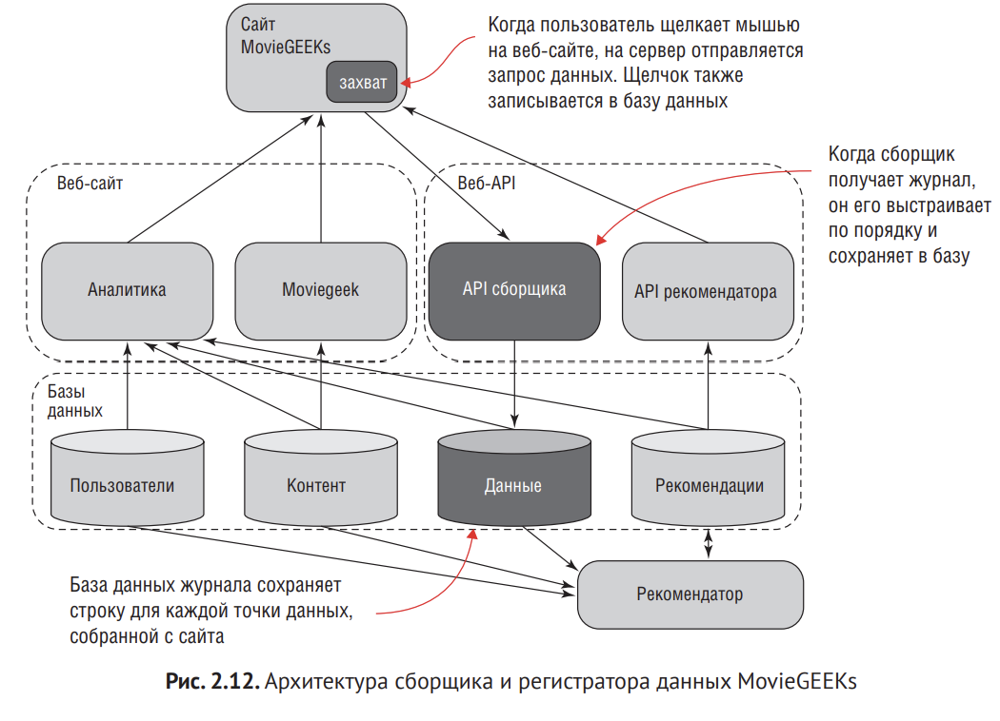

Ценность сборщика в том, что он представляет единую точку всех пользователей.

### 2.5.2. Модель данных 

Очень важно собрать данные о большинстве видов взаимодействий.

Информационная модель регистратора данных: 
date: datetime
user_id: varchar
content_id: varchar
event: varchar
session_id: varchar

### 2.5.3. Сборщик данных на стороне клиента

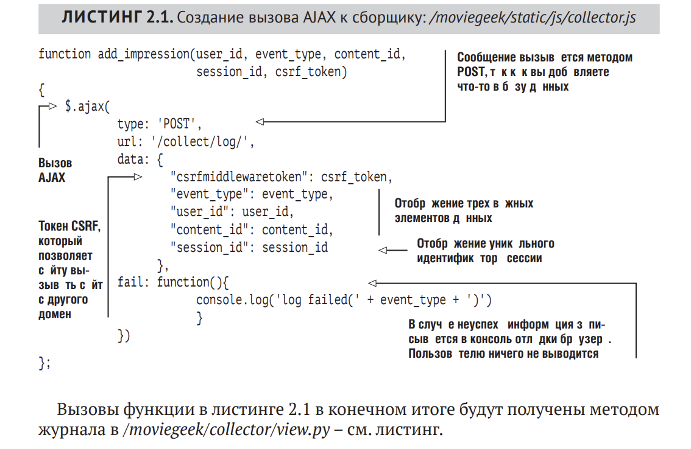

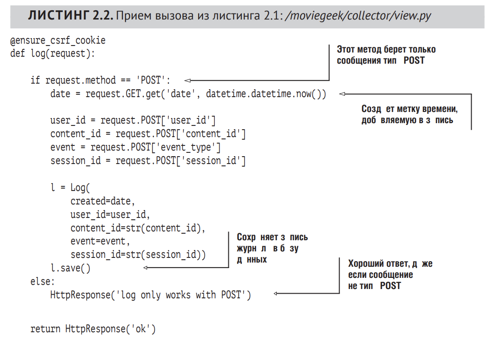

### 2.5.4. Интеграция сборщика в MovieGEEKs

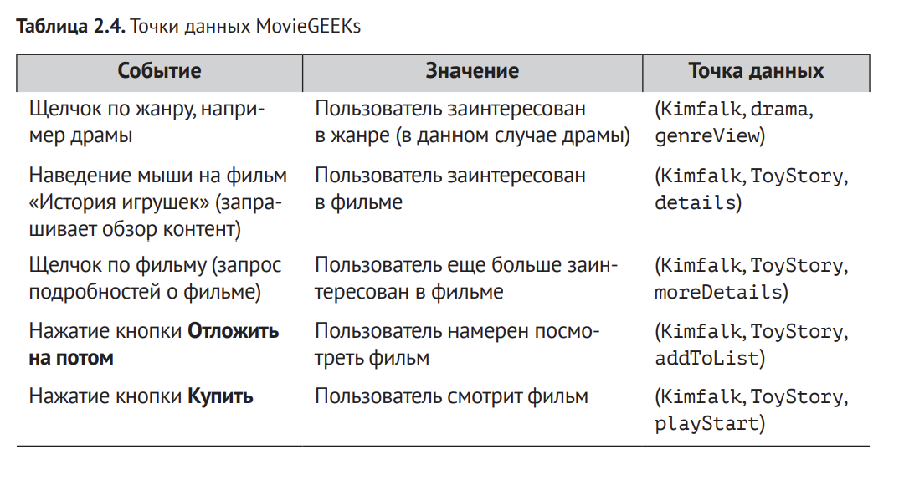

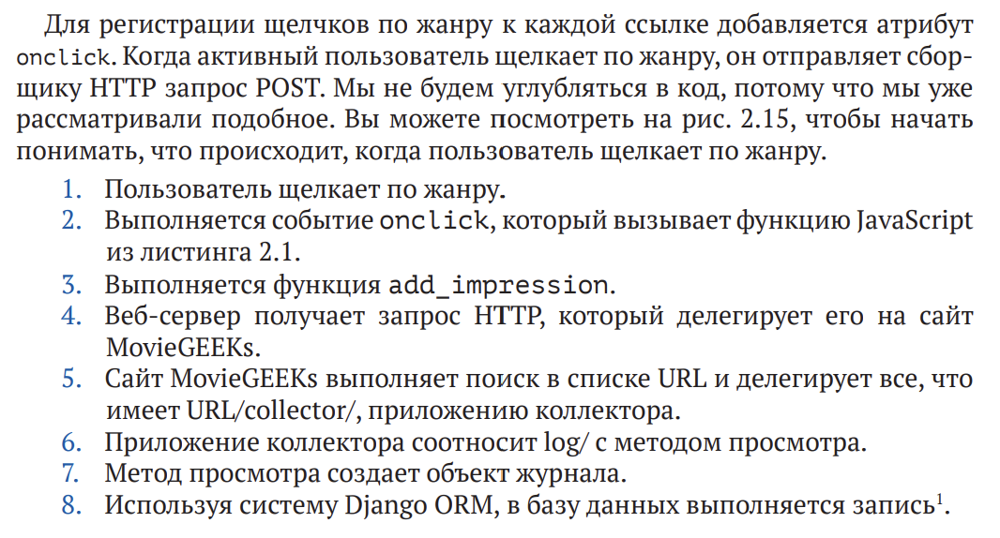

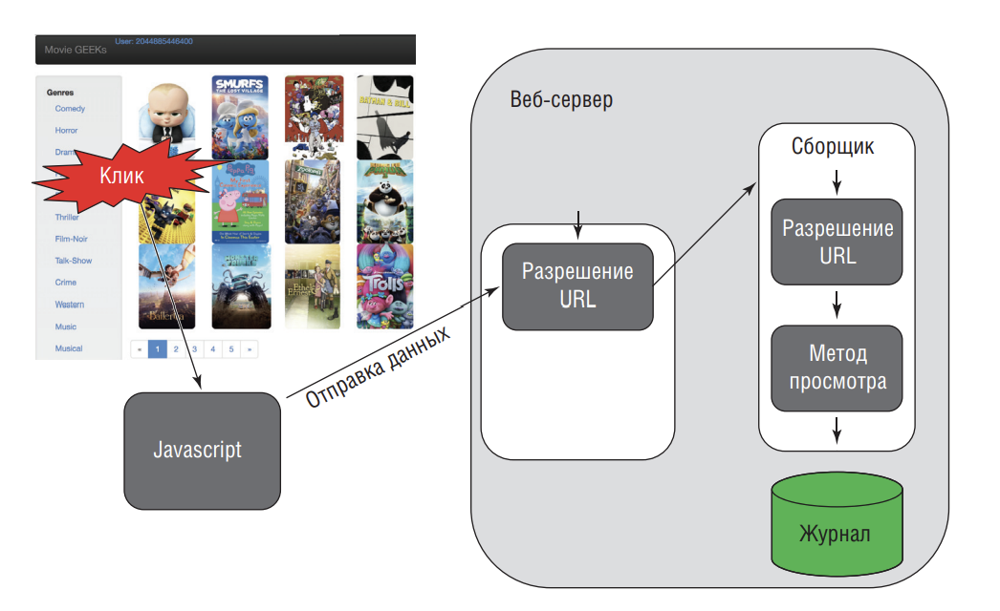

## 2.6. Какие пользователи есть в системе и как их моделировать

Прежде чем двигаться дальше, нужно немного подумать о  пользователях. 
Мы уже говорили о поведении пользователей, но также может быть полезно 
учитывать, что волнует пользователей. Иными словами, нужно «знать своего клиента».

Вам нужна модель пользователя, которую можно превратить в табличную 
базу данных и использовать в качестве дополнительных данных.

Если вы разрабатываете рекомендательную систему вроде Jobsite (www.jobsite.co.uk), то стоит собрать информацию, например о текущем местоположении, образовании, опыте работы и т. д. Если вы делаете пенсионный сайт, вам, вероятно, потребуется тот же набор, а также данные о состоянии здоровья 
(например, как часто пользователь посещает больницу и какие лекарства принимает). Для магазина книг могут также потребоваться все вещи, упомянутые выше, потому что все они указывают на то, какие книги могут заинтересовать 
пользователя. Но на большинстве книжных сайтов используются данные вкуса и покупательские привычки.

Давайте остановимся на том, что **нужно сохранять как можно больше данных о пользователе**

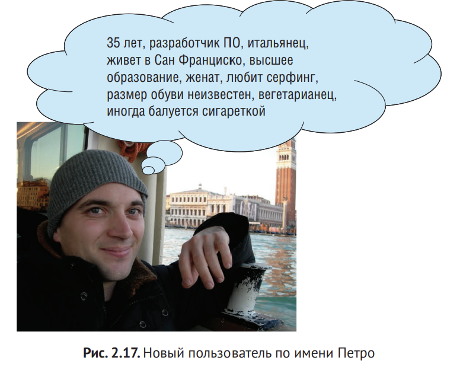

В идеале вам нужен список пар ключ/значение, связанный с идентификатором пользователя, адресом электронной почты, и, возможно, другой дополнительной информацией. Но помните, что вы делаете рекомендательную 
систему, поэтому можно также сохранить адрес доставки и тому подобные 
данные. Но для целей сайта MovieGEEKs это не так важно. Эта информация 
дает модель данных, показанную на рис. 2.18

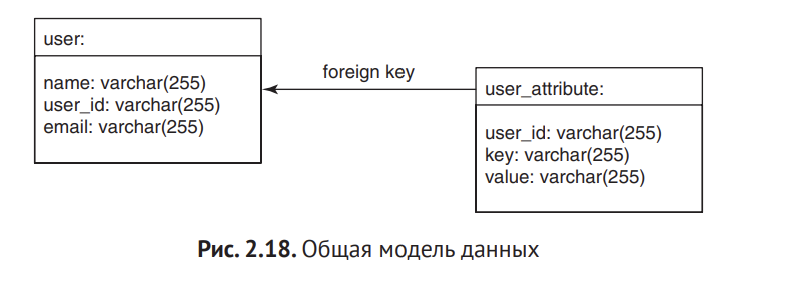

Есть несколько вещей, к которым следует стремиться. Нам нужны:
1. гибкость, чтобы сохранить все это;
2. простота, чтобы сделать код читаемым.

Однако эти цели тянут повозку в  противоположные стороны. Поэтому 
можно сделать менее гибкую, но более простую в использовании реализацию 
(где-то тут есть золотая середина). Вы можете создать таблицу, содержащую 
большинство предыдущих атрибутов, а также еще одну для каких-либо дополнительных данных, которые могут понадобиться позже. Ваша модель данных 
для пользователя может выглядеть, как показано на рис. 2.19.

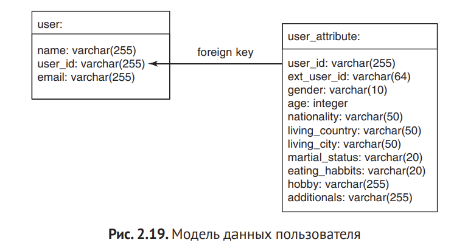

# Резюме

1. Поведение пользователей записывается в журнал, который представляет отдельный микросервис

2. Подключить сборщик к веб-сайту можно, прикрепив скрипт вызова ко всем событиями, происходящим на сайте

3. ХОрошие данные содержат информацию о системе вкусов пользователя. В идеале нужно записывать все события, потому что они могут оказаться полезными позже.

4. Неявные события - те что мы фиксируем сами, явные - пользователь вводит (оценки, отзывы)

5. Неявные оценки, как правило, более надежны, но только если вы понимаете, какой смысл несет каждое событие

6. Явные оценки не всегд анеджны, потому что они могут быть неточными в связи с влиянием социальных факторов.