# Глава 3. Мониторинг состояния системы

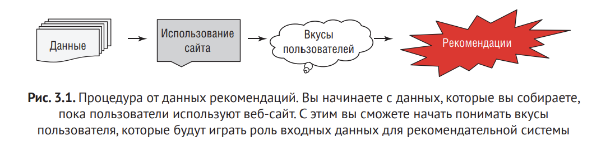

Нужно взять данные журнала и найти способ превратить данные каждого пользователя в информацию об их вкусах.

Мы говорим об аналитике в книге о рекомендательных системах, потому что нам нужен способ понять происходящее и измерить результата нашей работы.

# 3.1. Почему панель аналитики - это круто

Запуск приложения данных без их визуализации подобен вождению с закрытым глазами: "Сначала великолепно, но пока вы поймете, что что-то не так, будет слишком поздно"

## 3.1.1. Ответ на вопрос "Как там дела у сайта?"

Что является критрием качества? Вырученные деньги? Количество пользователей? Среднее время отклика?

Панель визуализации данных имеет первостепенное значение для понимания того, «как дела» у сайта, как вы можете использовать собранные данные и удалось ли что-то улучшить.

Мы рассмотрим, как можно отследить поток событий и поведение пользователей.

### Панели аналитики

В наше время, когда все идет к  повышению персонализации, владельцы сайтов должны знать своих пользователей и их активность на сайте, чтобы включить управляемые данными решения и быстро реагировать на изменения.

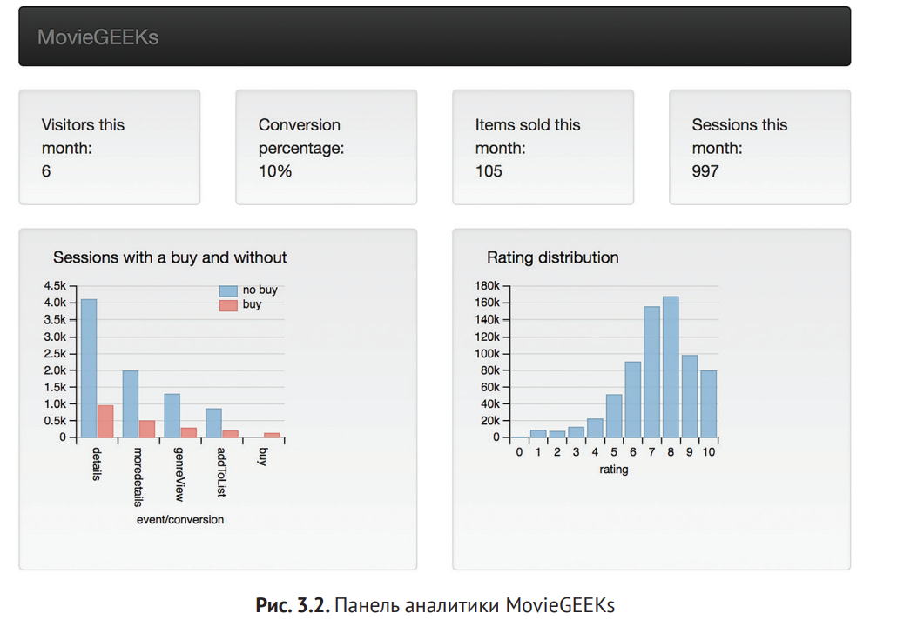

# 3.2. Реализация аналитики

Неважно, насколько хорош рекомендатор. Его качество зависит от 
контента. Имея хороший контент, мы не сможем в мясном магазине 
рекомендовать что-либо вегетарианцу.

## 3.2.1. Веб-аналитика

Веб аналитика делится на две категории: на сайте и вне его.

Аналитика вне сайта сосредоточена на возможности, видимости и голосах:

1. Возможность показывает, насколько велик потенциал сайта с точки зрения общего количества посетителей

2. Видимость показывает, насколько легко можно найти сайт

3. Голоса показывают, сколько людей говорит о сайте

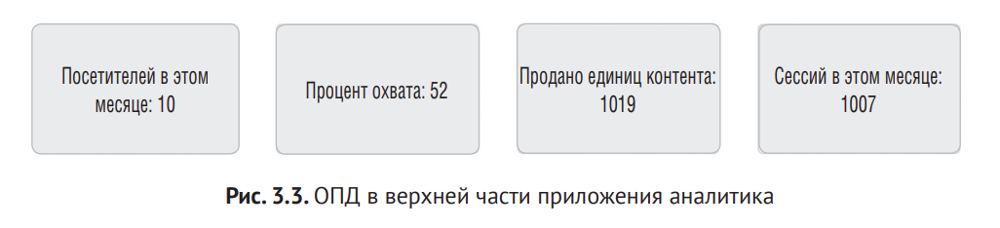

## 3.2.2. Базовые статитические данные

В качестве KPI может выступать все что угодно, что позволяет оценить успех вашего сайта. Что например?

1. Количество посетителей

2. Уровень конверсии

3. Проданный контент

Числа на панели показаны за предыдущий месяц, но они могут быть за любой период.

## 3.2.3. Конверсии

В электронной коммерции конверсионным маркетингом
называется превращение посетителей сайта в платежеспособных клиентов.

**Конверсия** - распространенный KPI, который определяется как:

```количество достижений цели / количество посещений```

Данный показатель называется по-разному в зависимости от поставленной цели – это может быть коэффициент конверсии целей, коэффициент конверсии продаж и т. д.

Весь онлайн-маркетинг построен вокруг понятия конверсии. Когда пользователь делает то, что вам от него требуется, то говорят о конверсии на сайте. 

Для создателей контента конверсией может являться 
оформление подписки, скачивание брошюры или ПО, заполнение формы обратной связи. А может быть, ваш коллега, заведя тему конверсий, начнет рассказывать о ROI (возврат инвестиций), но здесь эта тема не рассматривается

**Немного усложним:** слово конверсия исходит из идеи **конверсионной воронки**. Она иллюстрирует путь, который проходит пользователь перед конверсией. Давайте представим, как воронка показанная на рисунке, может искать компании, такие каке Amazon.

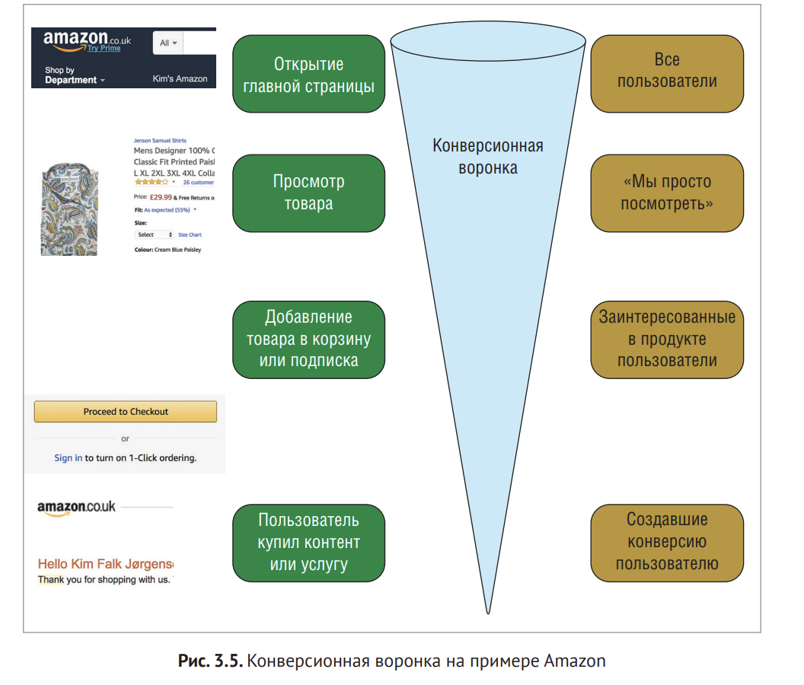

Пользователи заходят на главную страницу Amazon, что-то смотрят, и, возможно, где-то щелкают. Они могут поподробнее изучить какой-нибудь раздел, например одежду, и в конце концов купить потрясную гавайскую рубашку. Каждое событие, которое спускает пользователя на шаг вниз в воронке, называется значимым событием. У Netflix это, например, если пользователь смотрел фильм.

«Воронкой» она называется потому, что сначала она широкая, а потом сужается. То же самое происходит с посетителями сайта: на сайт заходит большое количество посетителей (широкая часть воронки), некоторые из них чтото добавят в пожелания или хотя бы посмотрят, и часть из них что-то купит 
(узкая часть воронки).

Если посмотреть на конверсию **с точки зрения пользователя**, то конверсия - это то, чего хочет пользователь. Например, пользователи заходят на Amazon с целью что-то купить или подписаться на интересную рассылку.


Цели могут меняться. На сайте автодилера клиент вряд ли создает конверсию при каждом посещении, но на Amazon, вероятно, большинство посещений должны превращаться в конверсию (по крайней мере, у меня так). Подумайте о том, какое изображение на рис. 3.6 подходит вашему сайту.

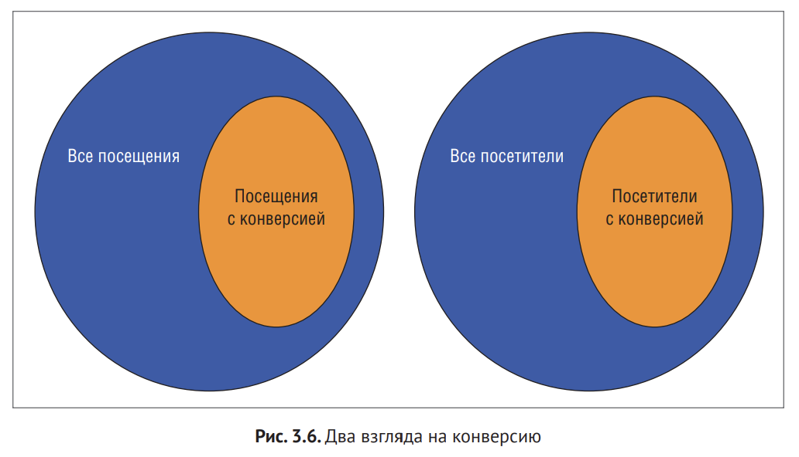

Если вы выбрали изображение слева, у вас сайт типа Amazon. Вы надеетесь на то, что все или почти все клиенты создают конверсию. Если вы выбрали картинку справа, то это ближе к сайту автосалона. Вы будете измерять конверсию по времени, которое пользователь проводит на сайте. ДЛя сайта автомслона не имеет значения посещение сайта - важна только покупка авто. В этом втором случае коэффициент конверсии вычисляется по следующей формуле:

```количество достижений цели / количество посетителей```

MovieGEEKs - сайт первого типа. Если посмотреть на множество посещений, то коэффициент конверсии будет вычисляться как количество сессий, в которых происходит покупка, деленное на общее число сессий. **Код SQL**:

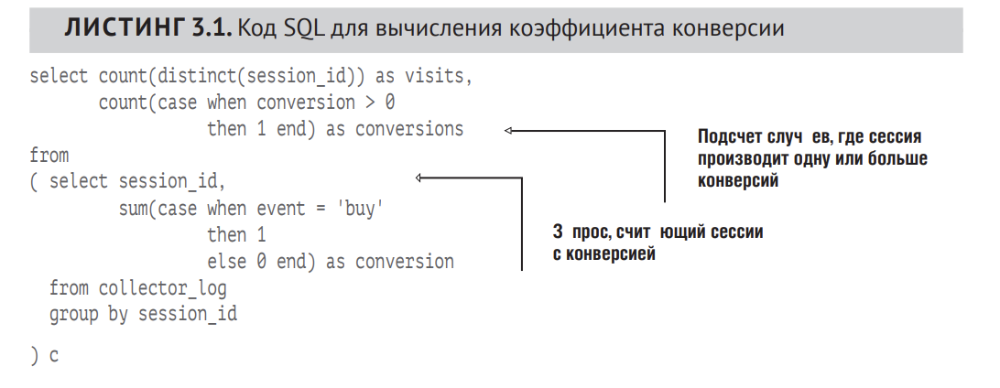

## 3.2.4. О пути к конверсиям

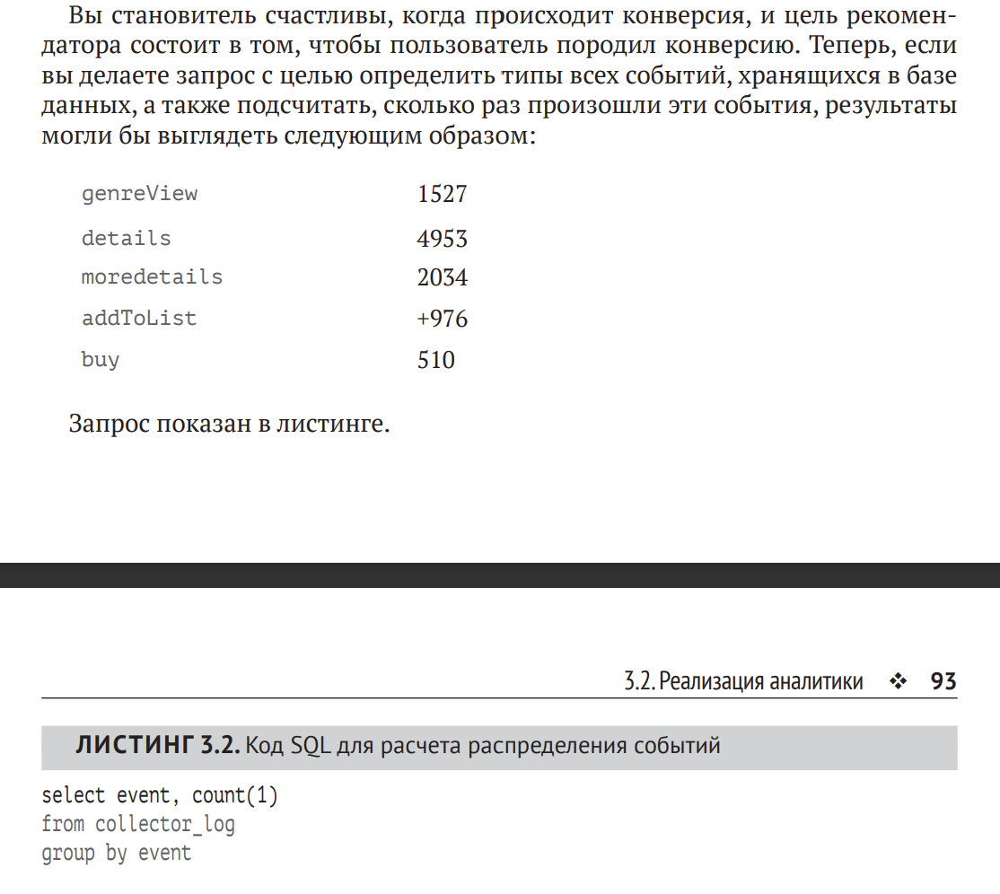

Этот запрос позволяет узнать, как часто происходят события каждого типа.

Теперь нужно еще раз посмотреть, как часто эти события происходят 
в сессиях с покупками и без них. Это можно проверить с помощью листинга 3.3, в котором сессии группируются так, что для каждой сессии строка указывает число событий покупки и  просмотра подробностей, которые случились в данной сессии.

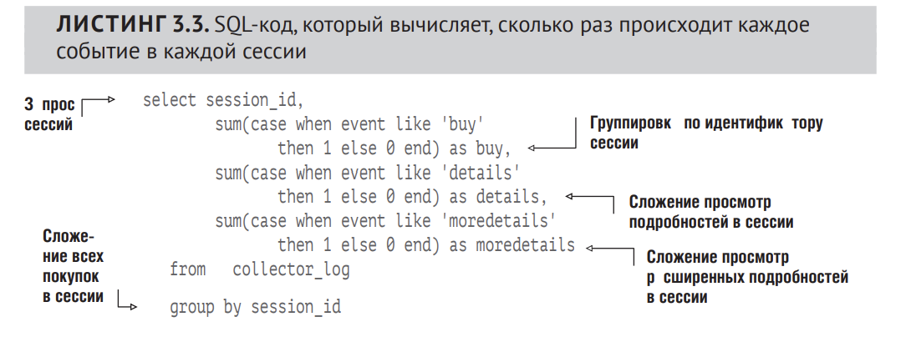

Теперь, когда вы разбили сессии в событие, можете сделать следующий шаг 
и посмотреть, что происходит в сессиях, где осуществляется покупка. Как вариант, можно повторно использовать предыдущий запрос и добавить фильтр, 
который будет выводить только сессии, когда что-то было куплено.
Но результата это не дает, потому что вы хотите знать, какие взаимодействия были в каждом из случаев. Важно узнать, с чем взаимодействовал пользователь, прежде чем покупать что-то.

## 3.2.5. Путь конверсии

```Это путь, по которому пользователь и конкретный контент 
идут рука об руку к событию покупки (а потом живут долго и счастливо).

Путь представляет собой последовательность страниц и действий, которые делает пользователь с момента прибытия на лендинг-страницу до конверсии.```

Это не тоже самое, что воронка конверсии. Воронка конверсии стсоит из предварительно определенных целей, которые должны быть достигнуты, чтобы пользователь создал конверсию. Путь преобразования - это не просто последовательность событий, а еще и последовательность страниц. MovieGEEKs не лучший иллюстрационный пример, так как на нем есть лишь ограниченный набор событий. Часто у веб-сайто предусмотрен гораздо более длинный список событий:

```просмотр содержимого;
 просмотр подробностей;
 взгляд внутрь;
 лайки;
 репосты;
 подписки на рассылки;
 щелчки по результатам поиска;
 ссылки на кампании;
 добавление в корзину;
 добавление в список избранных (об этом отдельно в следующей главе);
 оценка;
 написание отзыва;
 покупка```

Сам путь конверсии интересен, посколько события часто являются ключевыми индикаторами того, где именно возникает связь между пользователем и контентом (эта аналогия отлично подходит для сайтов знакомств). Этим индикатором может быть что угодно - например, большинство пользователей смотрят в поиске концовку фильма перед его покупкой. Это можно как-то интерпретировать. Но как рассчитать сам путь?

Для каждого пользователя нам важно знать все сессии, в которые произошла покупка. Затем для каждой покупки нужно выполнить подсчет событий, которые произошли с купленным товаром.

**Во-первых**, нужно определить все события покупки для каждого пользователя, сессии и контента. 

```sql
select session_id, user_id, content_id
from collector_log
where event = 'buy'
```

Давайте предположим, что все, что было сделано с конкретным элементом, было сделано до покупки. Это небольшая хитрость, которая бережет нас от построения сложных вычислений.

Этот запрос дает нам список, которые можно присоединить к исходной таблице, получив таким образов, только события, происходящие в сессии, где пользователь как-то взаимодействовал с контентом и что-то покупал.

```sql
select log.*
from (
    select session_id, content_id
    from collector_log
    where event = 'buy') as conversions
join collector_log as log
ON conversions.session_id = log.session_id
and conversions.content_id = log.content_id
```

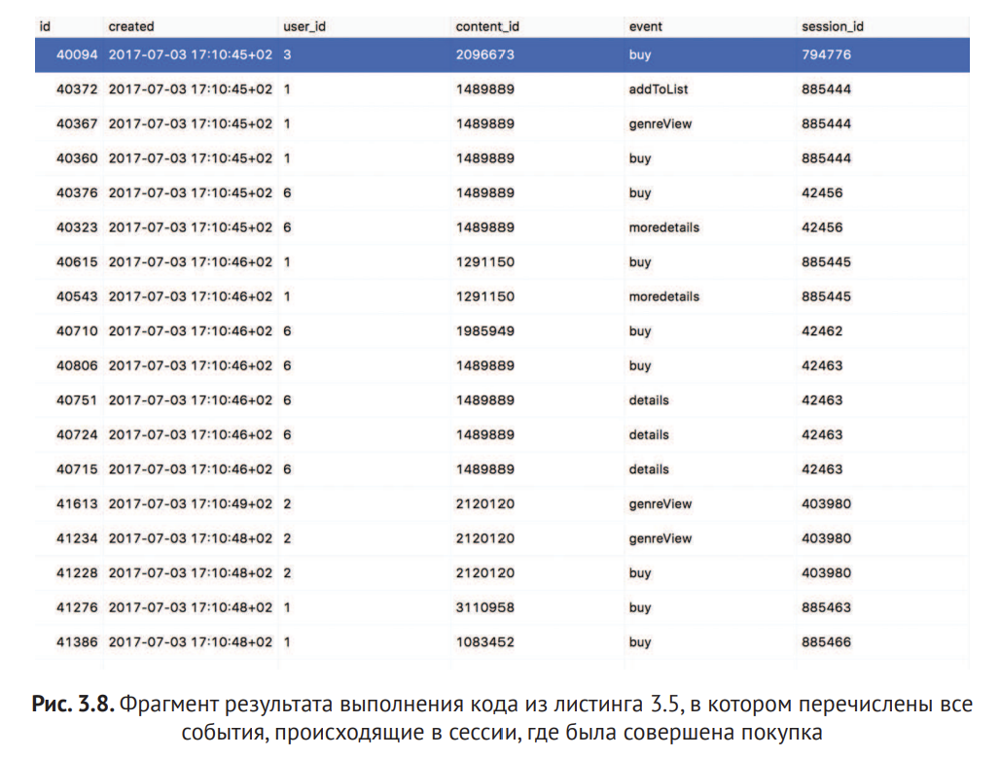

Но события покупок нам не интересны, о них мы знаем и так. Окончательный запрос выглядит следующим образом

```sql
select log.session_id, log.user_id, log.content_id
from (
    select session_id, content_id
    from collector_log
    where event = 'buy'
) as conversions
JOIN collector_log as log 
on conversions.session_id = log.session_id
and conversions.content_id = log.content_id
where log.event not like 'buy'
order by user_id, content_id, event
```

# 3.3. Архетипы

Это краеугольный камень ориентированного на пользователей 
дизайна и  маркетинга. Это вымышленные люди, созданные для представления различных стереотипов, которые соответствуют группам или сегментам 
в пользовательском сообществе. В этом разделе представлены несколько архетипов; они не являются продуктом качественного веб-анализа, но зато охватывают контент MovieGEEKs (фотографии использованы с согласия этих людей).

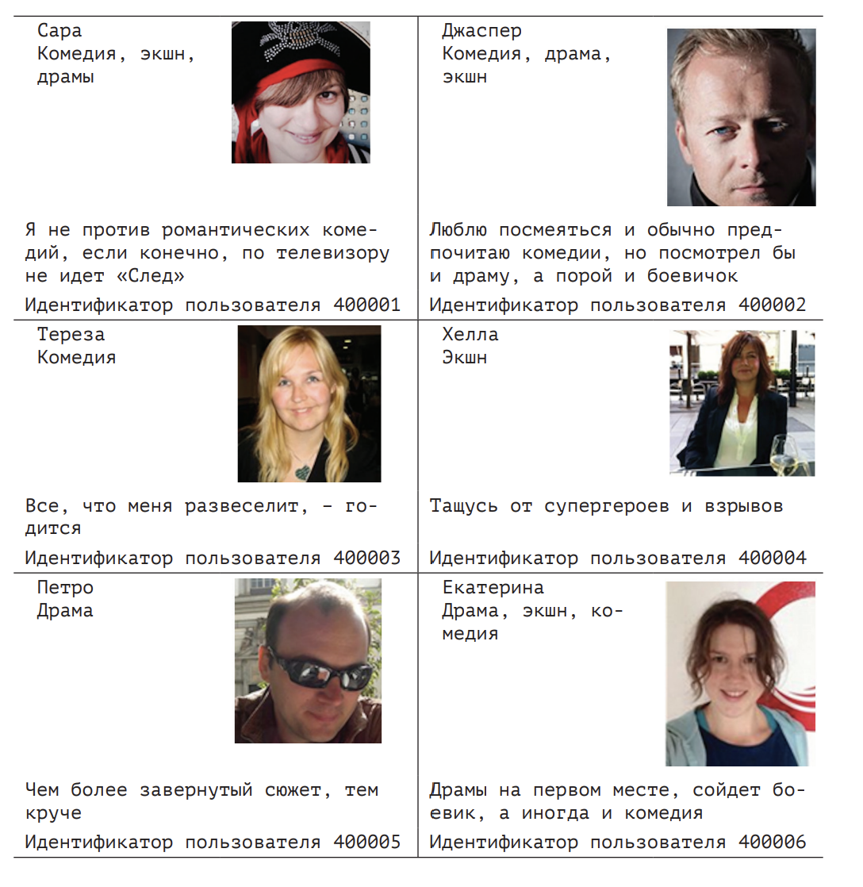

Каждого пользователя можно количественно описать как количество часов из ста, которое он потратить на тот или иной жанр.

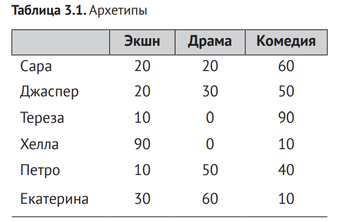

На основе этой таблицы можно построить диаграммы. Преимущество такого способа в том, что он позволяет легко найти похожие вкусы (или увидеть, что вы создали двух пользователей с такими же вкусами)

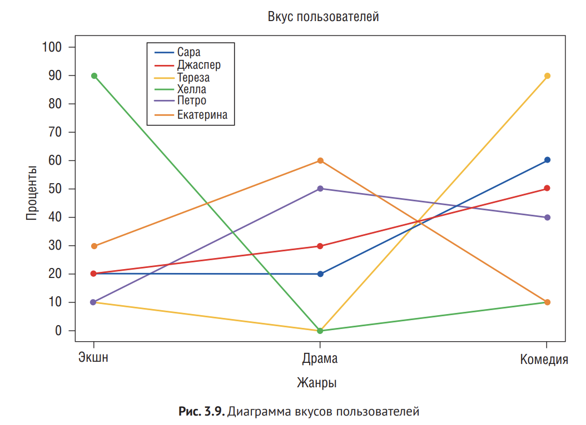

В аналитике сайта MovieGEEKs есть страница для каждого пользователя (рис. 3.10). На рисунке показано, что наша система знает о Хелле. Слева находится список наиболее высокооцененных фильмов. На диаграмме показана нормализованное представление о том, сколько фильмах Хелла оценила, и разница между средней оценкой жанра и оценками Хеллы в среднем во всех жанрах.
На рис. 3.10 видно, что Хелла оценила несколько фильмов в жанре экшн, но средняя оценка по этому жанру такая же, как и средняя по всем фильмам. Кроме того, кажется, ей нравится фантастика, хотя оценок мало.

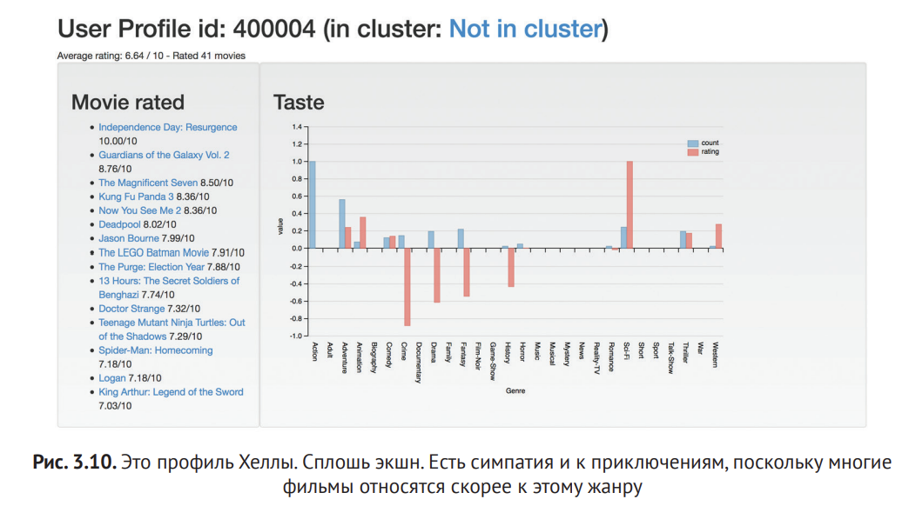

На графиках рис.  3.10 изображено два типа данных. Синяя (темная) полоса показывает, сколько фильмов каждого жанра Хелла оценила, а оранжевая (более светлая) – разницу со средней оценкой.

# 3.4. Панель сайта MovieGEEKs

## 3.4.1. Автоматическая генерация данных в журнале

Мы узнаём о неявной обратной связи. Эту вещь нельзя потрогать или скачать, но хочется иметь на своем сайте. Фальк написал скрипт,, который создает эти связи, чтобы они выглядели как настоящие.

Cкрипт автоматически создает журналы для шести архетипов пользователей. Основу сценария составляет цикл, которые работает в диапазоне от нуля до числа событий, которое вам нужно. В каждой итерации выбирается случайный пользователь и фильм в зависимости от вкуса пользователя, а затем выбирается, какое он выполнил действие. Когда все будет выбрано, событие сохраняется.

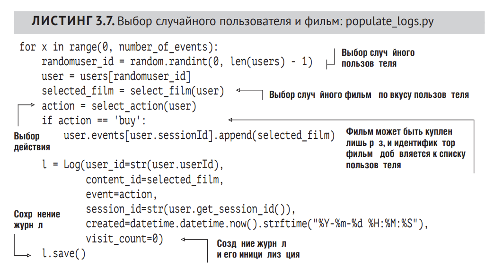

## 3.4.2. Характеристики и дизайн панели аналитики

У вас должна быть панель, которая показывает:

1. Количество посетителей и какие действие они принимают

2. Количество посещений, закончившиеся покупкой (коэффициент конверсии)

3. Самые продаваемые товары

## 3.4.3. Основа панели аналитики

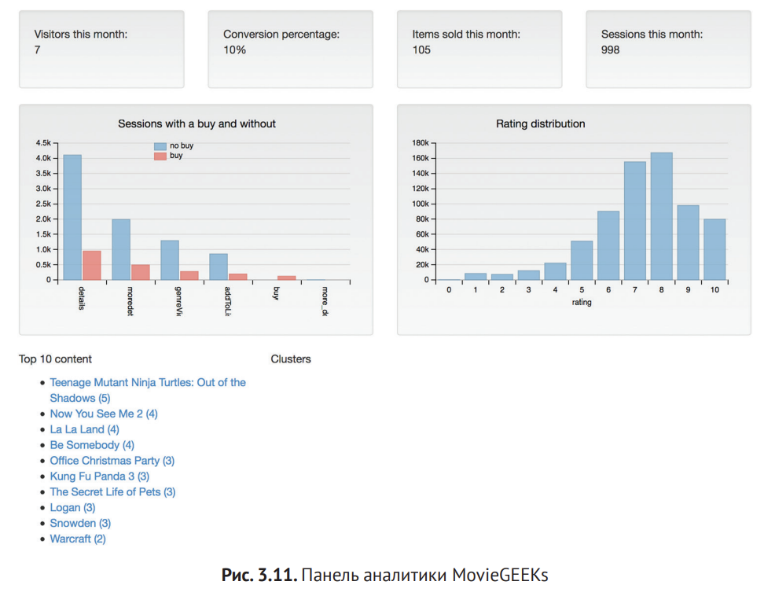

Сверху - KPI
Диаграмма слева - сколько раз происходили различные события
Диаграмма справа - распредеделение оценок, каждый столбик здесь показывает, сколько фильмов получили данную оценку

## 3.4.4. Архитектура

Приложение аналитики, это еще одно приложение в вашем проекте на Django. 
Все это хранится отдельно от основы сайта.
В приложении аналитики несколько разных окон. Остальные страницы используются в качестве веб-апи для извлечения данных. 

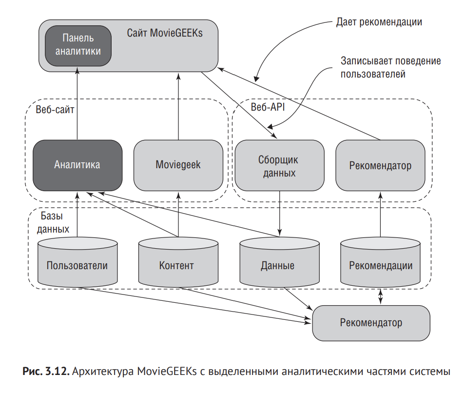

**Чуть-чуть о ежемесячных данных**

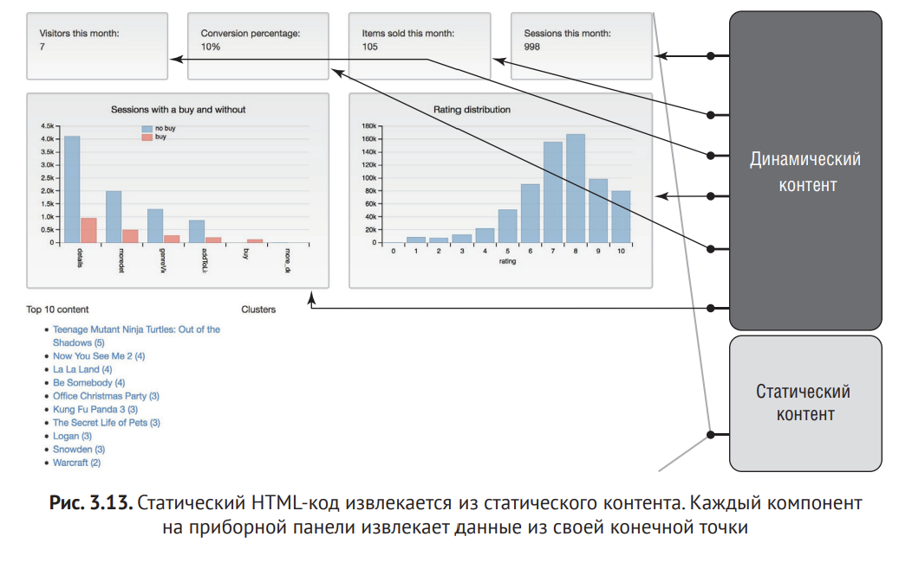

KPI рассчитываются за последний месяц, но могут рассчитываться ежедневно, еженедельно или даже ежечасно если трафика много. Можно использовать скользящее окно (рис 3.14).

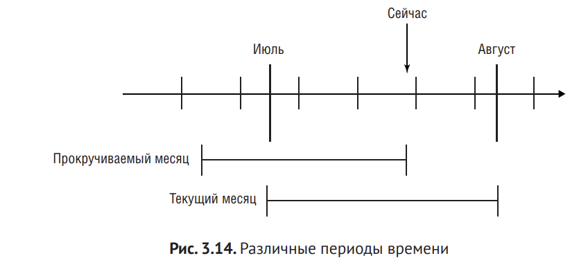

# Резюме

1. KPI - это хорошая вещь, потому что их легко оценивать и легко использовать, чтобы увидеть, есть ли у вашего сайта положительные сдвиги

2. Посетитель создает конверсию, когда выполняет вашу цель или делает что-то, на что вы надеетесь

3. Воронка конверсии иллюстрирует последовательность шагов, которые должен предпринять ваш пользователь. Путь конверсии - это реальный путь пользователя к конверсии

4. Очень важно понимать воронку конверсии вашего сайта, чтобы вы могли осознавать, насколько пользователи близки к конверсии

5. Важно понимать и всегда иметь рабочую аналитику


