# Оценки, и как их рассчитывать

„ создание матриц пользователь–элемент;
„„ пересмотр явных оценок с  целью узнать, почему они не  всегда 
хороши;
„„ погружение в тайну неявных оценок и их создания;
„„ кое-что о функции неявных оценок, которая превращает данные 
в оценки.

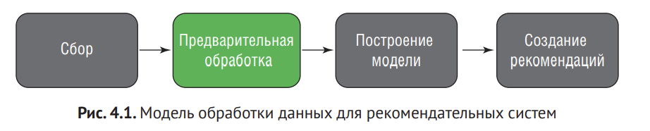

Данная глава - о предварительной обработке. Мы будем превращать поведение пользователя в оценки контекнта, которые вы станете использовать для создания рекомендаций в последующих главах. Этот тип оценок называется неявным, потому что они вводятся не напрямую

# 4.1. Предпочтения элементов пользователями

Матрицу пользователь-элемент можно рассматривать как таблице, где в строках перечислены пользователи, в столбцах - элементы. Или наоборот. 

## 4.1.1. Определение оценок

Оценка - например, число звезд на Amazon или список сердец в обзорах фильмов в местной газете. Обычно оценки - это числа от 0 до 5, которые часто превращаются в графическое обозначение и выводятся в таком виде пользователю.

Более формально оценка - это клей между пользователем, контентом и отношением пользователя к элементу контента, как показано на рисунке 4.2. На рисунке изображено, что сохранятся в данных сайта после того, как Джимми посмотрел и оценил 1 сезон сериала четырьмя звездами. В базе данных оценки оеализованы в виде таблицы, которая связывает пользователей с элементами контента.

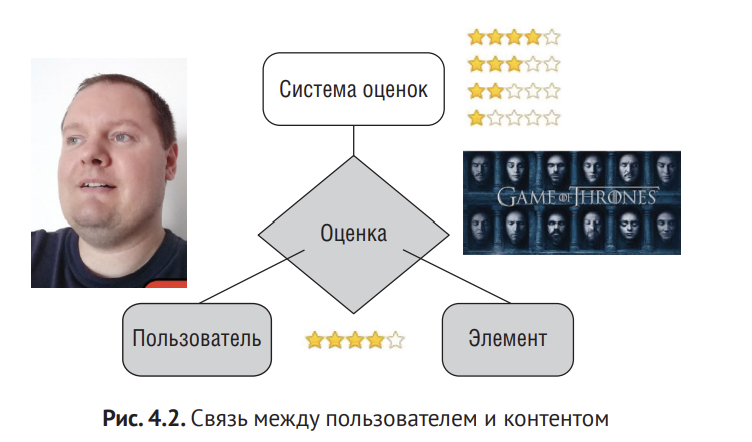

## 4.1.2. Матрица пользователь-элемент

Пустая клетка означает, что записей о взаимодействиях между пользователем и элементом нет.

Рекомендательная система пытается предсказать, что бы пользователь поставил пустому элементу в матрице.

**Проблема разреженности**

Непустые клетки встречаются редко, поскольку у многих интернет магазиов очень много и пользователей и товаров. При этом большинство пользователей покупают один-два товара.

В главе 8 будет идти речь о рекомендательных алгоритмов совместной фильтрации. Эти алгоритмы испльзуют матрицу для того, чтобы найти схожих пользователей. Если данных мало, она дает мало информации и это затрудняет вычисление рекомендаций.

В главе 5 мы узнаем, как вычислять рекомендации, даже если у вас разреженная матрица.

Сейчас же сконценртируемся на заполнении матрицы явными и неявными оценками.

# 4.2. Явные и неявные оценки

Приложение извлекает оценки из двух источников, важным из которых является банк данных MovieTweetings. Другая часть рассчитывается на основе поведения пользователя, данные о котором генерируются так, как описано в главе 3.

## 4.2.1. Как мы используем доверенные источники для составления рекомендаций

Явные оценки очень часто могут быть не субъективны

# 4.3. Переоценка

Сайты вроде TripAdvisor, Glassdoor и другие подобные существуют только за счет оценок пользователей. Напоминаю, что даже если неявные оценки в целом более точно отражают мнение пользователя, явные оценки все еще используются. Мы вернемся к явным оценкам позже, а пока сосредоточимся на неявных.

# 4.4. Неявные оценки

Если пользователь купил товар, или смотрит контент и доп инфо о товаре, ему возможно нравится. Если он вернул товар - не нравится.

Для расчета неявной оценки надо взять все события произошедшие между каждым пользователем и каждым товаром и определить число, показывающее насколько сильно пользователю нравится этот контент.

**Алгоритм элемент-элемент (item-to-item)** использует сайт Amazon.

Некоторые используют историю просмотра всех пользователей и рекомендуют подобные страницы. 

Иногда стоит разделять оценки на временные интервалы и делать разные рекомендатели для каждого из них. Но это компромисс между точностью рекомендаций и разрежеженностью данных

Всегда стоит помнить о **релевантности**. Не во всех приложениях есть система оценок, и не всегда она вообще нужна. Например, **eBay**. Какую информацию получить eBay от вашей оценки редкого ланчбокса с чудо-женщиной 1984 года? Он может вообще быть 1 на весь сайт. Полезная информация здесь - ваша любовь к комиксам, коллекционированию или ланчбоксам.

## 4.4.1. Предлолжения людей

Немалая часть вычислительнйо мощности тратится на вычисления того, как предложить людям других людей. 
У LinkedIn есть функция **Возможно, вы знакомы**, где пределагаются люди, которых можно добавить к вашей сети. Это пример сайта, где было неуместно вводить явные оценки. Но таким как сайтам все равно требуются вычисления для составления рекомендаций.
Мы идем по краю между рекомендательными системами и областью интелектуального анализ данных

## 4.4.2. Что учитывать при расчете оценок

**Двоичная матрица пользователь-элемент**

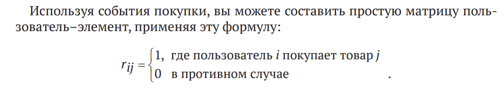

Больше всего этот принцип использутся на Amazon. 

**Временной подход**

Наибольшее внимание стоит уделять недавним событиям. Чтобы сделать матрицу более гибкой, нужно использовать функцию, зависящую от времени. Можно даже учесть время изготовления элемента. Например, покупка 5 минут назад товара, который был выставлен 5 минут назад, будет иметь более высокое значение, чем покупка старого продукта те же пять минут назад или покупка годичной давности. 

Такой подход поощряет продвижение новых элементов

**Алгоритм Hacker News**

На сайте Hacker News используется несколько схожий алгоритм, которые выдвигает вперед недавние события и меньше продивгает старые. Этот тип алгоритмов называется **алгоритмами временного затухания**.

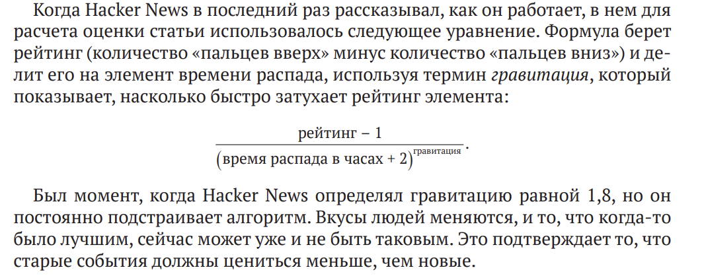

**Поведенческий подход** 

Большие компании наверно утонули бы в данных, если бы использовали данные об иных действиях помимо покупки. Но для большинства сайтов показанная ранее бинарная таблица была бы совершенно пустой или заполненной нулями. Вот почему хорошей идеей было бы немного расширить горизонт и добавить другие события, помимо событий покупки.

Использование нескольких видов событий – это уже посложнее, потому что вам нужно количественно оценить каждое из них. Когда значение каждого события будет определено, любая запись в  матрице пользователь–элемент может быть вычислена на основе всех событий, которые произошли между пользователем и  элементом. Именно с  этим подходом мы будем работать, слегка приправив его временным подходом.

# 4.5. Расчет неявных оценок

Если у вас сайт с книгами, вы хотите знать, какие книги я бы потенциально купил независимо от того, какую оценку я бы им поставил. То есть вы рассчитываете число, которое указывает на то, насколько вероятно, что ваш пользователь совершит покупку, а не оценку пользователя.

## 4.5.1. Просмотр поведенческих данных

**Рассмотрим пример**: пользователь думает о покупке фильма. Смотрит и думает "дороговато". Потом смотрит снова и снова. Наконец, решает почитать подробности, чтобы убедить себя в покупке, что и делает. Даже без покупки это много о чем говорит. 

Также стоит учитывать временной интервал. Если щелчки сделаны в течении короткого периода времени, они могут не означать то же самое, что щелчки, сделанные в течении нескольких дней.

Нужно добавить правила для ваших неявных рекомендаций, **например**:

1. покупка => высшая оценка
2. просмотр подробностей и расширенных подробностей => хорошая оценка 
3. пара просмотров подробностей => хорошо
4. один просмотр => неясно

На панели MovieGEEKs есть диаграмма, которая показывает, какие действия наиболее часто приводят к событию покупки. Вы также можете получить такую картину в отношении того, как рассчитывать неявные оценки.

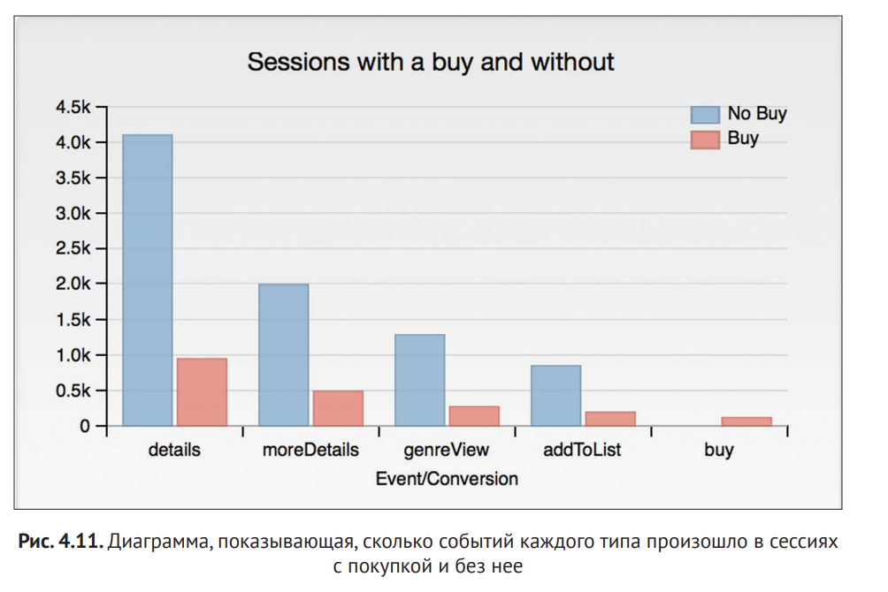

Чтобы подвести итоги этого исследования и помня о покупателе (который метался в выборе книги), вы можете определить функцию неявных оценок, которая будет выводить число, показывающее, сколько пользователей **u** будут заинтересованы в покупке элемента **i**. Если говорить точнее, то нам интересно узнать, насколько пользователь **u** близок к покупке элемента **i**, поэтому вы можете использовать эти знания, чтобы найти похожие элементы, которые пользователь может купить вместо или вместе с элементов **i**. Имеся это в виду рассмотрим следующую неявную оценку элемента **i** для пользователя **u**:


**Должны ли все события иметь положительный вес?**

Если действия чаще происходят в сессиях с конверсией, чем в сессиях без них, вы можете дать таким событиям положительную оценку или вес. Все взаимодействия между пользователем и товаром имеют положительный вес.

Но дизлайки, **например** могут иметь отрицательный вес.

**Расчет веса**

Давайте создадим функцию путем добавления веса в соответствии с тем, что вы узнали в примере с пользователем. 

### ПРИМЕЧАНИЕ

Хорошо работать с весами и функцией, когда у вас есть полноценный и рабочий рекомендатор, а затем посмотреть, как будет выглядеть результат.


Данные надо нормализовать, посколько оценка не должна улетать в небеса при большом количестве нажатий.

**Использование большего количества релевантных данных**

Первый раз, когда пользователь возвращается на сайт, ваши оценки будут основаны главным образом на данных просмотров, а не покупок, поэтому рекомендации будут основываться на меньшем количестве данных. Когда пользователь взаимодействует с сайтом и делает покупки, контент, с которым взаимодействует пользователь, уточняется до конкретных вкусов пользователя. 
Это можно было бы считать задачей машинного обучения. 

Сегодня многие компании тратят много энергии, пытаясь предсказать, какие пользователи готовы покупать и когда. У вас есть аналогичная проблема: нужно предсказать, насколько вероятно, что клиент собирается купить определенный продукт, который просматривал потенциальный покупатель.

Нельзя сказать наверняка, существует ли связь между взаимодействием 
пользователя с сайтом и его покупками, но это кажется правдоподобным. Если 
да, то определенные цифры или вектор могут быть умножены на собранные 
данные, чтобы получить вероятность, что указывает на то, насколько близко 
клиент находится к покупке чего-то. Это довольно близкое приближение того, 
что вы пытаетесь вычислить. Если вы определили это в терминах машинного 
обучения, что существует функция:
```Y = f(X) + ε```,

где Y представляет собой истинное предсказание близости пользователя к покупке конкретного элемента. Теоретически это может быть вычислено с помощью вставки ваших данных в журнал признаков. Также мы включим параметр 
шума – ε, – указание на то, что вы не можете получить всю информацию из признаков, так что у вас будет чувство неопределенности независимо от того, насколько близко ваша функция f касается расчета реальной оценки. Целью многих алгоритмов машинного обучения является использование данных для аппроксимации функции f, и я призываю вас попробовать ее с вашими данными

Какой вид машинного обучения можно применить к этой проблеме? Вы хотите предсказать неявную оценку на основе различных событий. Чтобы сделать это, вы можете только попытаться предсказать, приведет серия событий к покупке или нет. Чтобы сделать это, вам понадобится классификатор. Для начала подойдет наивный байесовский классификатор. Он  не только решает задачу классификации, но и дает вероятность того, насколько он уверен в классификации. В этом случае вы можете использовать вероятность того, что классификация предскажет покупку. Для получения более подробной информации о том, как использовать наивный байесовский классификатор, смотрите главу 5 книги Джеффа Смита «Реактивные системы машинного обучения» (Manning, 2017).

# 4.6. Как реализовать неявные оценки

Давайте начнем с обзора того вида, где вы хотели бы реализовать эту функцию на MovieGEEKs, а затем перейдем к объяснению того, как это сделать. Рассмотрим следующее:

1. Получение данных

2. Расчет оценки

3. Просмотр и понимание

**Получение данных**

Для расчета неявных оценок для конкретного пользователя вам нужно получить данные журнала пользователя. Вам нужны данные, которые должны для каждого элемента сказать вам, сколько раз пользователь взаимодействовал с контентом. Для примера с Джаспером вам нужна строка, как в таблице 4.5.

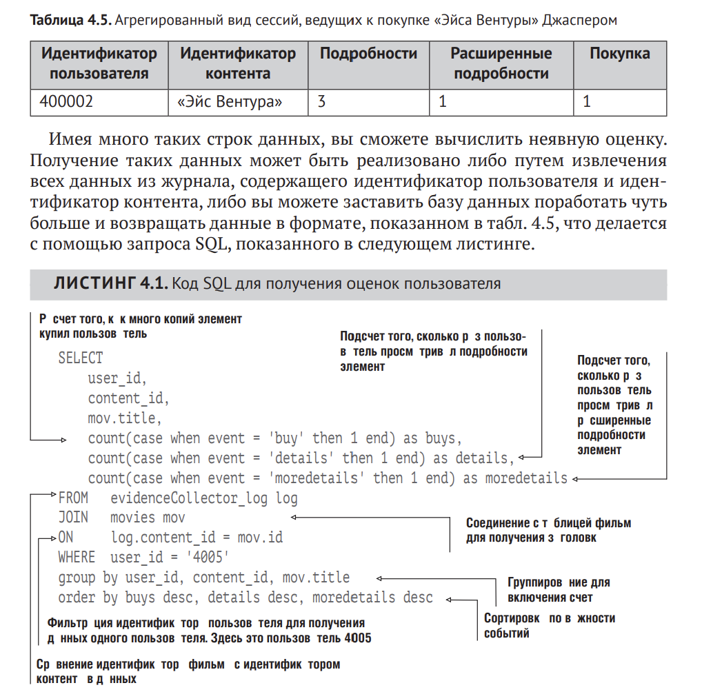


**Расчет неявных оценок**

Теперь мы можем подсчитать оценкупо формуле

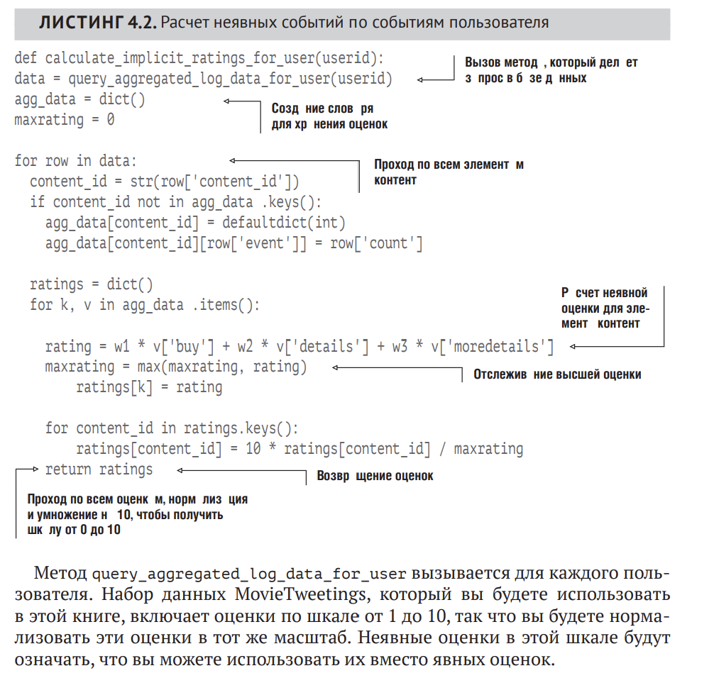

**Отображение результата**

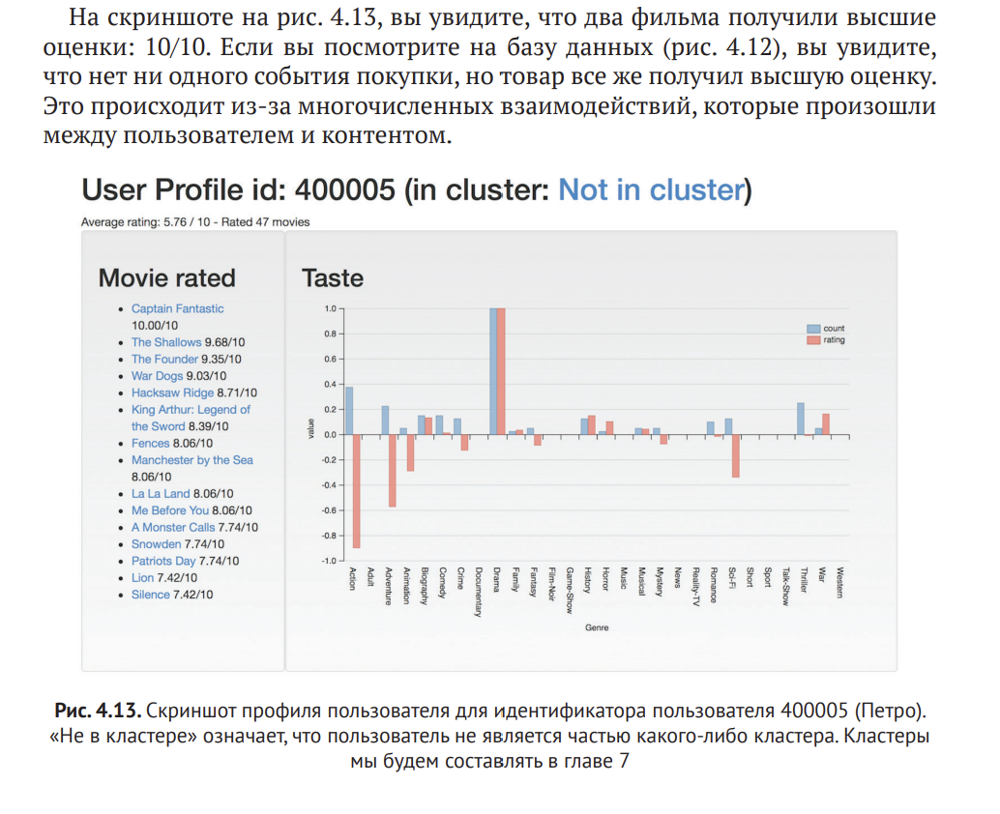

При использовании неявных оценок, как те, которые описаны здесь, 
вы  должны принять во внимание тот факт, что пользователь не  потреблял многие элементы, для которых стоят оценки. В результате некупленные элементы могут быть включены в рекомендации. Но так как пользователь, который смотрел элемент, до сих пор не купил его, вы, вероятно, не будете включать его в рекомендациях.

## 4.6.1. Добавления учета времени

Функция времени затухания, которую мы собираемся реализовать, использует следующую формулу

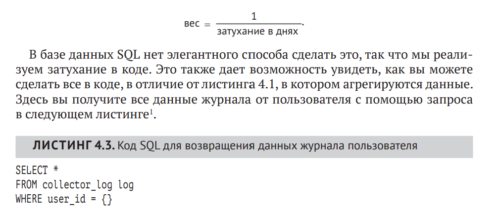

Есть две причины использования дней вместо секунд. Во-первых, вы хотите, чтобы все события, которые происходили в один день, считались одним и тем же, потому что фильмы не покупаются по несколько раз в день. Во-вторых, вы хотите реализовать медленное затухание. Если мы используем дни, вес событий, произошедших за неделю, уменьшится только на одну седьмую. Музыкальные стриминговые сайты вроде Spotify, возможно, уделяют большее внимание последнему часу или даже последним 10 мин.

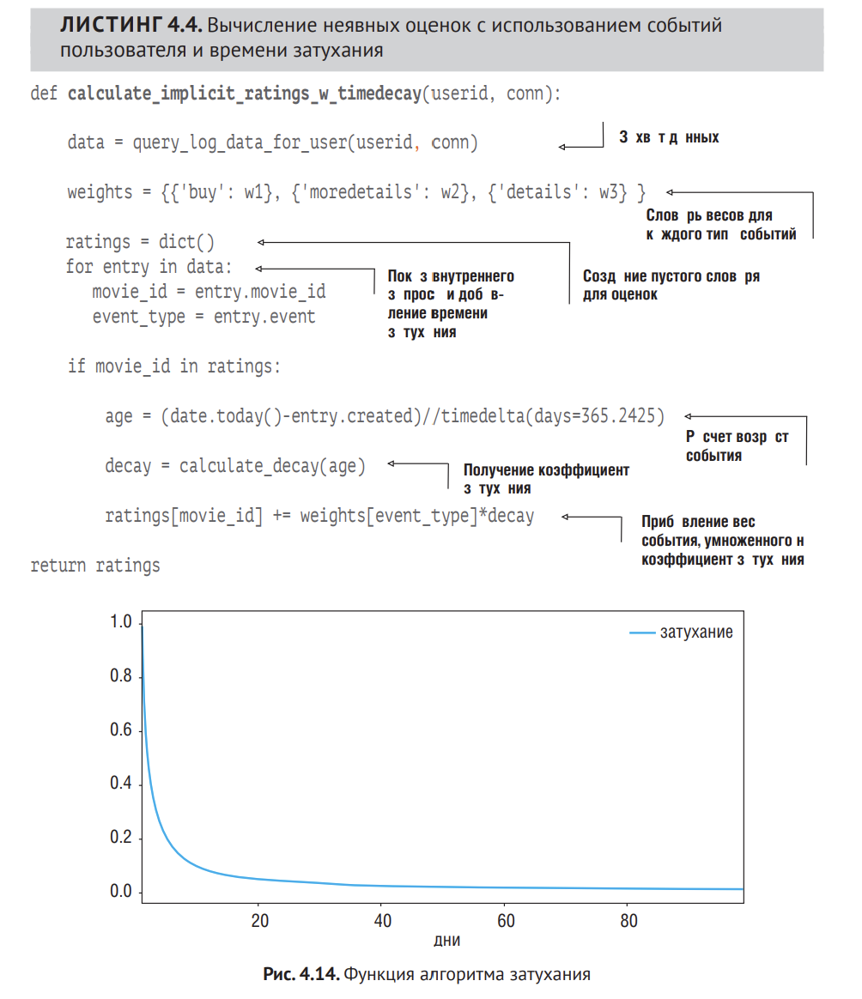

```
def calculate_decay(age_in_days):
    return 1 / age_in_days
```

# 4.7. Более редкие элементы имеют большую ценность

То, что не использует большая часть людей, но нравится пользователю должно иметь более весомую ценность для нас

1. Давайте определим функцию. Эта проблема связана с хорошо известной проблемой **частоты термина-обратной частоты документа (TF-IDF)**. Она часто используется поисковыми системами в качестве инструмента для ранжирования значения свободного документа при заданном запросе пользователя. Вы можете считать это беззапросным поиском, в котором вы хотите увеличить ценность особенных элементов. Чтобы понять, какие элементы контента считать особенным, вам понадобится IDF. Идея заключается в том, что, если пользователь покупает популярный элемент, это дает мало информации о вкусе пользователя. Если же пользователю нравится что-то особенное, это может быть лучшим показателм личного вкуса.

Эта функция может быть вычислена несколькими способами. Я покажу более ценный. Чтобы найти особенные элементы, вы можете вычислить обратную частоту пользователя (iuf):

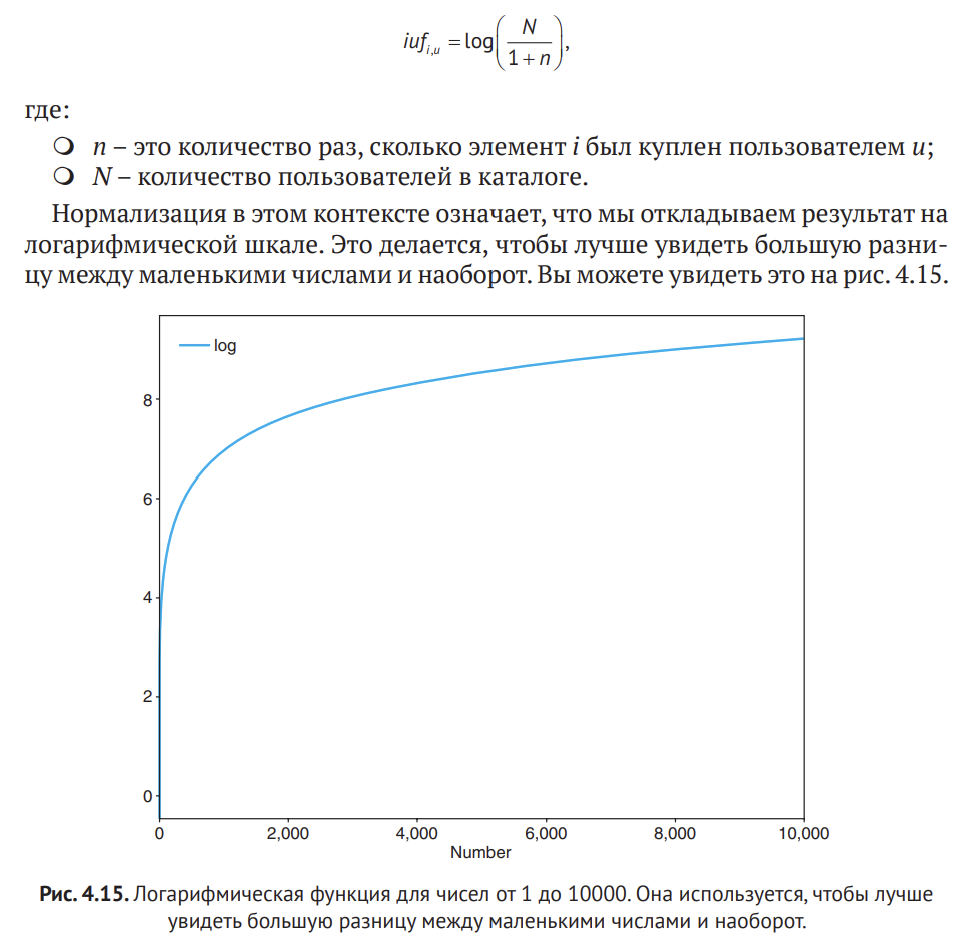

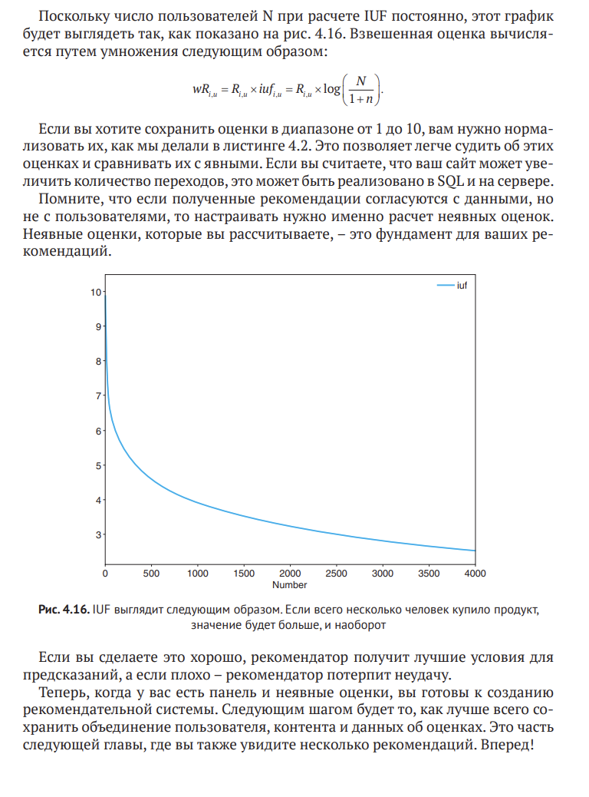

# Резюме

1. Матрица пользователь-элемент является форматом данных для рекомендательных алгоритмов. Вы можете заполнить ее явным и неявными оценками или путем указания того, какие элементы были потреблены пользователей в бинарной матрице

2. Оценка - это клей, который соединяет пользователя с элементом. Она либо может быть введена вручную пользователем, либо рассчитываться на основе поведения пользователя.

3. Алгоритм времени затухания учитывает, что не вся информация в равном степени важна: старые доказательства менее важны, потому что люди имеют свойство менять свои вкусы

4. Следует использовать обратную частоту, поскольку взаимодействие с менее популярными элементами дает более подробную информацию о пользователе, которые взаимодействует с популярными элементами.