# Неперсолизированные рекомендации

**Неперсонализированные рекомендации** – это, как правило, то, с чего большинство сайтов начинают, потому что реализовать их легко и не требуется знать что-либо конкретное о пользователях. Неперсонализированные рекомендации хороши, потому что вы всегда можете показать их, несмотря на то, как мало вы знаете о пользователях. Кто-то может сказать, что такие рекомендации годятся только до тех пор, пока система мало знает о пользователе. Но помните, что люди подобны стаду, и многим достаточно будет просто самых популярных элементов.

**Графики** - о простые рекомендации, основанные на 
статистических данных, например о том, какого контента было продано больше. Графики позволяют упорядочить данные.

**Во второй части этой главы мы рассмотрим**, что люди кладут в корзину, и создадим рекомендации типа «люди, которые купили X, также купили Y», используя так называемые *множества элементов* или же *частотные множества*.

# 5.1. Что такое неперсонализированные рекомендации?

## 5.1.1. Что такое реклама?

Сделка дня на сайте Manning, показанная на рис.  5.1, является рекламой. Это не делает ее плохой, ведь реклама – это то, что продавец хочет показать пользователям, и иногда пользователям она интересна. Но с этим вы, как владелец сайта, должны обращаться с осторожностью, потому что плохая реклама оставит вас без посетителей.

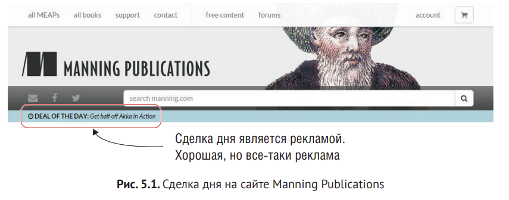

**Часто реклама** - это попытка продавца убедить пользователя в  том, что у него есть что-то хорошее или дешевое (даже если это не так), в то время как **рекомендация** – это то, чего хочет сам пользователь.

На самом деле многие сайты сделали бизнес, рекомендуя дешевые вещи. Лично я иду искать что-то, что мне нужно, в то время как сайты с купонами типа cupon.com (рис. 5.2) предназначены для людей, которые не знают, чего хотят.

На cupon.com используются неперсонализированные рекомендации. 
В верхней части перечислены самые популярные категории и бренды. В центральной части экрана содержится список ваучеров, позволяющих сэкономить деньги. **А именно это часто то, чего хочет пользователь!**

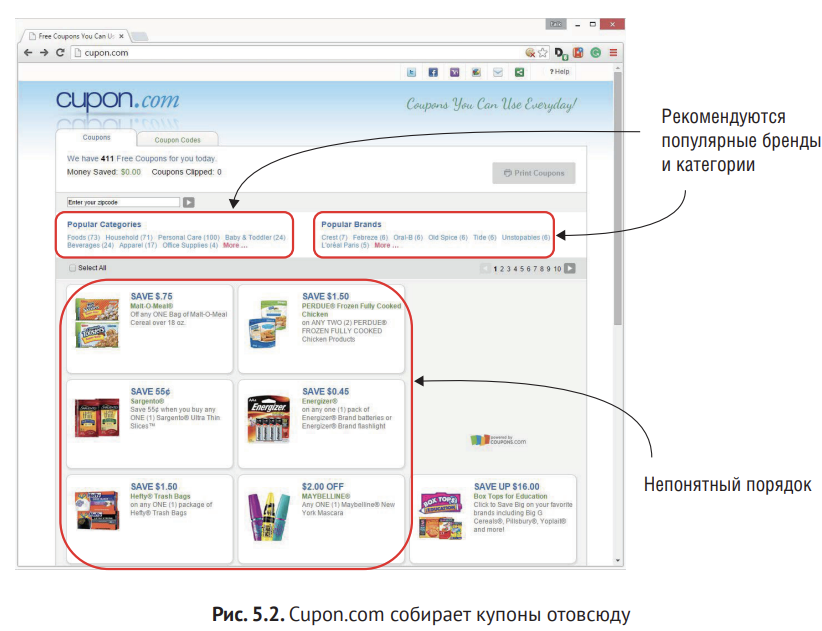

## 5.1.2. Что такое рекомендация?

Рекомендация, персонализированная или нет, основывается на данных 
и рассчитывается из них. Чтобы это определение не было слишком мутным, мы ограничим его компьютерным расчетом данных. Это означает, что популярные категории в cupon.com являются плодом рекомендаций (по категориям). Перед тем как начать расчет, давайте посмотрим на примеры того, что сайт может сделать, если у него нет никаких данных


# 5.2. Как сделать рекомендации, когда у вас нет данных

Можно отобразить недавние данные (недавние фильмы) или наобот давние (магазин антиквариата).

## 5.2.1. Топ-10: диаграмма элементов

Можно отобразить топ-10 (что покупали, смотретли, слушали больше всего), но всех он не удовлетворит, поэтому рекомендатор дааст все же лучший результат.

**Диаграмма - это неперсонализированная информация**

## 5.3. Реализация диаграмм и основа для рекомендатора

### 5.3.1. Компонент рекомендательной системы

Рекомендательная система может быть построена по-разному в зависимости от того, сколько рекомендаций нужно вывести, от объемов каталога контента и количества посетителей.

Решение для сайта MovieGEEKs состоит из двух компоненетов и БД. Первый компонент, *конструктор*, выполняет все предварительные расчеты (обучение), необходимые для вывода рекомендаций, в том время как второй компонент ориентирован на рекомендации. Причина в необходимости компонента *конструктора* заключается в том, что для большинства рекомендаций нужно много вычислений, а это требует времени, которого у нас нет, ведь пользователь ждет загрузки страницы. 

**Цель большинства рекомендательных алгоритмов** - вычислить как можно больше, чтобы сделать работу в режиме реального времени как можно быстрее.

Рекомендательные алгоритмы разделяются на алгоритмы на основе памяти и на основе модели.

**На основе памяти** означает, что рекомендатор получает доступ к данным журнала в режиме реального времени.

**На основе модели** - алгоритм агрегирует данные заранее, что делает его более отзывчивым.

Опыт показывает, что алгоритмы на основе памяти работают только до определенной точки, посколько при большом количестве просмотров поддерживать работу сервера трудно.

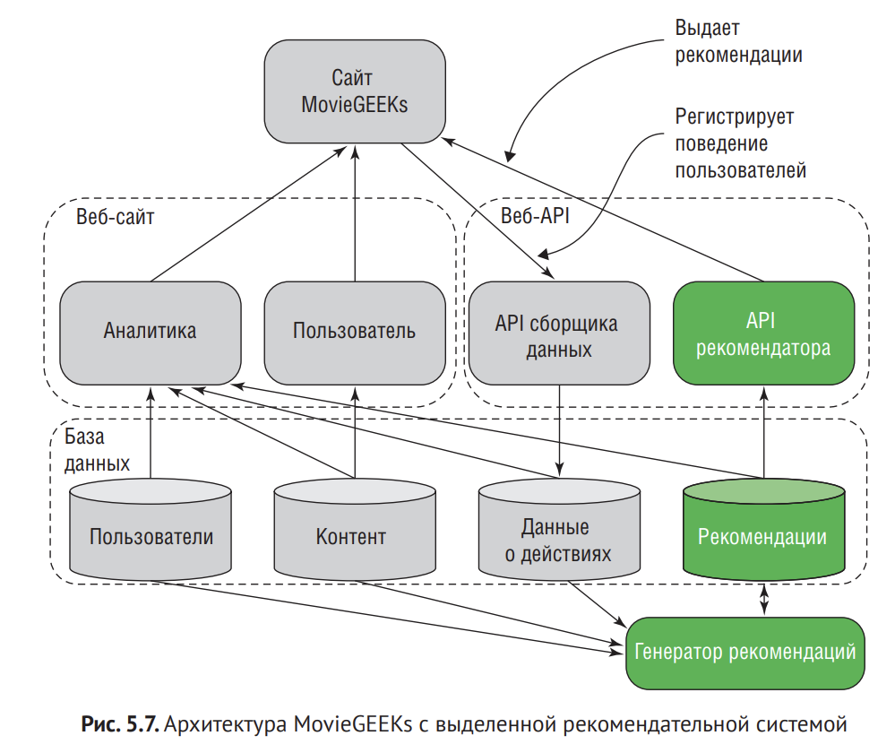

API рекомендатора обрабатывает запросы с веб-сайта. База данных рекомендаций содержит расчетные рекомендации. Конструктор рекомендаций - компонент, которые создает модели и в некоторых из алгоритмов выполняет расчет рекомендаций и сохраняет их в базе данных.

### 5.3.3. Рекомендательная система

*Рекомендательная система* - это приложенеи, которому требуется доступ ко всем вашим данным в зависимости от того, какого типа рекомендации нужно производить. Часто у сайтов рекомендатор обособлен от остального сайта, и на всякий случай используется резервный рекомендатор, которые будет продолжать предоставлять данные, если рекомендательная система сломается.

### 5.3.4. Добавление диаграмма на MovieGEEKs

Нужно подсчитать сколько раз был куплен каждый элемент, и отложить на графике (топ-10) эту информацию.

```
SELECT content_id, mov.title, count(*) as sold
from collector_log as log
join moviegeeks_movie as mov
on log.content_id = mov.movie_id
WHERE event like "buy"
GROUP BY content_id, mov.title
ORDER BY sold desc
LIMIT 10
```

Можно делать такой скрипт раз в день и складывать в кэш

# ИНСТРУКЦИЯ

Мы запрашиваете файл журнала, который будет пустым, если вы недавно загрузили код. Но  если вы запустите сценарий moviegeek/populate_logs.py в корневом каталоге, он сгенерирует для вас данные журнала. Этот сценарий более подробно описан в главе 4

Чтобы увидеть результат работы метода, введите URL-адрес localhost:8000/recs/chart в адресной строке браузера.

### 5.3.5. Заставим контент выглядеть более привлекательно

Можно сохранить в бд контекст: например, сохранить когда садовые приборы используются (время года) и выдавать результата, отсортированный по сезонному использованию.

**Теперь настало время посмотреть на более конкретные рекомендации**

## 5.4. Выборочные рекомендации

Многие сайты берут какой-то элемент и выводят в рекомендации связанные элементы. Эти элементы можно назвать сидами.

**Идея состоит в том,** что отобранные рекомендации могут быть элементом, продуктом или позицией, которые вы затем используете в качестве входных данных, чтобы найти связанный контент. Вы можете использовать покупаемые вместе элементы, а для того, чтобы понять, как люди покупают вместе, нужно изучить данные.

Одним из самых известных выборочных рекомендаций является раздел **Часто покупают вместе (BFT)**, который есть и на Amazon и почти в любом интернет магазине. Создание таких ассоциаций между элементами назыается *анализом родства* или привычнее *анализом корзины покупок*. 

### 5.4.1. Часто покупаемые элементы, похожие на тот, который вы просматриваете

Одна из проблем FBT-рекомендаций  заключается в том, что большинство продуктов покупается вместе с другими популярными элентами. **Классический пример:** у большинства людей в супермаркете в Дании в корзине будет литр молока почти независимо от того, что еще находится в корзине. То есть связи между продуктами особо нет.

Это дает список с частотой покупки, где будет молоко и большинство других продуктов. Когда два или более элементов часто оказываются в таких списках вместе, это называется **частотным набором.**

### 5.4.2. Ассоциативные правила

*Ассоциативные правила* можно рассматривать, как благонамеренные советы. Большинство людей будет недовольны, вернувшись домой с новым жестким диском и осознав, что у них нет кабеля для его подключения.

Давайте немного подумаем о том, как получить эти ассоциативные правила.

Ниже приведен список чеков из супермаркета. **Давайте представим**, что у вас есть супермаркет, в котором продается всего 5 продуктов: *молоко, финики, йогурт, морковь и хлеб*. Когда речь идет о правилах ассоциации, они как правило называются *элементами*.

1. {хлеб, йогурт}
2. {молоко, хлеб, морковь}
3. {хлеб, морковь}
4. {хлеб, молоко}
5. {молоко, финики, морковь}
6. {молоко, финики, йогурт, хлеб}

Чтобы соствить правила ассоциации, нужно посмотреть на элементы, которые преобретались вместе. Молоко покупалось в каждом чеке, эта информация не ценная.

Вам нужно найти элементы, которые всегда покупаются вместе, но не покупаются со всем остальным. Любое подмножество элементов списка назыается *множеством элементов*.

Хлеб и молоко образуют множество {хлеб, молоко}, и такое множество присутствует в трех транзакциях из шести. **Это говорит о том**, что стоит рекомендовать молоко, когда есть хлеб в корзине.

**Определим** некоторые цифры, которые позволяют легче решить, появилось ли у нас правило или это просто совпадение. Проблема множества в трех из шести заключается в том, что хлеб присутствует почти везде. Чтобы принять это во внимание, мы определим *уверенность* как количество сделок, в которых множество элементов делится на общее количество раз, когда присутствует элемент.

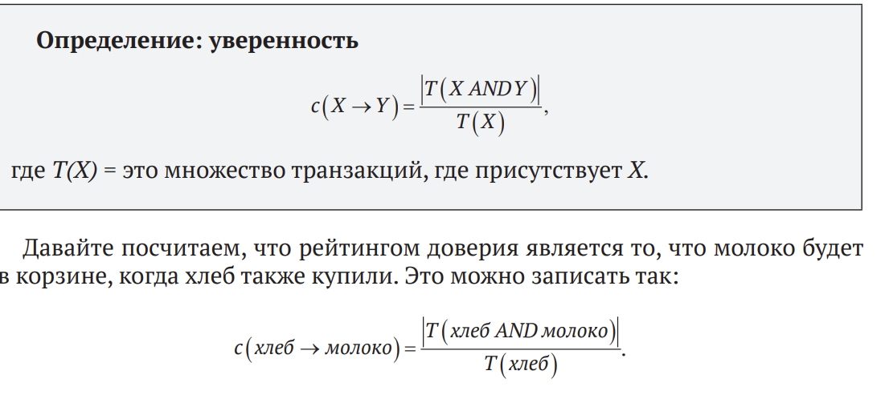

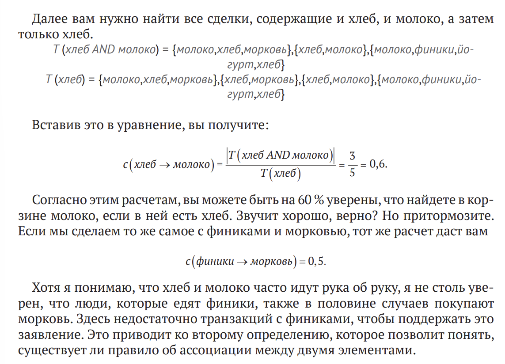

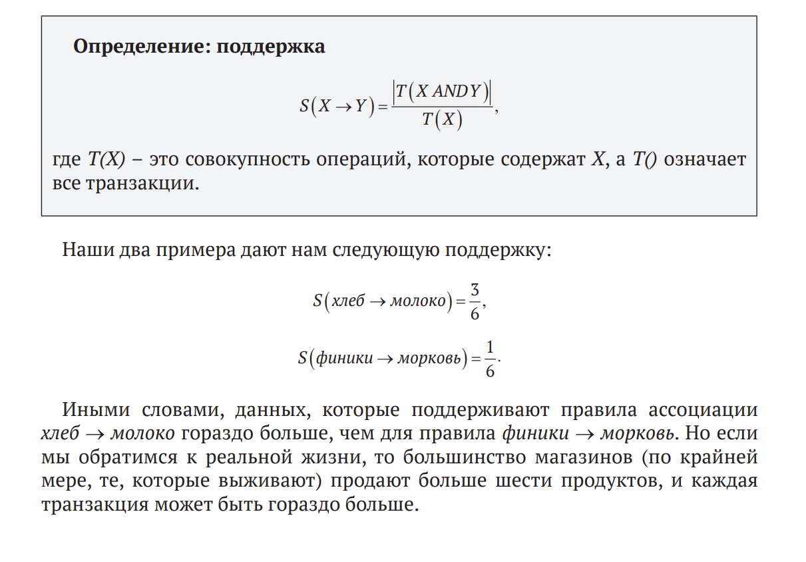

Для поиска ассоциативных правил вам в первую очередь необходимо найти частотные множества. На рис. 5.14 показаны возможные множества, которые могут появиться, если у вас есть множества из четырех элементов { молоко, масло, финики, хлеб }

Опять же, это простой пример, но, чтобы объяснить, как как все это реализуется, нам нужна схема (рис. 5.14).


Начнем с изучения множеств из одного элемента, чтобы увидеть, как часто они появляются. Если вы обнаружили, что мало почти всегда отсутствует в наборе, то вы знаете, что можно вычеркивать все правила, которые содержат масло. Черные узлы на рис. 5.16 показывают, какие элементы можно удалить из списка, так как масло покупают редко. Имя это в виду, посмотрим на реализацию в следующем разделе.

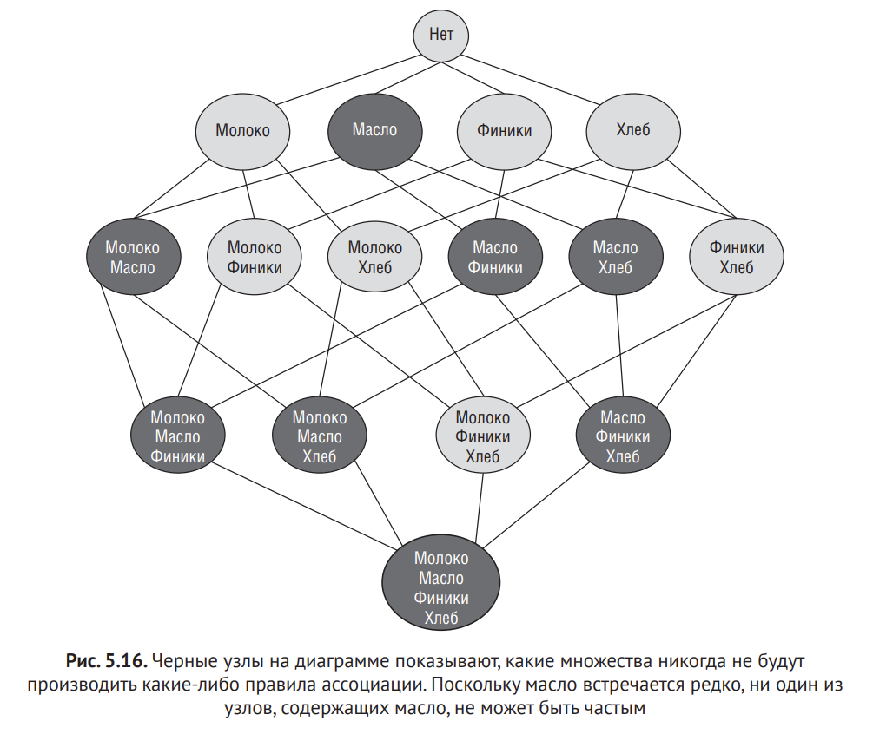

### 5.4.3. Реализация ассоциативных правил

Процедура, описанная в предыдущем разделе, выглядит примерно так:

1. Выбор на минимальной поддержке и минимальном уровне уверенности.
2. Получение всех транзакций.
3. Создание списка множеств, по одному для каждого элемента, вычисление их поддержки (количество присутствий на количество сделок) и установка уверенности на уровень 1.
4. Создание списка множеств, содержащих более одного элемента, вычисление поддержки и уверенности так, чтобы каждая сделка вносила вклад в поддержку элемента.
5. Перебор множеств данных и  удаление недостаточно «доверенных» 
множеств.

### Получение всех сделок

На сайте MovieGEEKs нет понятия корзины, так что вместо этого мы будем считать покупки, которые произошли в одной сессии, транзакциями. Вы получите ваши транзакции из журнала, поэтому сначала нужно извлечь события покупок из базы данных, а затем выстроить транзакции на основе идентификатора сессии, как показано на рис. 5.17.

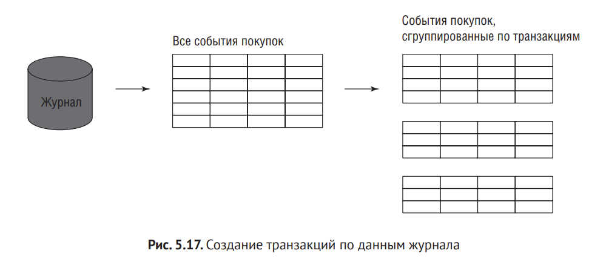

Чтобы выбрать все транзакции из вашего журнала, выберите все записи, которые содержат события покупок.

```
def retrieve_buy_events():
    sql = """
    sql = """
    SELECT *
    FROM Collector_log
    WHERE event = 'buy'
    ORDER BY session_id, content_id
    """
    cursor = data_helper.get_query_cursor(sql)
    data = data_helper.dictfetchall(cursor)

    return data
```

Теперь нужно сгруппировать все события покупок в сделки. Чтобы сделать это, нужно подать данные в метод generate_transactions, как показано в листинге 5.7. Этот метод работает с данными и собирает все транзакции в словарь, который содержит идентификатор транзакции в качестве ключа и несколько идентификаторов сессий для транзакций.

```
def generate_transactions(data):
    transactions = dict()

    for trans_item in data:
        id = trans_item["session_id"]
        if id not in transactions:
            transactions[id] = []
        transactions[id].append(trans_item["content_id"])

    return transactions
```

### Извлечение всех множеств элементов размера 1 и вычисление поддержки

Теперь можно вычислить частотные множества. Способ, показанный в листинге 5.8, позволяет легко представить, что происходит.

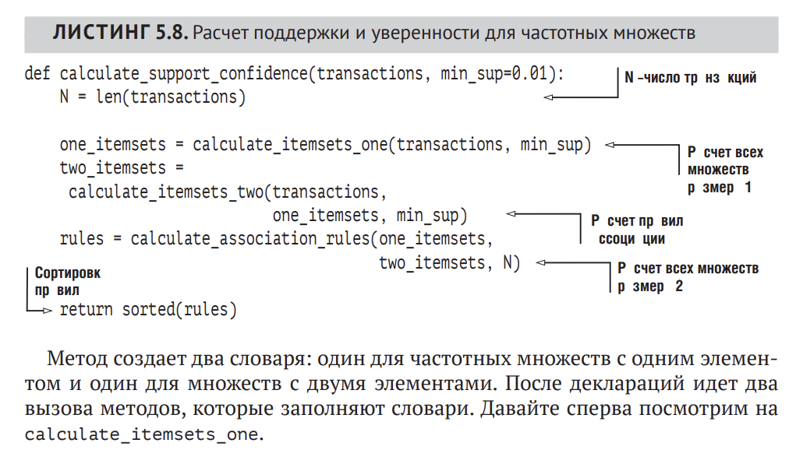

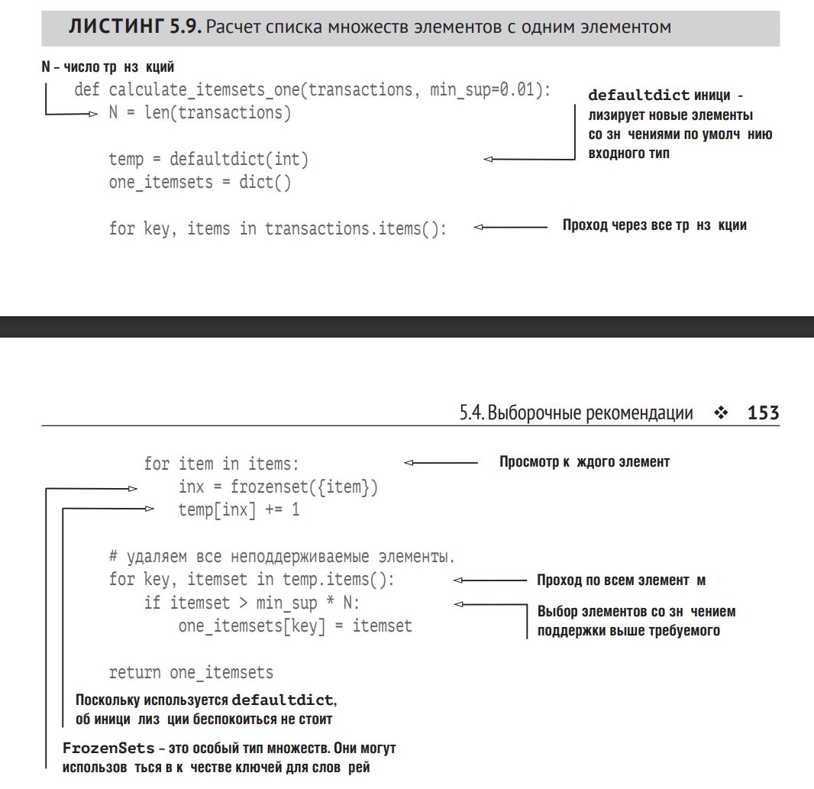

Когда все будет готово, множества с одним элементом (как в листинге 5.9) подаются в этот метод, который вычисляет множества элементов с уверенностью и с поддержкой, превышающей некоторое минимальное значение. В листинге 5.10 показан расчет для множеств с двумя элементами

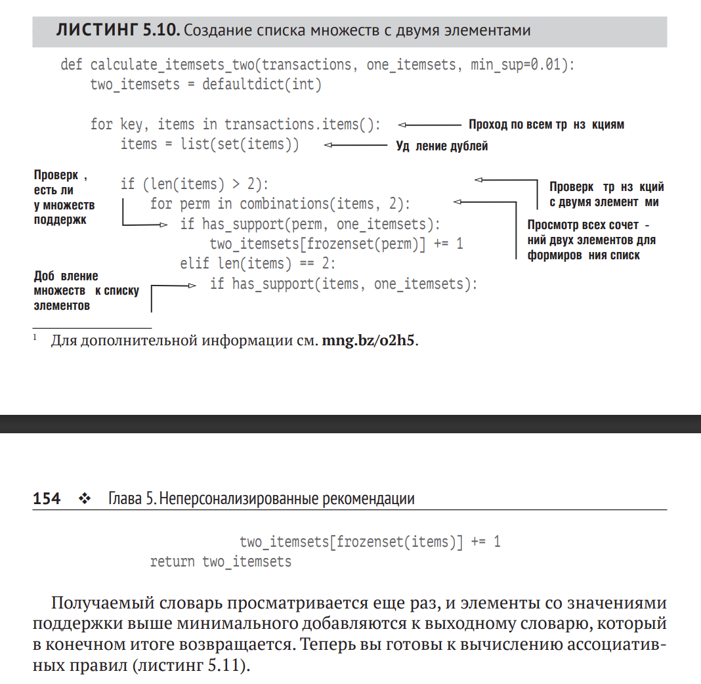

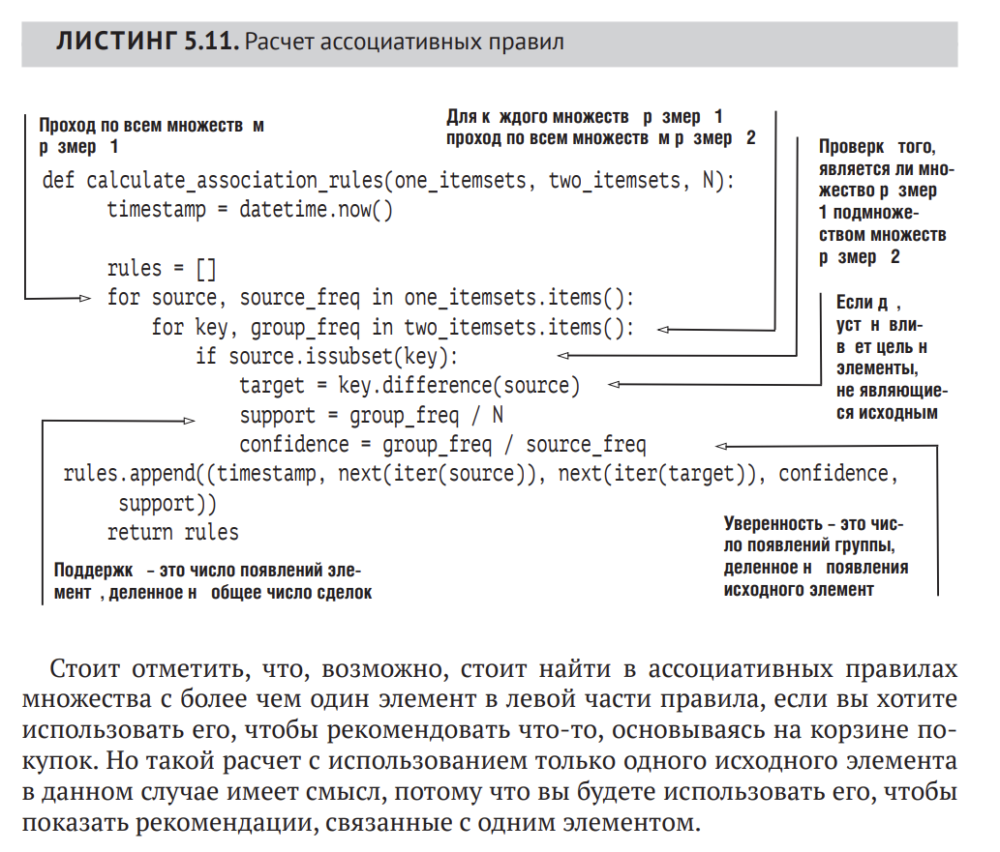

### 5.4.4. Сохранение ассоциативных правил в БД

Можно автономно вычислять ассоциативные правила, а затем как-то быстро извлекать их. Но ассоциативные правила нужно обновлять, и их обновление не должно нарушать работу.

Можете ли вы сохранять ассоциативные правила в одной таблице? Тут есть свои проблемы. Давайте сделаем шаг назад, чтобы вы успели за мыслью. Ваши пользователи щелкают по подробной информации о фильмах, что создает запрос в таблицу правил. Это также происходит в момент, когда система добавляет новые правила. Для того чтобы избежать проблем при сохранении новых правил, вам нужен маркер, который показывает, какие правила нужно извлекать

**Можно вести таблицу версий**. Она гарантирует, что система не будет смешивать различные версии правил. В таблице версий содержится строка для каждой полной версии правил. Это означает, что вы не можете запросить правила ассоциации напрямую, но можете присоединиться к ним через таблицу, как показано в листинге 5.12.

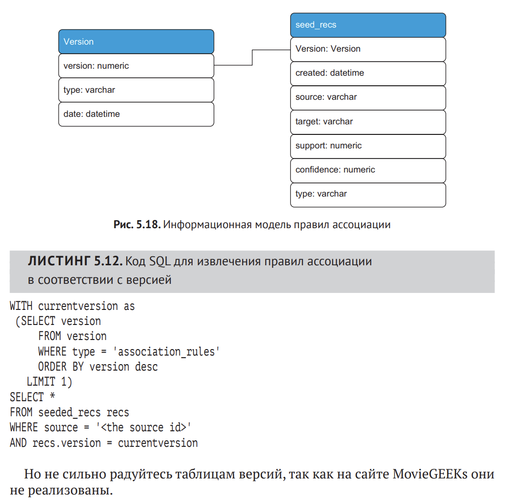


### 5.4.5. Запуск калькулятора ассоциаций


# ИНСТРУКЦИЯ
Для запуска калькулятора ассоциаций вам сначала нужно создать записи журнала, о  которых мы говорили в  главе 4 (запустив файл populate_logs.py). Затем можете запустить код, приведенный в следующем листинге.

**Расчет ассоциативных правил**

```
python –m builder.association_rules_calculator
```

Этот код создает ассоциативные правила и сохраняет их в базе данных. Здесь вам нужно понимать, как работают и реализуются ассоциативные правила.

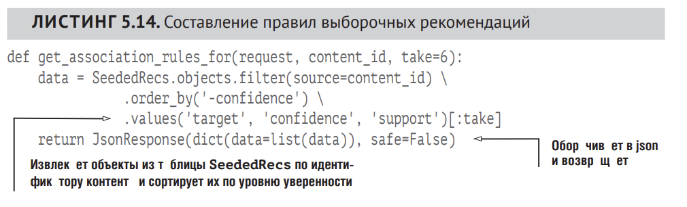

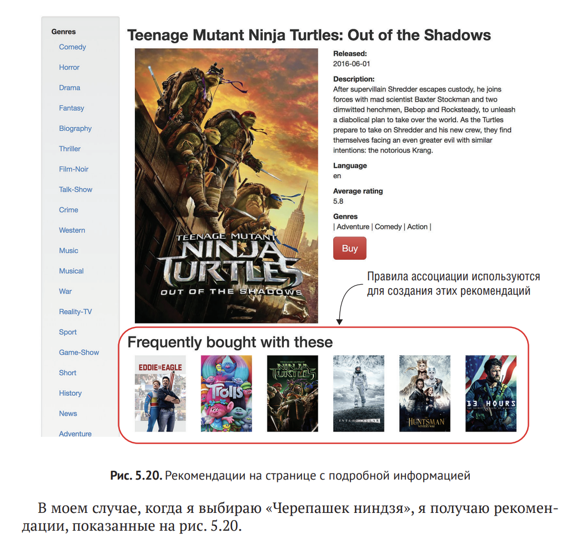

### 5.4.6. Использование различных событий для создания ассоциативных правил

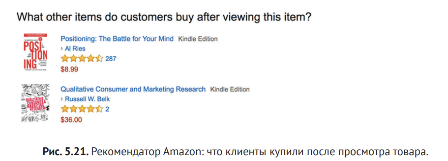

Читая книгу "Online Consumer Behavior" Анжелины Клоуз, автор наткнулся на еще один тип рекомендаций на Amazon.

Он думает, что эта рекомендация оказывает книге медвежью услугу, потому что возникает ощущение, что люди искали книгу, а купили что-то другое.

Однако здесь показан способ усилить ваши ассоциативные правила. Даже если не так много людей купили эту книгу, вы по-прежнему можете создавать ассоциативные правила путем определения всех сессий, где клиент просматривал книгу, а затем взглянуть на то, что клиент в конце концов купил.

Затем, когда вы рассчитаете все частотные множества, вы сможете вычислить правила и использовать их в качестве рекомендаций.

# Резюме

1. Графики - это круто, и их легко добавить. Вы можете построить данные разными способами, а не только путем подсчета того, что покупалось наиболее часто

2. Лучше не отображать неупорядоченный контент. Контент должен быть отсортирован для удобства пользователей по вашему разумению. Для фильмов и книг это может быть сортировка по дате выпуска, а для купонов - по размеру скидки.

3. Ассоциативные правила позволяют анализировать, что покупается вместе, и используется для формирования FBT-рекомендаций. Полезность правила рассчитывается с учетом значение поддержки и уверенности.

4. Рекомендации стоит хранить в базе данных. Это позволяет добиться от системы более быстрой реакции. С другой стороны, их вычисление отнимает много времени, и они занимают место.

5. Добавление номера версии к рекомендациям в базе данных позволяет одновременно иметь несколько версий базы, а это значит, что вы можете иметь версию для реальной работы, а другую на будущее. Но что еще более важно, если что-то случится с рекомендациями, которые вы в данный момент используете, вы сможете вернуться к более старой версии.