# "Холодные" пользователи и контент

## 6.1. Что такое холодный старт?

Постоянные потребители идеальны, и их нужно поддерживать счастливыми, но добавление новых – совсем другое.

Эта проблема настолько велика, что у нее есть название – **холодный старт**.

Термин касается не только генерации рекомендаций для новых пользователей, но и введения новых элементов в каталог. Новые элементы не будут отображаться в неперсонализированных рекомендациях, потому что им не хватает популярности, чтобы войти в статистику продаж, и они не будут появляться в персонализированных рекомендациях, потому что система не знает, как эти элементы связаны с другими.

В этой же связи вводятся **серые овцы**. Это пользователи, у  которых столь изощренные индивидуальные вкусы, что даже при наличии данных не найдется других пользователей, которые купили бы что-то подобное.

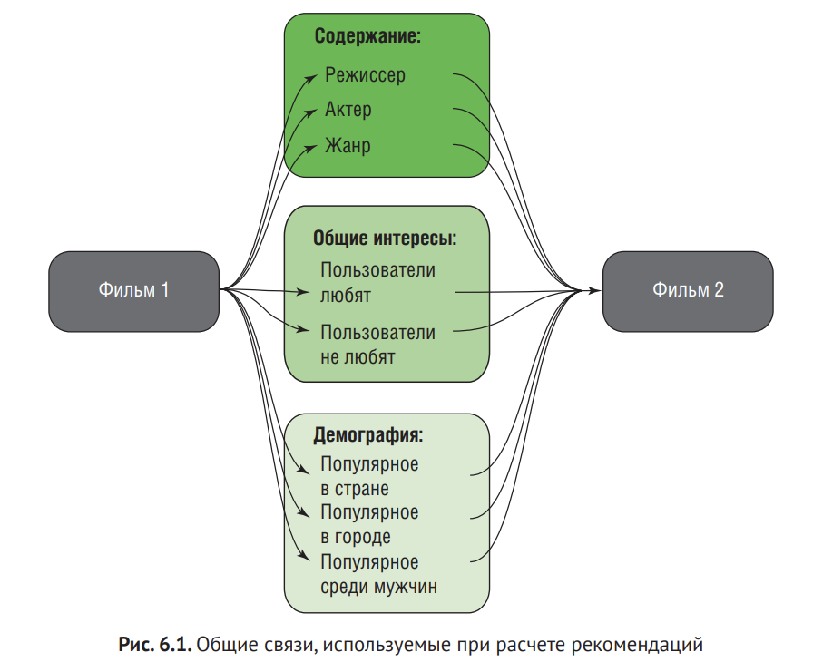

На рис. 6.1 показаны наиболее распространенные связи, используемые при расчете рекомендаций.

На рисунке показано, что если пользователь высоко оценил фильм #1, то при наличии одной из этих связей вы можете порекомендовать фильм #2. Если таких связей нет, придется как-то придумывать, что рекомендовать.

К счастью, это происходит только тогда, когда у вас появляются новые пользователи, которые еще не связаны с контентом (ничего не оценили и не купили). И, как вы увидите, пользователи с уникальными вкусами создают примерно те же проблемы.

### 6.1.1. Холодные товары

Каталогу товаров необязательно быть большим, чтобы новый контент мог затеряться как иголка в стоге сена. Поэтому крайне важно прикладывать дополнительные усилия, прежде чем привнести что-то новое. В  большинстве случаев добавление нового контента должно сопровождаться ручным процессом продвижения элемента, например отправкой электронной почты пользователям с похожими интересами.

Самый простой способ заставить посетителя заметить новый контент – это добавить место на странице, где он будет выводиться. Большинство людей любят что-то новенькое. У  Netflix есть отдельное место для демонстрации вновь прибывшего контента.

Другой способ продвинуть новый контент – это заставить его выглядеть популярным и выводить его в ваших рекомендациях. Тогда, если он не будет потребляться, его можно спускать вниз.

### 6.1.2. Холодный посетитель

Многие научные работы говорят, что нельзя рассчитать рекомендации 
до того, как пользователь оценит хотя бы 20–50 элементов. В нормальной ситуации клиент ожидает, что сайт начнет рекомендовать ему что-то задолго до этого

Некоторые сайты просят вас оценить пять элементов, прежде чем начать работу. Но для большинства сайтов это не вариант.

На рис.  6.3 показан мой поиск по LinkedIn. И тут же, в  верхнем углу, где обычно и бывает, – кнопка **Create Job Alert**. Такие элементы могут дать хорошие данные относительно того, что пользователь хочет, и этого может быть достаточно, чтобы классифицировать одну или две группы контента, которые могут иметь отношение к пользователю.

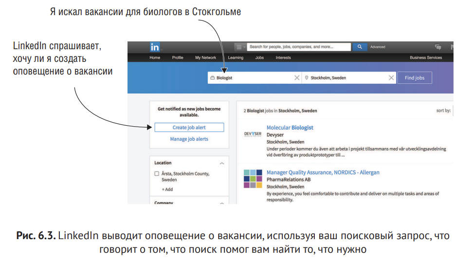


**Например**, представьте, что Сара заходит на MovieGEEKs и ее предпочтения в фильмах примерно такие: экшн: 20 %; драма: 20 % и комедии: 60 %, но оценок она еще не ставила. Сегодня она знает, чего хочет, и открывает жанр Драма и покупает фильм. Система знает, что Сара любит драмы, но не знает, насколько. Если 
рекомендатор предположит, что Сара смотрит только драмы, то он ошибется. Но, как уже упоминалось ранее, часто лучше слегка не угадать, чем вообще не рекомендовать ничего.

**Например**, Amazon будет в числе прочего показывать вам, что люди смотрят прямо сейчас. Реализовать это можно довольно быстро. Нужно просмотреть журнал и найти контент, который просматривался в последнюю минуту, час или день. Но есть и другие вещи, которые вы можете сделать. Даже зная что-то своих клиентах, вы все равно можете столкнуться с проблемой холодного старта. Мы называем это серыми овцами.

### 6.1.3. Серые овцы

*Серая овца* - это пользователь, который имеет настолько особенный вкус, что даже если о нем есть данные, то, скорее всего, нет или мало других потребителей, которые имели бы тот же вкус.

### 6.1.4. Посмотрим на примеры из реальной жизни

Возьмите фильм X, который никто не удосужился посмотреть. И тут приходит Сьюзен, которая, возможно, встретила кого-то, кто в течение двух минут играл в массовке фильма X, и именно эти две минуты она хочет посмотреть. 

Она болтала с этим человеком в интернете, хочет получить фильм и заходит на сайт фильма. В этом случае Сьюзен, вероятно, не нужны другие подобные фильмы, и рекомендовать ей что-то было бы ошибкой.

Сюзен создает нам **проблемы**: система будет тратить силы на поиск подобия, но не найдет его, и если, Сюзен потом купит что-то более популярное, внезапно образуется связь между популярным фильмом и тем, что было когда-то куплено одним пользователем.

Это может в  конечном итоге заставить ваш рекомендатор начать рекомендовать фильм X тем, кому нравится тот самый более популярный фильм. 

Только после того, как пользователь сгенерирует больше данных, вы поймете, что фильм Х попал сюда случайно и его надо было игнорировать. Это не проблема, когда мы говорим о правилах ассоциации, но, когда мы говорим о совместной фильтрации, это может стать проблемой.

### Пример серых овец и холодных продуктов

Рассмотрим сайт **Redbubble**.

Redbubble – это место, где художники могут демонстрировать и продавать искусство во многих формах – от граффити до футболок. 
Имея каталог контента, содержащий миллионы произведений искусства, и клиентов со всего мира, Redbubble может похвастаться большим количеством таких «овец».

Искусство трудно классифицировать, поэтому трудно сказать, что понравится пользователю. Добавим сюда факт, что большинство элементов продается всего несколько раз, в результате чего становится трудно рекомендовать вещи даже старым клиентам

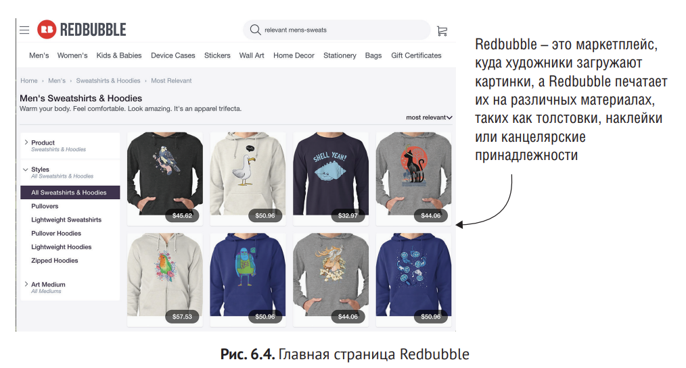

Большинство продуктов Redbubble остается холодным, потому что мало человек покупает каждый продукт. Соответственно, связей между элементами нет. Клиенты, которые покупают на Redbubble, легко могут быть серыми овцами, а это означает, что они купили вещи, которые не были приобретены другими людьми

Redbubble имеет ту же проблему, как новостные сайты, такие как Goggle новости, видеохостинги или журналы, как Issuu (приложение YouTube Для журналов).

Художники, кинематографисты или издатели журналов добавляют **контент без описаний (например, жанр, теги и т. д.)**. Когда они добавляют информацию в виде тегов, люди интерпретируют значение тега по-разному. Но Redbubble особенно интересен тем, что поставить тег на элементы искусства сложно.

### Что вы можете сделать с холодным стартом?

Многие из решений проблемы холодного старта (пользователи, продукты и серые овцы) являются одним из алгоритмов, которые вы будете изучать в следующих главах, так что это мы рассмотрим. Например, холодный элемент лучше всего обрабатывается с помощью фильтрации на основе контента, которую мы рассмотрим в главе 10. А пока я буду откладывать любые попытки решить эту проблему.

## 6.2. Отслеживание посетителей

К сожалению, большинство пользователей неуловимы. Они, как правило, заходят на сайты без авторизации, с разных устройств из разных мест, так что иногда сайту сложно узнавать постоянных клиентов. Это печально, потому что сайту нужно отличать новых пользователей от старых. Вы должны отслеживать пользователей – и новых, и старых, – чтобы понять их поведение.

### 6.2.1. Анонимные пользователи

Надо дать понять человеку, какие преимущества ему даются при вторизации. Но надо уметь хранить информацию о незарестрированных пользователях, на случай если они вернутся.

Можно хранить информацию в куки, но как только пользователь поменяет устройство - мы потеряем всю инфу о нем.

Django разрешает анонимные сессии: это сессии, где вы можете загрузить куки, даже если пользователь не добавил информации в систему. Структура сессии позволяет хранить и получать произвольные данные для каждого посетителя сайта. Он хранит данные на стороне сервера и абстрагирует отправку 
и получение куки.

## 6.3. Решение проблемы холодного старта алгоритмами

### 6.3.1. Использование ассоциативных правил для создание рекомендаций для холодных пользователей

Мы вернемся назад и используем ассоциативные правила в сочетании с данными о новом пользователе (которых мало), а именно данных о его просмотрах. Затем вы используете их в качестве сидов, чтобы найти соответствующие правила, и из этих правил можно произвести рекомендации.

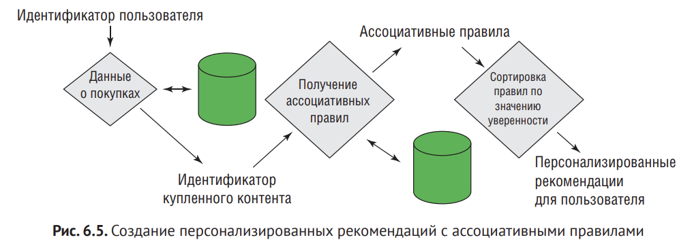

Система может запуститься, когда пользователь просмотрит первый элемент, что может произойти в первой сессии. Когда количество посещений увеличивается, данные могут стать все более и более ограничены, как показано в табл. 6.1.

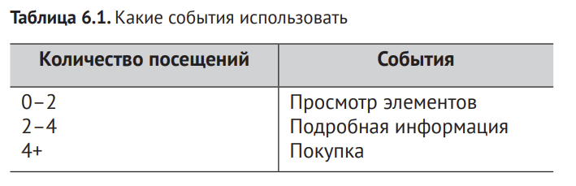

Вы также могли бы определить их иначе, извлекая только ассоциативные правила, основанные на более ценной информации. Что-то вроде:

1. получить все ассоциативные правила на основе покупок пользователя;

2. получить все ассоциативные правила на основе покупок и просмотров подробностей пользователя;

3. получить все ассоциативные правила, основанные на данных всех пользователя

**Средневзвешенное значение купленных товаров**

Когда пользователь покупает свой первый элемент, вы сможете использовать ассоциативные правила для предоставления рекомендаций на основе этого элемента. И по мере покупок вы сможете брать средневзвешенные значения ассоциативных правил. Давайте предположим, что пользователь купил хлеб и масло, а система уже имеет следующие правила:

```
хлеб => мармелад
хлеб => масло
хлеб => сыр горгонзола 
масло => мармелад
масло => мука 
яйцо => бекон
```

Затем, так как хлеб и масло были куплены, был бы следующий выбор:

```
хлеб => мармелад (и масло => мармелад) 
хлеб => сыр горгонзола
масло => мука
```

Масло также было куплено, так что вы должны добавить правило ```хлеб => масло```, но, так как масло уже куплено, это не добавит смысла. Если два правила указывают на одну цель, можно вычислить новое значение уверенности с использованием взвешенного среднего. Можно отсортировать их и взять лучшие, удалить дубликаты из списка и вернуть рекомендации. Если пользователь уже зарегистрирован, но для вас еще новый, так как у вас мало данных, вы можете также добавить веса к каждому из правил, основываясь на 
том, когда пользователь купил товар. Таким образом, более поздние покупки весят больше.

Чтобы рекомендации фильмов выглядели лучше, можно было бы добавить бизнес-правила. Это означает объединение знаний в  предметной области в систему, которую мы рассмотрим далее.

### 6.3.2. Использование знаний предметной области и бизнес правил

Иногда рекомендатор не может делать все за вас. Он не может понять, что показывать, когда люди покупают мультфильмы и фильмы ужасов. В конце концов возникают ассоциации. Те, кто покупают «Бэмби» и «Техасскую резню бензопилой», могут заставить систему рекомендовать детям кровавые ужастики!

Иногда рекомендатор не может делать все за вас. Он не может понять, что показывать, когда люди покупают мультфильмы и фильмы ужасов. В конце концов возникают ассоциации. Те, кто покупают «Бэмби» и «Техасскую резню бензопилой», могут заставить систему рекомендовать детям кровавые ужастики!

У вас есть несколько способов реализовать это. Обычно это делается путем вычисления списка из 100 рекомендаций (или 10), затем их фильтруют и берут топ-10 из оставшегося, как показано на рис. 6.6.

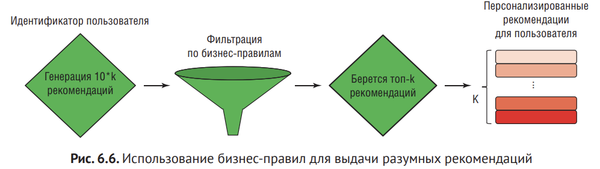

### 6.3.3. Использование сегментов

Нужно сгруппировать людей с похожими вкусами, чтобы можно было выяснить, какой тип людей какой любит контент.

Когда приходят новые посетители определенного типа, вы можете рекомендовать контент, популярный у этого сегмента. Это известно как **демографические рекомендации**. Многие люди говорят, что это не  работает, потому что люди слишком отличаются в своих демографических показаниях.

**Очевидные сегменты**

Местоположение, возраст, пол

**Неочевидные сегменты**

Группы типа «немка, которая любит по выходным боевики» или «американские подростки, покупающие фильмы ужасов во время учебы»

Кластерный анализ является менее субъективным способом поиска сегментов и может быть реализован с помощью машинного обучения без учителя. **Кластер** –это причудливое слово для группы с похожими признаками, поэтому мы постараемся найти конкретные типы пользователей, которые потребляют конкретный контент.

### 6.3.4. Использование категорий с целью обойти проблему серых овец и холодных продуктов

Если у вас есть ряд продуктов, которые купили или оценили всего несколько людей, трудно составить рекомендации. Но если вы делаете шаг назад и используете метаданные продукта, вы сможете найти подобные продукты. 

**ПРИМЕР:**
Вернемся к Redbubble: художники стремятся нарисовать картинку, которая попадет под вкус определенной группы пользователей (по крайней мере, так я это предполагаю). Чтобы уменьшить разреженность данных, можно посмотреть на художников, а не на контент. Чтобы сделать это, вам нужно сгруппировать все художественные работы художника в один элемент.

**Вы можете посмотреть на людей которые купили картину X, как на людей которые купили картину Y, если картины X и Y от одного автора.**

Сальвадор Дали создал много произведений искусства, два из которых показаны на рис. 6.7. И если вы можете себе представить, что он не является всемирно известным и что тысячи будут покупать его картины, вы можете посмотреть на пользователей, которые купили картину слева, как на людей, которые также купили X

Или вы могли бы смотреть на пользователей, которые приобрели картину Сальвадора Дали и которые также купили картины 
художника X.И если решение о покупке основано на контенте, то можно рекомендовать наиболее популярные картины художника Х

В случае с музыкой можно объединять песни по исполнителям, новости – по темам и т. д.

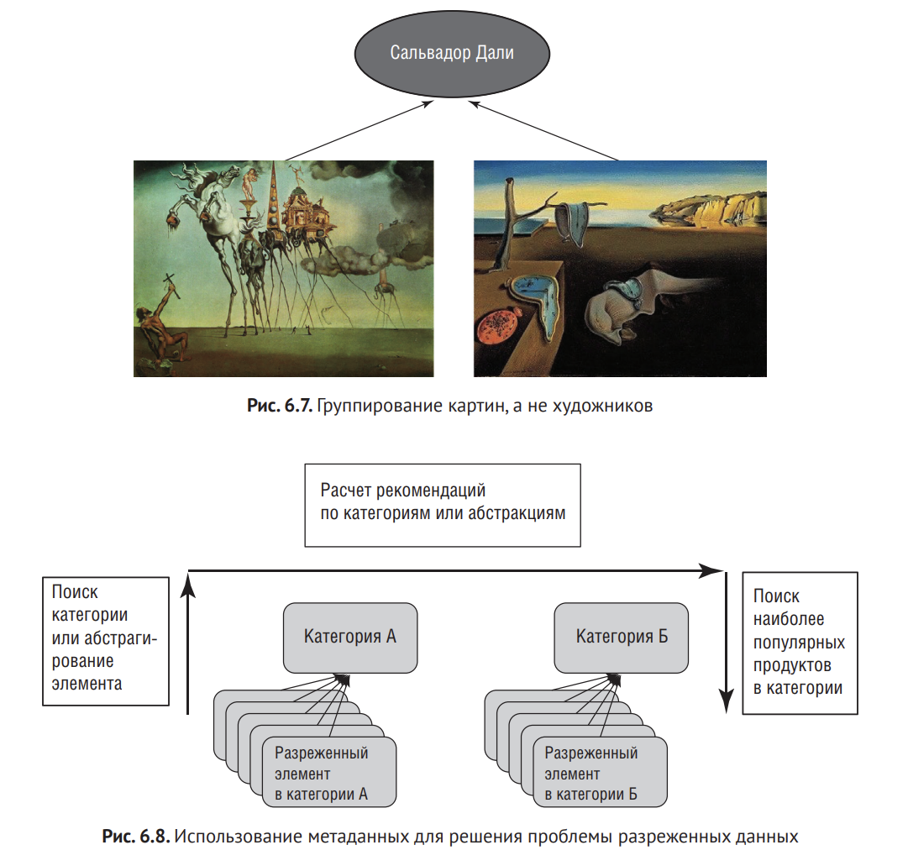

**Не столь очевидный пример:** я люблю фильмы Абрамса, поэтому я бы посмотрел любой его фильм (особенно после "Пробуждения силы"). Людям, которым он нравится, возможно, также нравится Маркуард, снявший "Возвращение Джедая". Если вы реализуете это, вы создадите ассоциативные правила на основе абстракции, а затем каждый раз, когда запрашиваете рекомендации сможете использовать текущий элемент, который просматривает пользователь. Это зависит от набора данных.

## 6.4. Кто не спрашивает, тот не будет знать

Для начала можно спросить о пользователей, что они думают о выбранном списке элементов. Но это плохо ограничивать доступ, пока не ответишь на вопросы.

Amazon предлагает улучить свои рекомендации. Для этого нужно авторизаоваться и нажать кнопку, показанную на рис. 6.9. Это не слишком полезно в нашей проблеме, потому что Amazon собирает эти данные со старых, а не новых пользователей

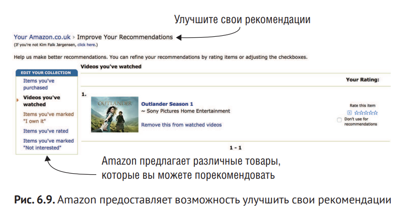

Стоит угадать рекомендации, еще нужно подумать о том, если мы возьмем популярный элемент, этого пользователя можно будет сравнить с другими.

Чтобы решить эту проблму, вы должны обратиться к активному обучению, и это круто.

Активно обучение для рекомендательных систем заключается в создании алгоритма, который дает пользователю контент для оценки, и рекомендатор в результате понимает информацию о предпочтениях человека.

### 6.4.1. Когда посетитель уже не новый

Время от времени стоит проверять пользователей на "новизну". Для такого рода рекомендаций можно использовать данные последней недели или последние 20 точек данных. 

Ассоциативные правила имеют смысл, когда вы смотрите на сырые данные, а не на неявные оценки. Можно, однако, начать с использования неявных оценок в качестве сидов, а затем взвешивать их на основе оценок.

## 6.5. Использование ассоциативных правил с целью ускорить показ рекомендаций

Вы должны принять то, к чему пользователь проявил интерес, и затем найти ассоциативные правила для каждого из этих элементов. После этого вы можете вернуть рекомендации, которые, по-вашему, подойдут лучше. Здесь не так много магии, но давайте посмотрим, что из этого получится.

С точки зрения сайта MovieGEEKs вы будете использовать пространство под другими элементами на первой странице, как показано на рис. 6.10.

Вот список действий для добавления персонализированных рекомендаций:
1. найти хорошее место на странице;
2. собрать и  использовать список элементов, с  которыми пользователь взаимодействовал;
3. найти ассоциативные правила;
4. сортировать по уверенности и вывести рекомендуемые элементы

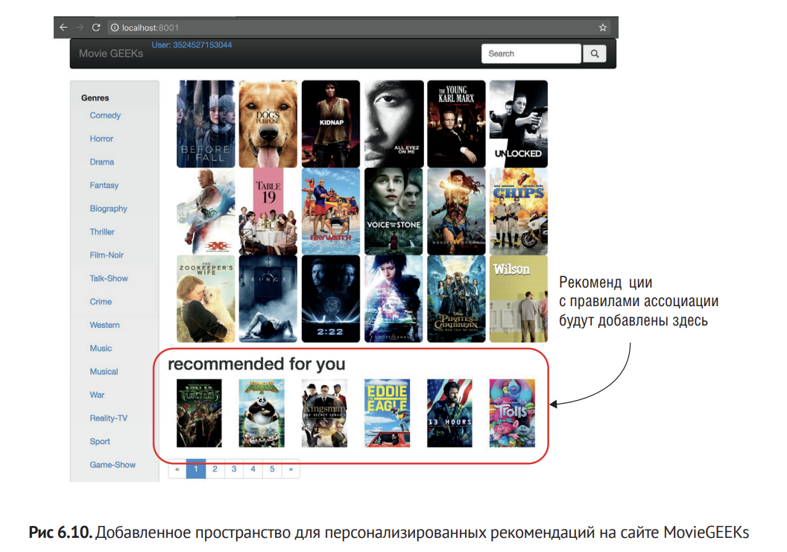

### 6.5.1. Поиск собранных элементов

Проблема, которую вы пытаетесь решить, – это создать рекомендации для пользователей, о ком вы знаете мало, так что вы будете использовать все элементы, с которыми пользователь взаимодействовал, а не только купленные. Данные немногочисленны, и в большинстве случаев пользователь не купил ничего до этого момента.

### 6.5.2. Получение ассоциативных правил и сортировка в соответствии со значениями уверенности

Вы можете использовать метод, который вы уже реализовали, чтобы получить ассоциативные правила, но это будет означать, что пришлось бы несколько раз делать запрос в базу данных. Вместо этого мы создадим новый метод, показаный в листинге 6.1, который делает запрос в базу данных самостоятельно.

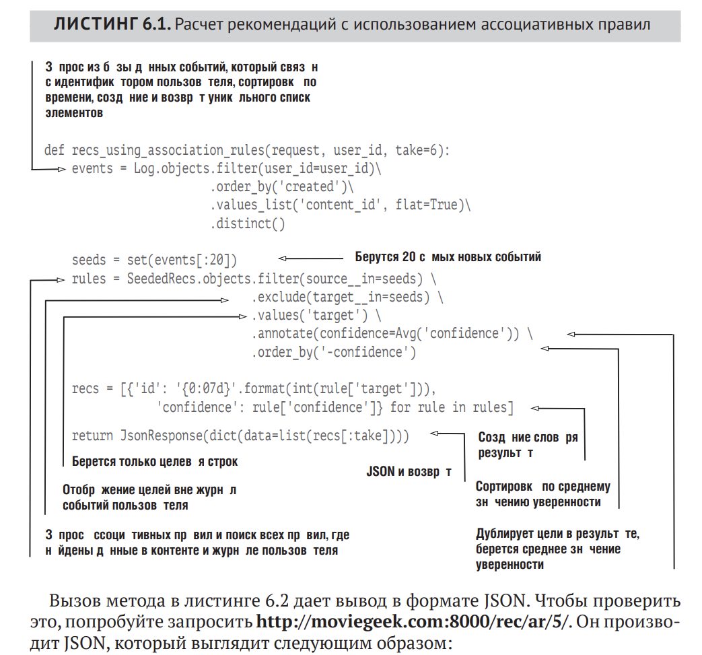

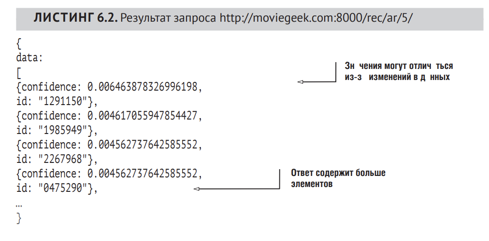

### 6.5.3. Отображение рекомендаций

# ИНСТРУКЦИЯ

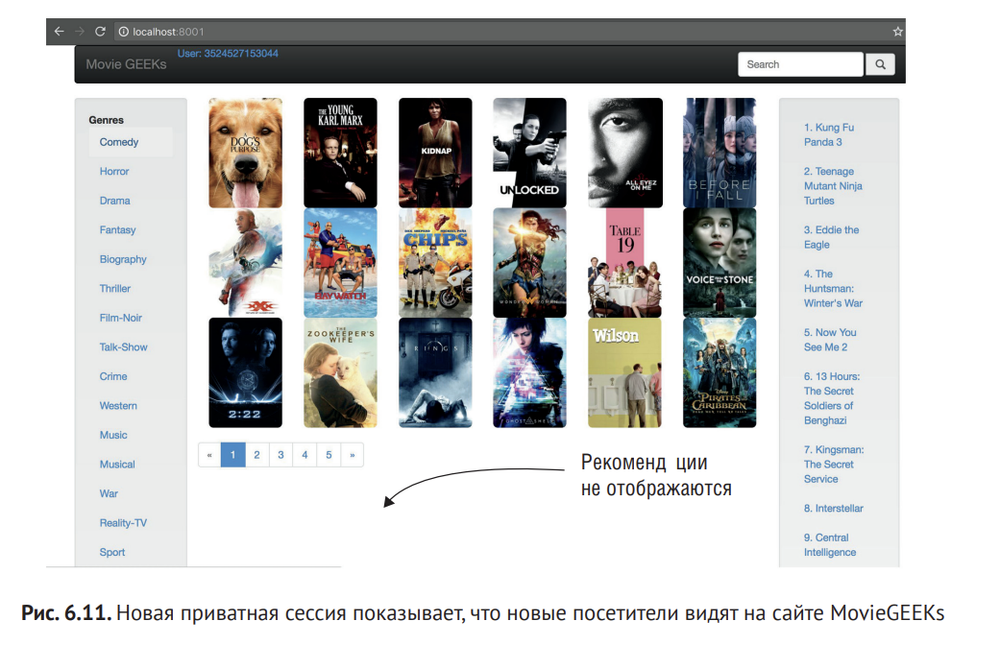

Приватная вкладка позволяет просматривать сайт MovieGEEKs, как если бы вы посетили его в первый раз.

Давайте купим товар (http://localhost:8000/movies/movie/3110958/). Нажмите кнопку покупки и убедитесь, что ваш журнал приложения Django показывает зарегистрированный элемент данных. Это приведет вас на страницу, показанную на рис. 6.13.

Возвращаясь к главной странице, вы должны увидеть те же рекомендации, как показано на рис. 6.14, хотя порядок пленок отличается. (Следует отметить, что эти рекомендации имеют следующие идентификаторы контента: 10, 18, 45 и 9.)

Теперь, чтобы добавить интереса, давайте купим другой элемент в списке ассоциативных правил так, что рекомендации будут обновлены. Тут есть небольшой трюк. Если вы купили самый популярный элемент, уровень уверенности уже используемых правил будет гораздо больше, чем у других, поэтому, прежде чем начать бросать что-то из окна, если это ничего не меняет, посмотрите на значение уверенности.

Посмотрев на предыдущие ассоциативные правила, вы сможете увидеть, что если вы выбрали Y, то по крайней мере один элемент должен измениться. Перейдите по ссылке http://moviegeeks:8000/movies/Y и нажмите кнопку покупки. Затем вернитесь на главное окно и нажмите кнопку обновления (F5 на большинстве компьютеров и браузеров). Рекомендации должны быть обновлены.

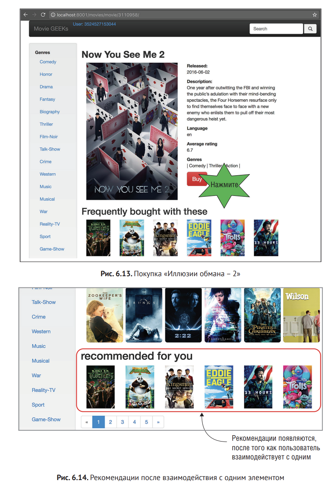

## 6.5.4. Оценка реализации

Рекомендации получились простые, но зато их можно сразу получать на "холодную"

Стоит также помнить, что данные, на которых вы основываете рекомендации, автоматически сгенерированы для MovieGEEKs. Генерация учитывает только жанры, так что ассоциации вроде «Ниндзи-убийцы» и  «Жены путешественника во времени» кажутся неправдоподобными, учитывая, что один фильм – боевик, а другой является драмой.

# Резюме

1. Проблема холодного старта означает, что вы должны решить, что рекомендовать новым посетителям на вашем сайте. Введение новых продуктов также является проблемой холодного запуска, который мы рассмотрим более подробно в последующих главах.

2. Добавление сознательного упорядочения данных – это отличный старт, он позволит сделать многие сайты более динамичными.

3. Серые овцы – это пользователи, чьи вкусы чересчур не похожи на вкусы других пользователей. Иногда серые овцы могут помочь в абстрагировании контента и разделении на жанры.

4. Создание рекомендаций для новых пользователей с помощью ассоциативных правил – это легкий и быстрый способ добавить персонализацию

5. Можно вручную или автоматически создать сегменты, чтобы получить полуперсонализированные рекомендации. Кроме того, можно использовать демографические данные.

