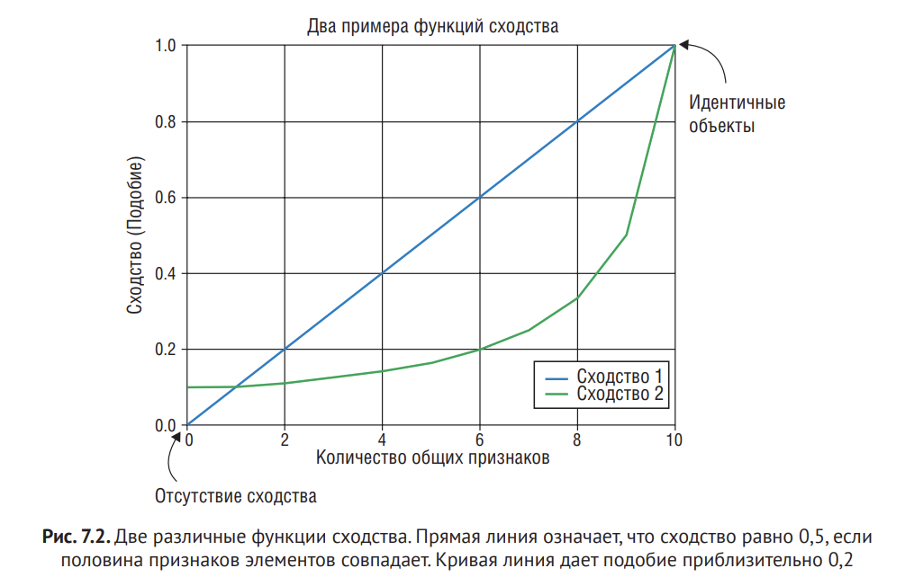
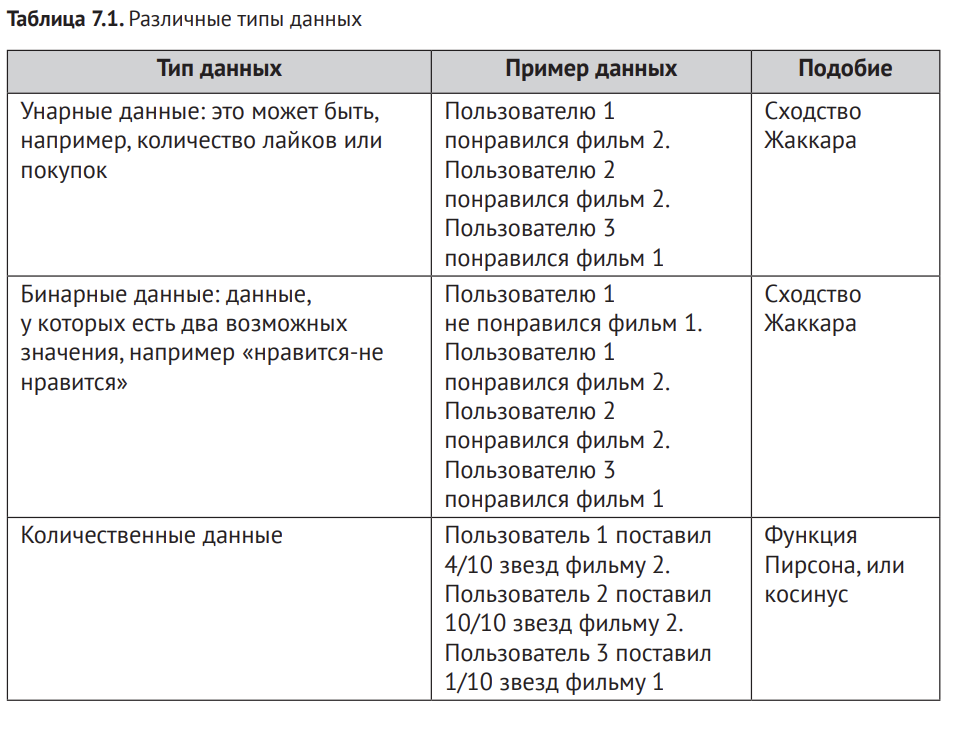
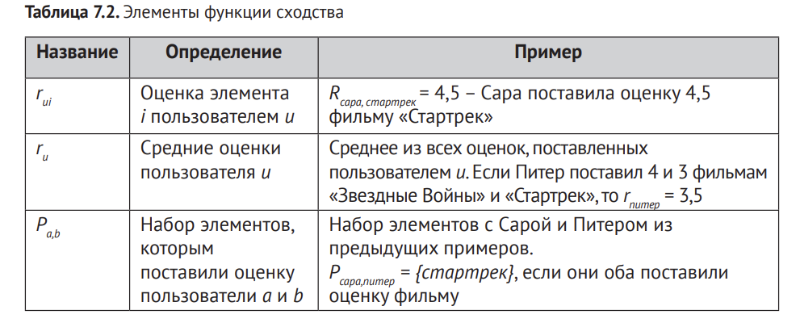
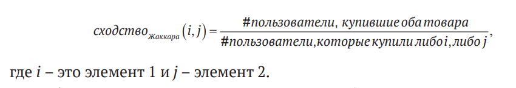
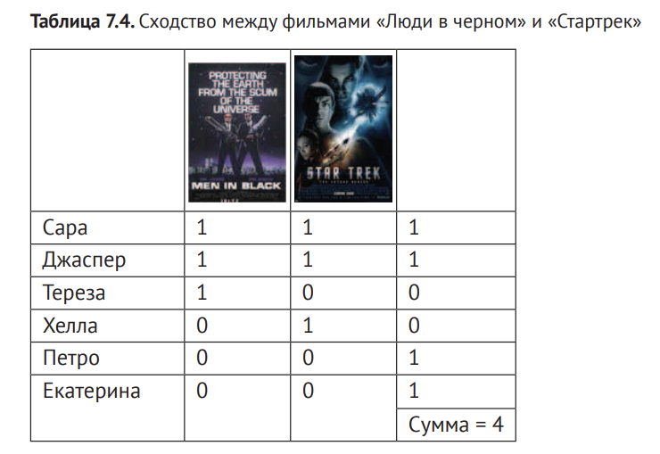
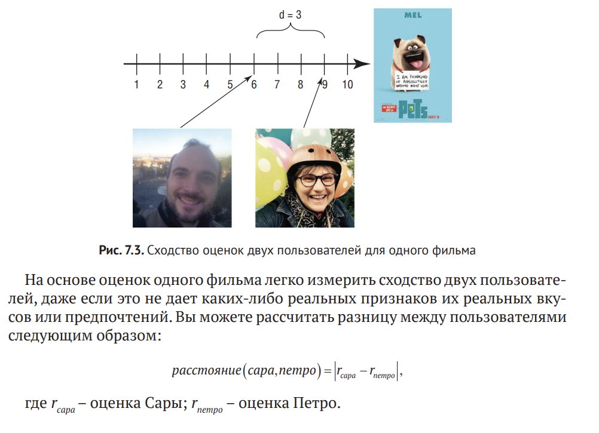
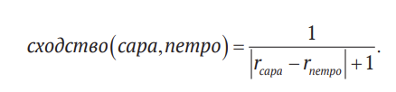
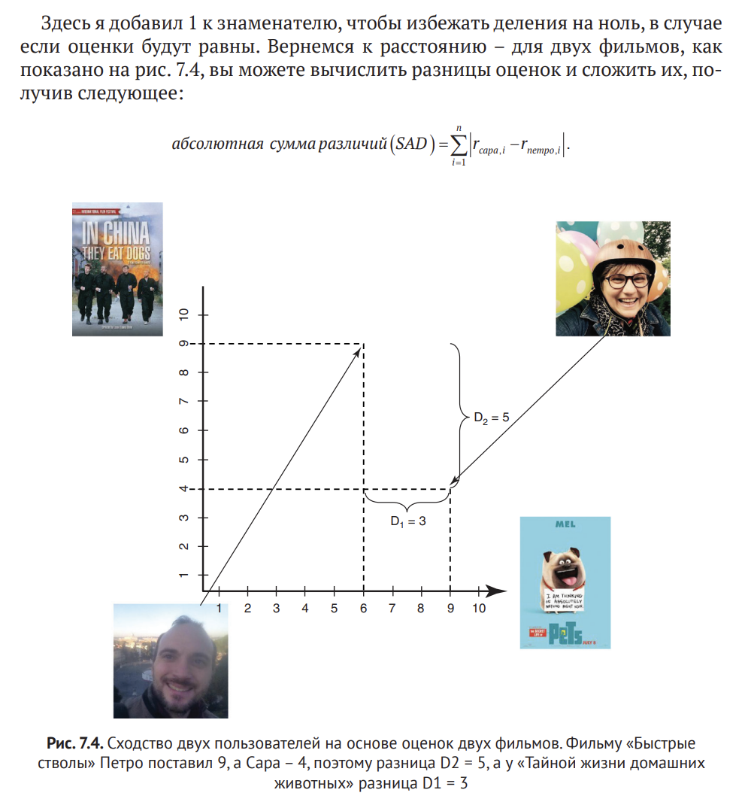
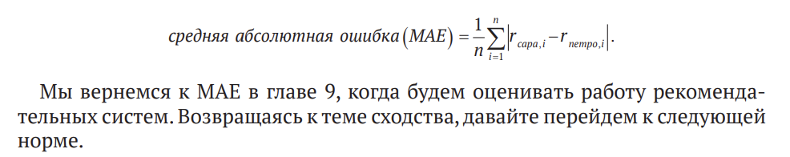

# Выявление общих черт у пользователя и контента

Ассоциативные правила – это такой способ связи контента независимо от элементов самого контента или пользователей, которые его потребляли.

А вот персонализированные рекомендации почти всегда составляются 
на основе вычисления сходства. В качестве примера можно привести рекомендации More Like This на сайте Netflix. Эта рекомендация показана на рис. 7.1, а в ее построении используется алгоритм, который определяет похожий контент.

Речб идет не только о том, чтобы вывести фильмы, похожие на выбранный фильм "Доктор Стрендж". Если бы мы хотели занести 
фильм «Доктор Стрэндж» в какой-нибудь каталог, я бы отнес его к категории Супергерои, куда также попал бы фильм «Первый Мститель: Противостояние» и «Чудо-женщина». А что насчет двух других фильмов? Как сюда попали они?

**В этой главе мы узнаем:**

1. Как рассчитать сходство на бинарных данных (купил или не купил товар), а затем вычислим сходство между пользователями на основе их оценок (и сходство элементов по оценкам одного и того же набора пользователей)

2. Как можно сгруппировать пользователей на основе их предпочтений.

3. Вычисление сходства среди контента и среди 
пользователей с помощью различных метрик

# 7.1. Что за сходство?

**Пример:** Если у нас есть два человека, как можно определить насколько они похожи по шкале от -1 до 1?

Путь будет сходство во вкусах.

Можно было бы сказать, что у двух людей схожие вкусы, если им обоим нравятся фильмы с Томом Хэнксом, фантастические фильмы или просто фильмы «на вечер». Но даже у любителей фантастики могут быть разные вкусы. Кому-то нравится «Стартрек», а кому-то – «Звездные Войны». Похожи ли они?

В научной литературе есть несколько функций подобия, которые, как говорят, дают хорошие результаты, и далее мы рассмотрим их все. Также поговорим об оптимизации количества вычислений сходства пользователей путем нахождения сегментов похожих пользователей.

## 7.1.1. Что такое функция подобия?

**Подобие можно рассчитать по-разному**, но в общем и целом задача может быть определена следующим образом: имеется два элемента, i1 и i2; сходство между ними определяется функцией sim (i1, i2).

Возвращаемое этой функцией значение пропорционально степени сходства между элементами. Тогда для идентичных элементов sim(i1, i1) = 1, а для элементов, не имеющих ничего общего, sim (i1, i2) = 0. На рис. 7.2 показаны примеры двух функций сходства. Выбирать из них нужно ту, которая больше подходит для вашего домена и ваших данных.

Измерение сходства тесно связано с  расчетом несходства между элементами. Как правило, сходство и несходство соотносятся следующим образом:

1. с увеличением несходства сходство стремится к 0

2. с уменьшением несходства сходство стремится к 1

# 7.2. Основные функции подобия

Сперва рассмотрим коэффициент сходства Жаккара, который используется для сравнения наборов данных.

**В нашем случае** эти набором будет множество фильмов, которым пользователь поставил оценку. Затем мы посмотрим на сходство между оценками - сходство между оценками одного филмьа, поставленными двумя пользователями.

Эти данные позволяют оценить, насколько схожи два пользователя, если они оценят достаточно много фильмов. Для этого воспользуемся функциями сходства Пирсона и косинусной функцией. Для каждого сходства необходим определенный вид данных, как показано в **табл. 7.1.**

Несколько вещей, которые позволяют легко описать функцию сходства:

## 7.2.1. Расстояние Жаккара (коэфициент сходства Жаккара, индекс Жаккара)

**Допустим** если каждый фильм - это такой список пользователей, которые купили этот фильм, то у вас есть по одному набору пользователей для каждого фильма. Тогда мы можем сравнить два фильма, взяв две такие группы пользователей.

Такой набор, можно получить из пользовательских покупок, превращенных в список, где в каждой строке написано, купил или не купил пользователь продукт (1 - да, 0 - нет). Если пользователю понравился контент, то у вас есть унарный набор данных, который можно свести в таблицу. Это унаррный набор данных.

Чтобы найти сходсство между двумя элементами, нужно подсчитать, сколько пользователей купили оба элемента, а затем разделить на количество пользователей, которые купили один из них (оба). В виде формулы это будет выглядеть так:

Чтобы вычислить сходство между двумя фильмами, нужно подсчитать 
количество одинаковых битов (сколько раз пользоватлеи сделали с каждым фильмом одно и то же действие), как показано в **табл. 7.4**. В таблице даны четыре ряда из шести, в которых пользователи сделали то же самое, т. е. сходство Жаккара между ними равняется 4/6. Если вы посмотрите на фильмы в табл. 7.4, за которые пользователи не голосовали, сходство Жаккара у них равно 2/4 = 0,5, т. е. у них есть небольшое сходство..

Сходство Жаккара показано на предыдущем рисунке как сходство 1 
(см.  рис.  7.2). Сходство 0,5 может быть высоким для вашего случая, но лучше попробовать разные функции сходства и оценить, какая лучше подходит для данной задачи

## 7.2.2. Изменерения расстояние с помощью Lp-норм

Рассмотрим измерение расстояния, или несходства, с  помощью Lp-норм и попробуем две различные меры, самые L1- и L2-нормы. 

Если набор данных является более детализированным, чем в  примере MovieGEEKs, и  известно, скольким людям понравился контент, вы можете использовать множество других функций для расчета расстояния и сходства, а не только меру Жаккара.

**L1-норма**

Если нам нужно узнать, сходятся ли мнения Петро и Сары о фильме "Тайная жизнь домашних животных", можно попросить их оценить фильм по шкале от 1 до 10. Петро этот фильм показался неплохим, так что он поставил оценку 6, а вот Сара обожает и собак и мультики, поэтому поставила 9.

Такой способ измерения расстояния или сходства называется «Расстояние 
Манхэттена» и является частью так называемой метрики Расстояния городских кварталов

Более официально она называется L1-нормой. Ее  идея заключается в том, что для измерения расстояния между двумя углами улиц 
в Нью-Йорке требуется сетка, а не прямые линии.

По L1-норме сходство будет равно 3 + 5 = 8. Часто требуется найти **среднюю абсолютную ошибку (МАЕ)**, которая рассчитывается через среднее значение L1-нормы. Как видно из следующей формулы, новым здесь является то, что вы делите сумму на количество элементов, чтобы получить среднее расстояние между оценками:

191