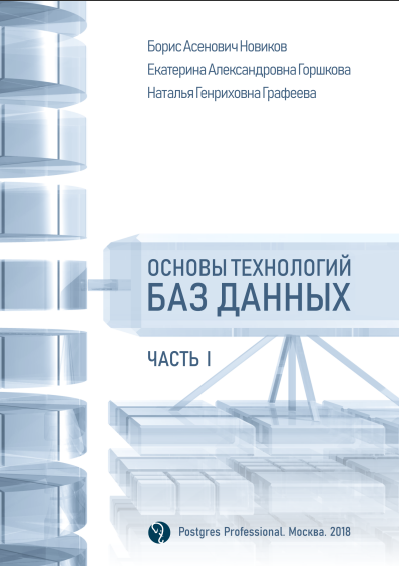
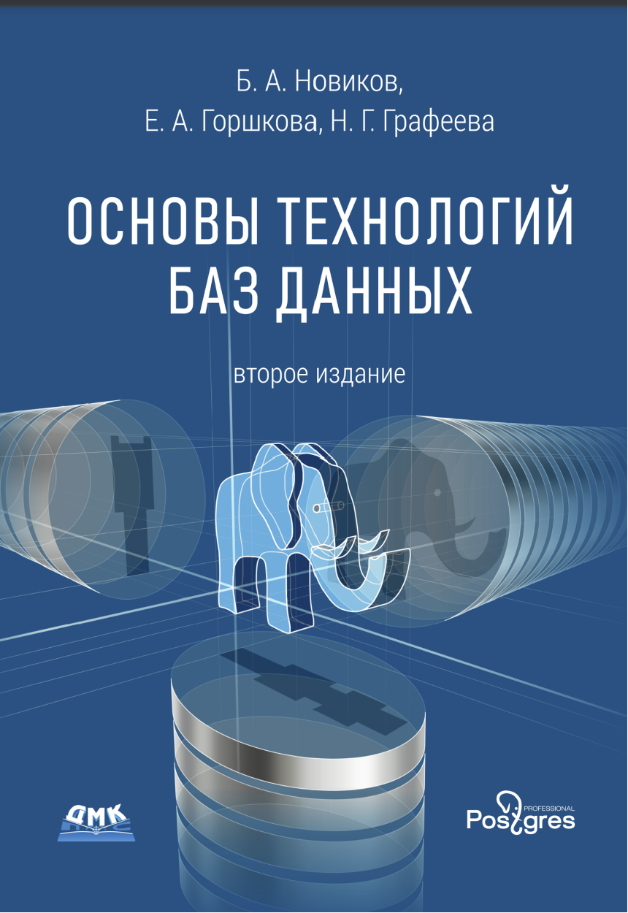
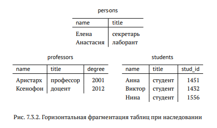
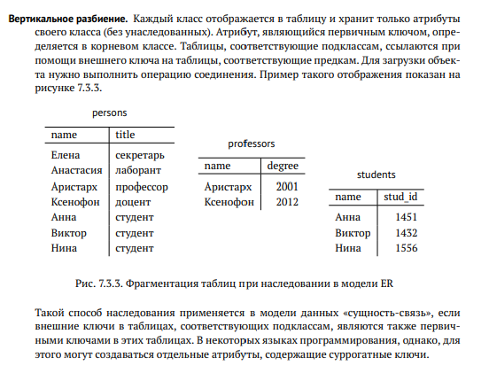

# PostgreSQL

PostgreSQL - свободная объектно-реляционная система управления базами данных. На данный момент наиболее популярная среди всех реляционных БД. Поэтому начать стоит именно с неё

Что меня интересует в первую очередь:
1) Эффективные запросы к данным
2) Администрирование PostgreSQL

Материалы:
1) Основы технологий баз данных, Часть 1. Postgres Professional

2) Основы технологий баз данных, Часть 2. Postgres Professional
В этой книге читал только вторую часть

Глава 4. Введение в SQL
- уровни БД (концептуальный и тд) !!!
- схемы данных: public, создание своих схем !!!
- процедуры, средства расширения функциональности СУБД, подддержка расширенной системы типов данных и вопросы проектирования
- индексные структуры и их влияние на время выполнения запросов
- соединения
- аггрегирование и группировка
- модификация данных 
- описание данных: отношения
- вложенные подзапросы
- псевдонимы для таблиц
- представления

Глава 5. Управление доступом к базам данных
- принципал, который имеет право разрешать доступ к ИС другим лицам. Суперпользователь. 
- объекты и действия. Пользователи. Любой пользователь, создавший объект является его владельцем. Привилегии. Роли. RBAC (Role Based Access Control). ABAC (Attribute Based Access Control). 
- пользователи и роли в СУБД. Набор привилегий. Пользователь БД. Группы пользователей. Начиная с версии 8.1. осталось только понятие роли. Объекты и привилегии. Предоставление привилегий, оператор GRANT, GRANT OPTION. Отзывание привилегии, REVOKE. session_user.

Глава 6. Транзакции и согласованность данных.
- диспетчер транзакций, многопользовательский доступ к базе данных, восстаноавление корректного состояния после отказов
- определение и основные требования к транзакциям, понятия целостности (integrity) и согласованности (consistrncy), ACID
- фиксанция транзакции (commit), обрыв (abort), откат (rollback)
- аномалии конкуретного исполнения
- объект: страница базы данных, строка таблицы, пара ключ-значение или какой-нибудь ещё объект в БД
- операция чтения элкмента x, выполняемая в транзакции i -> ri(x), операции записи -> wi(x), самая транзакция -> ti
- запись последовательности выполнения всех операций нескольких ti называется историей, а любой начальник отрезок истории называется расписанием

Примеры аномалий:
1) Потерянное обновление 
Транзакция - читает значение баланса карты, уменьшает его на 100, и записывает обратно. 
Если транзакции 2, то порядок должен быть таким:
r1(x) w1(x) r2(x) w2(x)
В следствии чего спишется 200 рублей
Однако, если операции двух транзакций выполняются в следующем порядке:
r1(x) r2(x) w1(x) w2(x)
то в результате будет записано значение, учитывающее только работу последней записывающей транзакции и будет списано лишь 100 вместо 200, потому что вторая транзакция читает x до того, как первая записывает результаты своей работы

2) Несогласованное чтение
Условие согласованности может связывать также значения различных элементов данных. Например, предположим, что сумма значений x и y должна оставаться постоянной в любом согласованном состоянии (например в случае перевода денег, с одной карты на другую). Пусть первая транзакция считывает оба элемента данных, затем вычитает ненулевое значение из x и прибавляет его к y, в вторая транзакция читает оба этих объекта. Тогда следующая последовательность выполнения операций:
r1(x) r1(y) r2(x) w1(x) w1(y) r2(y)
приводит к неккоректному результату: вторая транзакция считывает несогласованное значения объектов x и y. 

3) Грязное чтение
Еще один вид аномалий связан с операциями завершения транзакций, то есть фиксации (c) и обрыва (a). Рассмотрим следующую последовательность операций:
r1(x) w1(x) r2(x) a1 c2
Поскольку первая транзакция обрывается, ее результаты не должны оставлять следов, однако они уже были прочитаны второй транзакцией. Устранить эту аномалию можно двумя способами: задержать выполнение второй транзакции до завершения первой (commit или abort) или оборвать вторую, когда оборвется первая. Такие обрывы, которые иногда могут быть нужны для сохранения согласованности называются каскадными обрывами.

4) Грязная запись
Вторая транзакция записывает новое значение до финсации первой:
w1(x) w2(x) c1

5) Нечеткое (неповторяющееся) чтение
повторное чтение элемента данных дает другой результат, поскольку значение было изменено другой транзакцией:
r1(x) w2(x) c2 r1(x)

6) Фантомное чтение
повторный поиск данных по предикату возвращает результата, отличающийся от первого, потому что другая транзакция добавила, удалила или изменила запись таким образом, что они стали удовлетворять (или перестали удовлетворять) предикату

7) Несогласованная запись
в отличие от последовательного выполнения транзакций, новые значения x и y не учитывают значения, записанные другой транзакцией:
r1(x) r2(x) w1(x) w2(x) c1 c2

8) Аномалия только читающей транзакции
в приведенном расписании t3 возвращает некорректные значения, так как учитывает изменение элемента y первой транзакцией, но не учитывает изменение x второй транзакцией, хотя t2 использует значение, записанное до выполнения t1
r2(x) w1(y) c1 r3(x) r3(y) c3 w2(x) c2

Сериализуемое расписание - расписание, выполнение которого эквивалентно последовательному

- восстановление, его можно выполнять только в том случае, если данные, измененные обрываемой транзакцией, не были изменены другой транзакцией:
w1(x) w2(x) c2 a1

- диспетчеры и протоколы; протокол двухфазного блокирование (two-phase locking, 2PL); блокировки являются несовместимыми, если: они связаны с одном объектом данных или устанавливаются для разных транзакций или по крайней мере одна из двух операций является операция записи

- START TRANSACTION, COMMIT, ROLLBACK

- обрыв транзакции не приводит к восстановлению использованных значений последовательностей

- если при выполнении оператора, находящегося внутри транзакции, происходит ошиька, то транзакция обрывается и любая попытка выполнить какой-либо оператор (кроме оператора, заверщающего транзакцию) в рамках той же транзакции также приводит к индикации ошибки

- если оператор SQL выполняется вне транзакции (например, приложение не выполняло оператор BEGIN), то поведение системы зависит от настроек клиента. Если установлен режим автоматической фиксацииЮ каждый оператор превращается в отдельную транзакцию, которая не может быть оборвана по инициативе приложения, посколько всегда завершается неявным оператором COMMIT или ROLLBACK

- уровни изоляции
Для всех уровней недопустима аномалия потерянного обновления
1) read uncomitted - разрешает доступ к результатам выполнения еще не зафиксированных транзакций и никак не ограничивается выполнение транзакций, тем самым допуская появление любых аномалий. в PostgreSQL действие этого уровня эквивалентно read committed
2) read committed - результаты других транзакций становтся доступными после их фиксации, то есть запрещается аномалия грязного чтения
3) repeatable read - повторное выполнение операций поиска и выборки данных дает такие же результаты, как первое, то есть запрещается грязное и нечеткое чтение
4) serializable - требует, чтобы выполнение транзакцией было эквивалентно последовательному выполнению 
- точки сохранения, save point
- долговечность, durability, журналы СУБД

Глава 7. Разработка приложений СУБД
1) object-relational impedanced mismatch
Одновременное использование объектно-ориентированной и реляционной парадигмы вызывает определенные трудности. В процессе проектирования мы получаем логическую модель информационной системы, которая, вообще говоря, не привязана к конкретным технологиям. На следующем этапе нам нужно получить модель, которую будет использовать приложение, и модель, представляющую данные в СУБД. Эти модели имеют серьезные различия, и здесь мы сталкиваемся с этой проблемой
2) сторонние (third party) копоненты
3) тонкий клиент - frond (отображение данных) и толстый клиент
4) data access layer. DAL
5) хранение бизнес логики в процедурах (используетрся в 11% приложений примерно). Снижает зависимости кода приложения от схема БД, а также повышает производительность, однако приводит к существенному увеличению стоимости разработки

7.1) Проектирование схемы БД: логическа модель, объектная модель

7.2) Объектно-реляционная потеря соответствия (object-relational impedance dismatch)
    1) идентификация объекта, система типов, навигация между объектами, инкапсуляция (в бд эту роль выполняют ограничение целостности и триггеры)
7.3) Использование каркасов объектно-реляционного отобржения (object relational mapping, ORM)
    7.3.1) Наследование
        1) отображение иерархии классов в одну таблицу
        2) горизонтальное разделение на таблицы
        
        3) вертикально разбиение на таблицы
        
    7.3.2) Запросы
        1) ленивая загрузка, проблема n+1 выборки, жадная загрузка
        2) ORM работают в рамках унифицированного и сильно ограниченного подмножества SQL стандарта 1992 года
        3) основная проблема ORM - слишком большое количество мелких запросов, порожденных ленивой загрузкой
7.4) кэширование данных
    1) стратегия паралелльного доступа к кэширования данным: транзакционная, чтение-запись, нестрогое чтение-запись, только чтение
    2) ORM обычно поддерживают 2 типа кэширования, дублирующие функции СУБД
        - сеансовый кэш или кэш 1 уровня
        - разделяемый кэш или кэш 2 уровня
7.5) Взаимодействие с БД
    1) параметры запросов: 
        - этап подготовки - синтаксический анализ и проверка на соответствие схеме базы данных, оптимизация и генерация кода
        - этап интерпретации (выполнения)
    2) унифицированные средства взаимодействия
        ORM не имеет смысл использовать, когда приложение строится над уже имеющеся БД или если уже не хватает производительности
    3) интерфейс PostgreSQL для приложений
        1) libpq - библиотека наиболее полно отражающая возможности СУБД
        2) при выполнении оператора клиент может получать результат построчно (курсор)
    
7.6) Некоторые общие задачи
    1) ограничения доступа к данным: принцип наименьших привилегий
    2) поддержка многоязычности: отдельный аттрибут, таблица с переводом для каждой сущности, общая таблица для хранения всех переводов
    3) автоматический оптимизатор БД выбирает план выполнения запроса
    4) меры, направленные на повышение производительности, могут применяться на различных уровнях:
        - изменение (расширение) конфигурации оборудования
        - выбор параметров сервера
        - управление схемой БД
        - улучшение запросов
        - реструктуризация кода приложения
7.8) Проектирование декларативный запросов
    1) "думать в терминах множеств"

Глава 8. Расширения реляционной модели
8.1) Ограниченность реализаций SQL
    1) необходимо организовать несколько версий проекта, в частности для систем автоматизированного проектирования (САПР, CAD). За время существования проекта может существовать несколько десятков версий, однако каждая из них представляет собой сложный объект, объем которого может достигать значительных размеров. Для поддержки таких систем было введено понятия вложенных отношений или отношений не в первой нормальной форме (nested relations, non-first normal form, NFNF, NF^2).  В таких отношениях значения атрибутов могут быть таблицами или отношениями (возможно, тоже
    содержащими вложенные таблицы).
8.2) Реализация объектных расширений в PostgreSQL
    1) наследование 
    2) определение типов данных: составной, тип диапазона, перечисляемый тип, новые базовые типы
    3) домены
    4) коллекции
    5) указатели
    6) функции: pl/pgsql
    7) активные базы данных
        Event-condition action
        Триггер - функция, вызывающаяся при срабатывании определенного предписания 
        Before, after - когда будет выполнен триггер
        Механизм правил
    8) слабоструктурированные данные: json-agg, json-each, json-populate-record, json-populate-recordset, xml, 

Глава 9. Разновидности СУБД
1) OLTP (on-line transactional processing) - системы оперативной обработки (коротких) запросов
OLAP (on-line analytical processing) - системы оперативной аналитической обработки (больших объемов) данных
2) multi-tier архитектура
3) обработка в буфере бд
4) phase-change memory (память с изменением базового состояния)
5) следующие классы параллельных систем управления базами данных: shared memory, shared disks, shared nothings
6) proof of concept