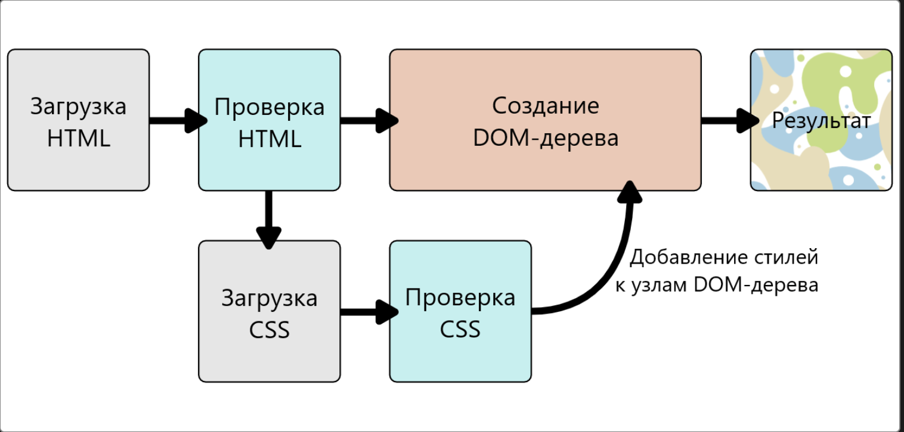

ОСТАНОВИЛСЯ НА СТИЛИЗАЦИЯ ТАБЛИЦ
https://developer.mozilla.org/ru/docs/Learn/CSS/Building_blocks/Styling_tables

Основные непонятки:

1) контейнеры для видео 
какие браузеры что поддерживают

2) object, iframe (как это сделать для своего сайта, чтоб твою линку так могли вставить)
проблемы безопасности iframe
какие не поддерживают браузеры
кликджекинг
настройка csp
sandbox
x-frame-options

3) векторная графика и растровая


4) адаптивная верстка
Так же как <video> и <audio>, элемент <picture> это обёртка содержащая некоторое количество элементов <source> которые предоставляют браузеру выбор нескольких разных источников, в сопровождении крайне важного элемента . Что это значит????

7) селекторы
- h1  /* это селектор тегов */
- a:link  /* это селектор ссылок */
- .manythings  /* это селектор классов (классы применяются тогда, когда необходимо применить правило к нескольким элементам) */
- #onething  /* это селектор идентификаторов (они применяются, когда правило относится к одному элементу) */
- *  /* универсальный селектор */
- .box p  /* селектор потомков */
- .box p:first-child  /* селектор потомков + селектор псевдоклассов */
- h1, h2, .intro  /* перечисление селекторов */
- a[title], a[href="https://example.com"], a[attr~=value], a[attr|=value],
a[attr^=value], a[attr$=value], a[attr*=value] - выбирать селекторы, основываясь на наличии у них конкретного атрибута элемента или основываясь на значении атрибута
- комбинаторы: потомка, исключительно потомков верхнего уровня, общий родственный комбинатор

8) каскады или спецификации, наследование
- Мы создали два правила, которые могут потенциально применяться к одному и тому же элементу. Каскад и тесно связанная концепция специфичности — это механизмы, которые контролируют, какое именно правило применяется, когда имеется такой конфликт
- Чем более общее влияние оказывает селектор на элементы страницы тем меньше его специфичность
- Приоритет специфичности: 1) то что определено в самом html у элемента 2) селектор id 3) селектор класса 4) селектор тега
- Наследование: некоторые свойства css наследуют значения, установленные для родительского элемента текущего элемента, а некоторые не наследуют
css предоставляет 4 специальных универсальных значения свойства для контроля наследования: inherit, initial, unset, revert


9) @rules (at-rules) - особые правила, дающие CSS инструкции, как вести себя

10) медиавыражения

11) отображение страницы вместе со стилями
- получение html разметки
- преобразование html в dom (в памяти компьютера)
- браузер забирает все ресурсы и описания, связанные с html-документом, например: встроенные картинки, видео .. и стили css
- бразуер анализирует css код, сортирует описанные там правила в зависимости от их селекторов и раскладывает их в различные "корзины": элементы, классы, идентификаторы и тд. основываясь на найденных селекторах бразуер понимает какие правила относятся к определенным "узлам" в dom дереве и применяет их по мере необходимости (этот промежуточный шаг называют "формированием дерева представления" или "формированием дерева рендеринга")
- дерево представления (render tree) формируется в том порядке, в котором оно затем должно будет отображаться, когда все правила будут применены
- затем происходит визуальное отображение контента на станицу (этап отрисовки) 


12) dom-дерево
```
<p>
  Let's use:
  <span>Cascading</span>
  <span>Style</span>
  <span>Sheets</span>
</p>
```
Как будет представлено DOM-дерево в памяти:
```
P
├─ "Let's use:"
├─ SPAN
|  └─ "Cascading"
├─ SPAN
|  └─ "Style"
└─ SPAN
   └─ "Sheets"
```
Если браузер встретит свойство, которое он не понимает, он просто проигнорирует его и двинется дальше. Тоже самое касается селекторов.


13) псевдоклассы, псевдоэлементы
К этой группе относятся псевдоклассы, которые стилизуют определённое состояние элемента
Основные псевдоклассы:
псевдоклассы пользовательского действия

Псевдоэлементы ведут себя сходным образом, однако они действуют так, как если бы вы добавили в разметку целый новый HTML-элемент, а не применили класс к существующим элементам.

14) Блочная модель
Если элемент определён как блочный, то он будет вести себя следующим образом:
- Начнется с новой строки
- Будет расширяться вдоль строки таким образом, чтобы заполнить всё пространство, доступное в её контейнере. В большинстве случаев это означает, что блок станет такой же ширины, как и его контейнер, заполняя 100% доступного пространства.
- Будут применяться свойства width и height.
- Внешние и внутренние отступы, рамка будут отодвигать от него другие элементы
Если не изменить намеренно тип отображение на строчный, то такие элементы, как заголовки (например h1) и <p>, все исполюзую block как свой внешний тип отображения по умолчанию

Если элемент имеет тип отображения inline (строчный), то:
- Он не будет начинаться с новой строки.
- Свойства width и height не будут применяться.
- Вертикальные внешние и внутренние отступы, рамки будут применяться, но не будут отодвигать другие строчные элементы.
- Горизонтальные внешние и внутренние отступы, рамки будут применяться и будут отодвигать другие строчные элементы.
Элемент <a>, используемый для ссылок, <span>, <em> и <strong> — всё это примеры по умолчанию строчных элементов.

Внутренние и внешний тип отображения


Существует особое значение display, которое представляет собой золотую середину между inline и block. Это полезно в ситуациях, когда вы не хотите, чтобы элемент переносился на новую строку, но нужно, чтобы он применял width и height и избегал перекрытия, показанного выше.

box-sizing

15) Фон и границы
- background-color
- background-image
- background-repeat
- background-size: cover (браузер сделает изображение достаточно большим, чтобы оно полностью заполнило блок, сохраняя при этом соотношение сторон. В этом случае часть изображения, скорее всего, окажется за пределами блока) / contain (браузер сделает изображение нужного размера, чтобы поместиться в блоке. В этом случае могут появиться пробелы с обеих сторон или сверху и снизу изображения, если соотношение сторон изображения отличается от соотношения сторон блока)
- background-position
- background-attachment: scroll, fixed, local

15) перекрытие содержимого (overflow)
- CSS пытается избежать "потери данных"
- overflow: visible (default), hidden, scroll
- overlow-y, overlow-x
- word-break, overflow-wrap
- контекст форматирования блока (BFC)

16) стилизация текста

Font-styles
шрифты, цвета
font-size наследуется от родительского элемента
font-style: normal, italic, oblique
font-weight: light, normal, bold, extrabold, lighther, bolder
text-transform: none, uppercase, lowercase, capitalize, full-width
text-decoration: none, underline, overline, line-through
text-shadow

Text layout
text-align: left, right, center, justify
line-height
letter-spacing, word-spacing

17) стилизация списков:
line-style-type
list-style-position
list-style-image

18) Стилизация ссылок
color
cursor
outline

19) Веб-шрифты
@font-face - для загрузки woff, eot, svg шрифтов
бесплатные и платные дистрибьютеры шрифтов, а также онлайн-сервисы шрифтов

20) Нормальный поток
- Нормальный поток (Normal flow) это то как ваш браузер отображает по умолчанию, когда вы не меняли расположение элементов на странице
- По умолчанию содержимое элемента уровня блока составляет 100% от ширины его родительского элемента и столь же высок, как и его содержимое. 
- Строчные элементы ведут себя по-другому — они не появляются на новых строках; они располагаются на той же строке, что и другие и любой смежной или завёрнутый текст располагается на всю ширину внутри элемента уровня родительского блока, до тех пор, пока не закончится пространство. Если пространства нет, тогда текст и/или элементы перейдут на новую строку (не с абзаца).
- Если два смежных элемента имеют заданные для них поля/внешние отступы (margin) и эти поля соприкасаются друг с другом, большее из них остаётся, а меньшее исчезает — это называется схлопывание полей (margin collapsing), и мы рассматривали это ранее.

21) Введение в css верстку
- Свойство display: block, inline, flex, grid
- float - делая элемент плавающим (float) мы меняем поведение этого элемента и элементов блочного уровня, следующих за ним в нормальном потоке. Элемент перемещается влево или вправо и удаляется из нормального потока (normal flow), а окружающий контент обтекает плавающий элемент.
- позиционирование: Позиционирование позволяет вам перемещать элементы с места, где бы они располагались при нормальном потоке в другую локацию. Позиционирование не является методом создания основной разметки страницы, это больше об управлении и точной настройке положения определённых элементов на странице.
5 типов позиционирования: статическое, относительное, абсолютное, фиксированное, липкое


5) flexbox
Когда элементы выложены как flex блоки, они располагаются вдоль двух осей:
Главная ось (main axis) проходит в том направлении, вдоль которого расположены Flex элементы (например, в строку слева направо или вдоль колонок вниз.) Начало и конец этой оси называются main start и main end.
Поперечная ось (cross axis) проходит перпендикулярно Flex элементам. Начало и конец этой оси называются cross start and cross end.
Родительский элемент, на который назначено свойство display: flex называется flex container.
Элементы, размещённые в нём как Flex блоки называются flex items.

flex-grow
flex-shrink - вступает в роль, когда flex элементы переполняют контейнер. Оно указывает, сколько забирается от размера каждого flex элемента, чтобы он перестал переполнять контейнер
flex-basis - Значение минимального размера, как мы обсуждали ранее
justify-content - контролирует, где flex элементы располагаются на главной оси
align-items - контролирует, где на поперечной оси находятся flex элементы.
flex-direction
order
align-self
flex-wrap - переход или не переход на новую строку
flex-flow -  flex-direction and flex-wrap
align-content

6) grid:
набор горизонтальных и вертикальных линий, создающих шаблон, по которому мы можем выстроить элементы дизайна
- В сетке обычно будут столбцы (columns), строки (rows), а затем промежутки между каждой строкой и столбцом, обычно называемые желобами (gutters).
grid-column-start, end
grid-column-end: span
grid-column: 4/6
grid-row-start, end
grid-row
grid-area
order
grid-template-rows / columns
repeat(8, 12.5%)
px em % fr

7) float 
- Свойство float вводилось для того, чтобы разработчики могли включать изображение, с обтеканием текста вокруг него слева или справа, как это часто используется в газетах.
- Floats очень часто использовались для создания макетов целых веб-страниц, отображающих несколько колонок информации, обтекаемых так, что колонки располагаются друг за другом (поведение по умолчанию предполагает, что колонки должны располагаются друг за другом, в том же порядке в котором они появляются в источнике).
- Элемент с установленным float изымается из нормального потока документа и крепится с левой стороны от родительского контейнера. Любой контент, который следует ниже за обтекаемым элементом в макете при нормальном потоке теперь будет оборачивать его вокруг, заполняя пространство справа от него начиная на той же высоте что и вершина обтекаемого элемента. Там он остановится.
- обтекаемый объект удалён из нормального потока и что другие элементы будут располагаться за ним, поэтому если мы хотим остановить перемещение следующего элемента нам необходимо очистить его; что достигается при помощи свойства clear

8) позиционирование
- Позиционирование позволяет вам изымать элементы из нормального потока макета документа и заставить их вести себя по-другому; например, располагаться друг на друге или всегда оставаться на одном и том же месте внутри окна просмотра браузера.
- Статическое - это умолчание, которое получает каждый элемент, что всего лишь значит "поставить элемент в его нормальное положение в потоке макета документа — ничего особенного для рассмотрения"
- Относительное - оно очень похоже на статическое позиционирование, за исключением того что вы можете модифицировать окончательное положение позиционируемого объекта занявшего своё место в макете нормального потока, в том числе заставлять его перекрывать другие элементы на странице
- Абсолютное - абсолютно позиционированный элемент больше не существует в нормальном потоке макета документа. Вместо этого он располагается на своём собственном слое отдельно от всего остального. Это очень полезно: это значит, что мы можем создавать изолированные функции пользовательского интерфейса, которые не влияют на макет других элементов страницы. Например, всплывающие информационные блоки и меню управления; опрокидывающиеся панели; функции пользовательского интерфейса, которые можно перетаскивать в любом месте страницы; и так далее...
- Фиксированное - оно работает точно также как и абсолютное позиционирование, одним ключевым отличием: в то время как абсолютное позиционирование фиксирует элемент в месте относительно его ближайшего позиционированного предка (исходный содержащий блок если нет иного), фиксированное позиционирование обычно фиксирует элемент в месте относительно видимой части области просмотра, кроме случаев, когда один из его потомков является фиксированным блоком из-за того, что его свойству transform отличается от none.
- Sticky - это гибрид относительной и фиксированной позиции, который позволяет позиционируемому элементу вести себя как будто он относительно позиционирован, до тех пор пока он не будет прокручен до определённой пороговой точки
- контекст позиционирования
- z-index

9) отзывчивый дизайн
жидкие сетки, жидкие изображения, медиавыражения
- Общим подходом при использовании медиавыражений является создание простого одноколоночного макета для устройств с узкими экранами (например, мобильные телефоны), затем проверка для больших экранов и применение макета с несколькими столбцам, когда вы знаете, что у вас достаточно ширины экрана, чтобы уместить все. Такой подход часто называют mobile first дизайном.

10) Медиавыражения
```
@media media-type and (media-feature-rule) {
  /* CSS rules go here */
}
```
media-type - для какого типа media
media-expression - правило, которое должно пройти, чтобы css код был применен
- media-types: all, print, screen
- самые важные медиавыражения: width, height, orientation, resolution (разрешение экрана), print (при печати веб страницы), screen (для применения стилей при отображении веб-страницы на экране)


всякие непонятные штучки (чисто теоретические):
cors
crfs там че то там 
встраивание в браузер других языков (java апплеты)
woff, eot, otf, ttf шрифты
на каком уровне применяются дефолтные значения свойств в css и как их посмотреть, и как они скрываются
меры длины: em, rem, vm
всякие свойства непонятные, которые ни разу не видел
overflow
фрагментация
зачем мобильные браузеры ВРУТ о своем размере

что надо будет досмотреть:
https://developer.mozilla.org/ru/docs/Learn/CSS/CSS_layout/Floats#clearfix_hack
floats еще раз повторить
forgiving selector list

