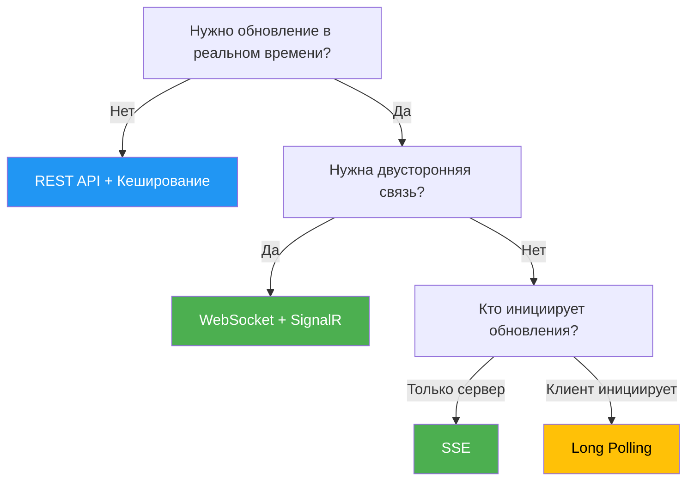

#  Real-Time Communication: Polling, SSE, WebSocket, Files

## Главная идея

**Все протоколы реального времени сводятся к одному — ожиданию события.**

Но **транспорт не определяет архитектуру ожидания**. На бэкенде вы все равно можете:
- Опрашивать БД
- Читать из кеша (Redis)
- Дергать внешнее API
- Слушать брокер (RabbitMQ, Kafka)
- Использовать in-memory очереди/каналы

Разница — **как долго и как именно** клиент ждет ответа.

---

## 📊 Сравнительная таблица протоколов

| Характеристика | Polling | Long Polling | SSE | WebSocket |
|----------------|---------|--------------|-----|-----------|
| **Инициатор** | Клиент | Клиент | Клиент | Клиент |
| **Кто ждет событие** | Клиент | Сервер | Сервер | Сервер/Клиент |
| **Направление** | Клиент→Сервер | Клиент→Сервер | Сервер→Клиент | Двустороннее |
| **Задержка** | N секунд | Мгновенная | Мгновенная | Минимальная |
| **Кол-во запросов** | Много | Мало | 1 соединение | 1 соединение |
| **Авто reconnect** | ❌ | ❌ | ✅ | ❌ (ручной) |
| **Поддержка браузеров** | ✅ Все | ✅ Все | ✅ Все (кроме IE) | ✅ Все |
| **Сложность** | ★☆☆☆☆ | ★★☆☆☆ | ★★☆☆☆ | ★★★★☆ |
| **Прохождение прокси** | ✅ | ✅ | ✅ | ⚠️ Может блокироваться |
| **Binary данные** | ✅ | ✅ | ❌ (base64) | ✅ |

---

## 🔄 1. Polling (Обычный опрос)

### Суть
Клиент **периодически** спрашивает сервер: "Есть событие?"

### Архитектура
```
Клиент → GET /api/events (каждые N секунд)
Сервер → 200 OK (есть/нет данных)
Клиент → GET /api/events (снова)
```

### Реализация

**Фронтенд:**
```typescript
// React + TypeScript
useEffect(() => {
    const interval = setInterval(async () => {
        try {
            const response = await fetch('/api/polling/events');
            const data = await response.json();
            
            if (data.length > 0) {
                setEvents(prev => [...prev, ...data]);
            }
        } catch (error) {
            console.error('Polling error:', error);
        }
    }, 3000); // Каждые 3 секунды
    
    return () => clearInterval(interval);
}, []);
```

**Бэкенд (ASP.NET Core):**
```csharp
[HttpGet("events")]
public IActionResult GetEvents()
{
    // Просто возвращаем все накопившиеся события
    var events = _eventQueue.GetAll();
    return Ok(events);
}
```

### Когда использовать
- ✅ **Некритичная задержка** (погода, курс валют)
- ✅ **Простота реализации**
- ✅ **Старые браузеры / ограниченная среда**
- ❌ **High-load системы** (много пустых запросов)
- ❌ **Реальное время**

### Performance
```
Запросов в минуту: 20 (при интервале 3с)
Сетевой трафик: Высокий (даже без данных)
Нагрузка на сервер: Высокая (много хитаний)
```

---

## ⏳ 2. Long Polling (Длинный опрос)

### Суть
Клиент отправляет запрос, **сервер держит соединение открытым**, пока не появится событие или не истечет таймаут.

### Архитектура
```
Клиент → GET /api/events (ждет)
Сервер → ... держит соединение 30 секунд ...
Сервер → 200 OK (событие)
Клиент → GET /api/events (сразу переподключается)
```

### Реализация

**Фронтенд (рекурсивный вызов):**
```typescript
// React + TypeScript
useEffect(() => {
    let isActive = true;
    let abortController: AbortController | null = null;
    
    const poll = async () => {
        if (!isActive) return;
        
        abortController = new AbortController();
        
        try {
            const response = await fetch('/api/longpolling/events', {
                signal: abortController.signal,
                // Таймаут 30 секунд (чуть больше серверного)
            });
            
            if (isActive && response.ok) {
                const data = await response.json();
                setEvents(prev => [...prev, data]);
            }
        } catch (error) {
            if (error.name === 'AbortError') return;
            // Таймаут — нормальное поведение
            if (error.name !== 'TimeoutError') {
                console.error('Long polling error:', error);
            }
        } finally {
            if (isActive) {
                poll(); // ⬅️ Всегда переподключаемся
            }
        }
    };
    
    poll();
    
    return () => {
        isActive = false;
        abortController?.abort();
    };
}, []);
```

**Бэкенд (ASP.NET Core):**
```csharp
[HttpGet("events")]
public async Task<IActionResult> GetEvents(CancellationToken cancellationToken)
{
    using var cts = CancellationTokenSource.CreateLinkedTokenSource(cancellationToken);
    cts.CancelAfter(TimeSpan.FromSeconds(30));
    
    try
    {
        // Ждем событие из очереди
        var evt = await _eventQueue.DequeueAsync(cts.Token);
        if (evt != null)
            return Ok(evt);
        
        return NoContent(); // Таймаут
    }
    catch (OperationCanceledException)
    {
        return NoContent(); // Таймаут
    }
}
```

### Ключевой паттерн — рекурсия
```typescript
const poll = async () => {
    try {
        const response = await fetch('/api/events');
        // обработать данные
    } finally {
        poll(); // ⬅️ Всегда переподключаемся
    }
};
```

### Когда использовать
- ✅ **Почти реальное время**
- ✅ **Сложно использовать WebSocket** (прокси, корпоративные сети)
- ✅ **Средняя нагрузка** (меньше запросов, чем polling)
- ⚠️ **30 секунд — стандартный таймаут**
- ❌ **Двусторонняя связь**

### Performance
```
Запросов в минуту: ~2 (при 30с таймауте)
Сетевой трафик: Низкий (только когда есть данные)
Нагрузка на сервер: Средняя (держит соединения)
```

---

## 📨 3. SSE (Server-Sent Events)

### Суть
Клиент открывает **одно долгоживущее HTTP-соединение**, сервер **стримит** события по мере их появления.

### Архитектура
```
Клиент → GET /api/stream (открываем соединение)
Сервер → (соединение открыто)
Сервер → data: {"event": 1}\n\n
Сервер → data: {"event": 2}\n\n
Сервер → data: {"event": 3}\n\n
... соединение остается открытым ...
```

### Реализация

**Фронтенд (EventSource):**
```typescript
// React + TypeScript
useEffect(() => {
    const eventSource = new EventSource('/api/sse/stream?clientId=abc123');
    
    // Обычные сообщения
    eventSource.onmessage = (event) => {
        try {
            const data = JSON.parse(event.data);
            setMessages(prev => [...prev, data]);
        } catch (error) {
            console.error('Parse error:', error);
        }
    };
    
    // Кастомные события
    eventSource.addEventListener('status', (event) => {
        console.log('Status update:', event.data);
    });
    
    eventSource.addEventListener('ping', (event) => {
        // Heartbeat — соединение живо
        console.log('Ping');
    });
    
    eventSource.onopen = () => {
        console.log('✅ SSE connected');
        setIsConnected(true);
    };
    
    eventSource.onerror = () => {
        console.error('❌ SSE error');
        // ⬇️ EventSource сам переподключится!
        setIsConnected(false);
    };
    
    return () => {
        eventSource.close(); // Закрываем соединение
    };
}, []);
```

**Бэкенд (ASP.NET Core):**
```csharp
[HttpGet("stream")]
public async Task Stream(CancellationToken cancellationToken)
{
    // ⚡ Критические заголовки для SSE
    Response.Headers.Append("Content-Type", "text/event-stream");
    Response.Headers.Append("Cache-Control", "no-cache");
    Response.Headers.Append("Connection", "keep-alive");
    Response.Headers.Append("X-Accel-Buffering", "no"); // Отключаем буферизацию nginx
    
    while (!cancellationToken.IsCancellationRequested)
    {
        var evt = await _eventQueue.DequeueAsync(cancellationToken);
        if (evt != null)
        {
            var json = JsonSerializer.Serialize(evt);
            
            // Формат SSE: data: {json}\n\n
            await Response.WriteAsync($"data: {json}\n\n");
            await Response.Body.FlushAsync();
        }
    }
}
```

### Формат SSE
```
data: {"id": 1, "text": "Hello"}

event: status
data: {"status": "OK"}

id: 123
data: {"id": 123}

: Комментарий (игнорируется)

retry: 10000  // Переподключение через 10 секунд
```

### Heartbeat (для поддержания соединения)
```csharp
// Бэкенд: отправляем ping каждые 15 секунд
while (!cancellationToken.IsCancellationRequested)
{
    await Response.WriteAsync(": ping\n\n");
    await Response.Body.FlushAsync();
    await Task.Delay(15000);
}
```

### Когда использовать
- ✅ **Сервер → Клиент (односторонний поток)**
- ✅ **Уведомления, логи, метрики, стриминг**
- ✅ **Автоматическое переподключение** (из коробки!)
- ✅ **Легко проходит через прокси и фаерволлы**
- ❌ **Двусторонняя связь**
- ❌ **Бинарные данные** (только текст/base64)

### Performance
```
Соединений: 1 на клиента
Сетевой трафик: Только когда есть данные
Нагрузка на сервер: Держит соединения (как WebSocket)
```

---

## 🔌 4. WebSocket

### Суть
**Двустороннее постоянное соединение** по специальному протоколу (`ws://` или `wss://`).

### Архитектура
```
Клиент → HTTP Upgrade (Handshake)
Сервер → 101 Switching Protocols
Соединение установлено (двустороннее)
Клиент → сообщение
Сервер → сообщение
Сервер → сообщение
Клиент → сообщение
```

### Реализация через SignalR (.NET)

**Бэкенд:**
```csharp
// Program.cs
builder.Services.AddSignalR();

app.MapHub<ChatHub>("/chatHub");

// Hub
public class ChatHub : Hub
{
    public async Task SendMessage(string message)
    {
        // Отправляем всем подключенным клиентам
        await Clients.All.SendAsync("ReceiveMessage", message);
    }
    
    // Метод для конкретного клиента
    public async Task SendToClient(string connectionId, string message)
    {
        await Clients.Client(connectionId).SendAsync("ReceiveMessage", message);
    }
    
    // Группы
    public async Task JoinGroup(string groupName)
    {
        await Groups.AddToGroupAsync(Context.ConnectionId, groupName);
    }
}
```

**Фронтенд (@microsoft/signalr):**
```typescript
import * as signalR from '@microsoft/signalr';

const connection = new signalR.HubConnectionBuilder()
    .withUrl('http://localhost:5266/chatHub')
    .withAutomaticReconnect()
    .build();

// Подписка на события
connection.on('ReceiveMessage', (message) => {
    console.log('Received:', message);
});

// Подключение
await connection.start();

// Отправка сообщения
await connection.invoke('SendMessage', 'Hello, World!');
```

### SignalR — встроенный маршрутизатор между инстансами

```csharp
// Масштабирование с Redis Backplane
builder.Services.AddSignalR()
    .AddStackExchangeRedis(options =>
    {
        options.Configuration = "redis:6379";
        options.InstanceName = "SignalR";
    });

// ✅ SignalR сам маршрутизирует сообщения между инстансами с учетом какой клиент на каком инстансе живет!
```

### Когда использовать
- ✅ **Двусторонняя связь** (чаты, игры, коллаборация)
- ✅ **Минимальная задержка**
- ✅ **Бинарные данные**
- ⚠️ **Сложнее в реализации**
- ⚠️ **Может блокироваться прокси/фаерволлами**

---

## 🧠 Вывод

### 1. **Все сводится к ожиданию события**

```
┌─────────────────────────────────────────────────────────────────┐
│                    БАЗОВАЯ МОДЕЛЬ                               │
├─────────────────────────────────────────────────────────────────┤
│                                                                 │
│  Клиент → Ждет событие → Сервер генерирует → Клиент получает   │
│                                                                 │
│  ┌─────────────────────────────────────────────────────────┐   │
│  │              Механизм доставки                          │   │
│  │                                                         │   │
│  │  ┌──────────────┐    ┌──────────────┐    ┌───────────┐ │   │
│  │  │   Polling    │    │ Long Polling │    │ SSE/WS    │ │   │
│  │  │  Клиент сам  │    │  Сервер      │    │ Сервер    │ │   │
│  │  │  дергает     │    │  держит      │    │  сам      │ │   │
│  │  │  каждые N    │    │  соединение  │    │  отправляет│ │   │
│  │  │  секунд      │    │  открытым    │    │  когда    │ │   │
│  │  │              │    │  до события  │    │  есть     │ │   │
│  │  └──────────────┘    └──────────────┘    └───────────┘ │   │
│  └─────────────────────────────────────────────────────────┘   │
└─────────────────────────────────────────────────────────────────┘
```

### 2. **Транспорт не определяет логику ожидания**

На бэкенде вы можете:
```csharp
// 1. Опрос БД
while (!cancellationToken.IsCancellationRequested)
{
    var events = await _dbContext.Events
        .Where(e => e.CreatedAt > _lastCheck)
        .ToListAsync();
    
    if (events.Any()) return Ok(events);
    
    await Task.Delay(1000);
}

// 2. Кеш (Redis)
var events = await _redis.ListLeftPopAsync("events");

// 3. Брокер (RabbitMQ)
var message = await _consumer.ReceiveAsync(cancellationToken);

// 4. In-memory очередь (SemaphoreSlim)
var evt = await _eventQueue.DequeueAsync(cancellationToken);
```

---

## 📋 Content-Type: Cправочник

### 🟢 Текстовые
```
text/plain           →  Обычный текст
text/html            →  HTML-страница
text/css             →  CSS-стили
text/javascript      →  JavaScript
text/csv             →  CSV-данные
text/xml             →  XML-документ
text/event-stream    →  Server-Sent Events
text/markdown        →  Markdown
text/vcard           →  Контакты vCard
```

### 🔵 JSON и структурированные
```
application/json                →  JSON
application/jsonlines           →  NDJSON (JSON Lines)
application/xml                 →  XML
application/yaml                →  YAML
application/protobuf            →  Protocol Buffers
application/msgpack             →  MessagePack
application/rss+xml             →  RSS Feed
application/atom+xml            →  Atom Feed
application/ld+json             →  JSON-LD
```

### 🟡 Изображения
```
image/jpeg       →  .jpg, .jpeg
image/png        →  .png
image/gif        →  .gif
image/webp       →  .webp
image/svg+xml    →  .svg
image/avif       →  .avif
image/heic       →  .heic (Apple)
```

### 🟠 Аудио
```
audio/mpeg       →  .mp3
audio/wav        →  .wav
audio/ogg        →  .ogg
audio/flac       →  .flac
audio/webm       →  .webm
audio/opus       →  .opus
```

### 🔴 Видео
```
video/mp4        →  .mp4
video/webm       →  .webm
video/quicktime  →  .mov
video/x-matroska →  .mkv
video/ogg        →  .ogv
```

### 🟣 Документы и архивы
```
application/pdf                     →  .pdf
application/msword                  →  .doc
application/vnd.openxmlformats-officedocument.wordprocessingml.document  →  .docx
application/vnd.ms-excel            →  .xls
application/vnd.openxmlformats-officedocument.spreadsheetml.sheet  →  .xlsx
application/zip                     →  .zip
application/gzip                    →  .gz
application/x-tar                   →  .tar
application/epub+zip                →  .epub
```

### ⚪ API и безопасность
```
application/problem+json        →  RFC 7807 (ошибки API)
application/vnd.api+json        →  JSON:API
application/hal+json            →  HAL
application/jwt                 →  JWT-токен
application/x-www-form-urlencoded  →  Формы
multipart/form-data             →  Загрузка файлов
```

---

## Дополнительные заголовки

### Content-Disposition

Content-Disposition — это HTTP-заголовок, который управляет тем, как браузер должен обрабатывать содержимое ответа:

Показать в браузере (inline)
Скачать как файл (attachment)

### Accept-Ranges

Кто отправляет: Сервер → Клиент
Когда: В ответе на обычный запрос (статус 200)
Что означает: "Я поддерживаю частичные запросы"

Возможные значения:
bytes — сервер поддерживает range requests по байтам (самый распространенный)
none — сервер НЕ поддерживает частичные запросы, клиент должен скачать всё целиком

Браузер смотрит на этот заголовок и понимает: "Ага, можно запрашивать части файла, буду делать Range запросы". Если заголовка нет или none, браузер может скачать весь файл сразу.

### Content-length

Кто отправляет: Сервер → Клиент
Когда: Всегда в ответе
Что означает: Размер тела ответа в байтах

Важно различать два случая:

Случай А: Полный файл (статус 200)
HTTP/1.1 200 OK
Content-Length: 10485760    // весь файл = 10 МБ

Случай Б: Частичный контент (статус 206)
HTTP/1.1 206 Partial Content
Content-Length: 1048576     // только запрошенная часть = 1 МБ

Зачем нужен:
Браузер знает, сколько байт читать из потока
Прогресс-бар может показать общий размер
Помогает выделить память под буфер

### Content-Range

Кто отправляет: Сервер → Клиент
Когда: ТОЛЬКО при статусе 206 (Partial Content)
Что означает: "Вот какая часть файла я тебе сейчас отправляю"

Content-Range: bytes <start>-<end>/<total>


Первый 1МБ из 10МБ:
HTTP/1.1 206 Partial Content
Content-Range: bytes 0-1048575/10485760
Content-Length: 1048576

## Файлы

В основе всего лежит структура HTTP-сообщения:
[Стартовая строка] + [Заголовки] + [Пустая строка] + [Тело сообщения (Body)]

Для маленького файла скачивание: Content-Type + Content-Length + Content-Disposition + Body в виде данных файла (один http запрос)

Загрузка: Либо Multipart Form Data либо Raw Body

Для больших файлов: Accept-Ranges: bytes (сервер указывает что можно кусками скачивать) + Range: bytes=5000000000- (клиент говорит какой кусок ему нужен)

## 🎯 Выбор протокола: Decision Tree



---

## 💎 Принципы

### 1. **Выбирайте протокол по потребностям, а не по моде**
- Чаты, игры → **WebSocket**
- Уведомления, логи → **SSE**
- Простые опросы → **Long Polling**
- Всё остальное → **REST**

### 2. **Всегда думайте о масштабировании**
```csharp
// SSO проблема — клиент привязан к инстансу
// Решение: SignalR Backplane (Redis)
// Решение: Sticky Sessions
// Решение: Consistent Hashing
```

### 3. **Heartbeat обязателен для долгих соединений**
```csharp
// Каждые 15-30 секунд отправляем пустое сообщение
// Чтобы прокси/балансировщик не разорвал соединение
```

### 4. **Всегда обрабатывайте ошибки и переподключение**
```typescript
// ✅ EventSource делает это автоматически
// ❌ WebSocket — нужно вручную
// ❌ Long Polling — нужно вручную (рекурсия)
```

### 5. **Content-Type — это контракт**
```csharp
// Неправильный Content-Type = неправильная обработка на клиенте
Response.ContentType = "text/event-stream"; // SSE
Response.ContentType = "application/json";  // JSON API
Response.ContentType = "text/csv";          // CSV отчет
```

---

## 📚 Итог

| Что выбрать | Когда |
|-------------|-------|
| **Polling** | Простота, некритичная задержка, старые системы |
| **Long Polling** | Почти реальное время, сложно использовать WebSocket |
| **SSE** | Сервер → Клиент, уведомления, логи, автоматический reconnect |
| **WebSocket** | Двусторонняя связь, минимальная задержка, чаты, игры |

**Главный вывод:** Все протоколы решают одну задачу — **доставить событие от сервера к клиенту**. Разница только в эффективности, сложности и сценариях использования.