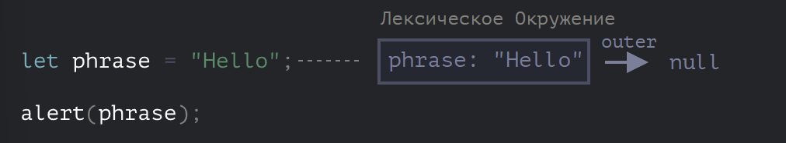
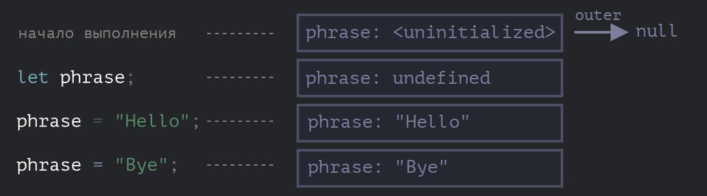
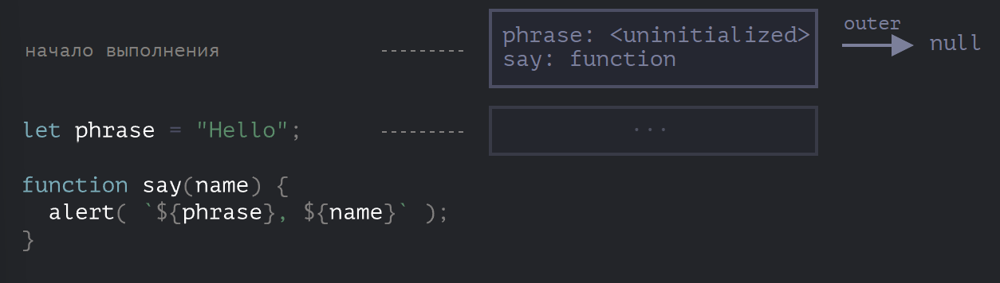

# Основы JS

# Чего не может JS в браузере

1. Доступ к файлам и функциям ОС. С микрофоном/камерой можно работать, но при этом пользователь должен дать разрешение
2. Различные окна/вкладки не знают друг о друге. Иногда JS открывает другое окно. Но даже в этом случае JS не имеет доступа к другой, если они пришли с разных сайтов. Это называется "Политика одинакового источника" (Same Origin Policy). Чтобы обойти это, обе страницы олжны согласиться с этим и содержать JS код, который специальным образом обменивается данными.
3. Получать данные с других доментов, если нет специального разрешения (CORS)

# Строгий режим - "use strict"

Долгое время JS поддерживал обратную совместимость не удаляя старых функций языка. Так было до 2009 год, когда появился ES5. Он добавил новые возможности в язык и изменил некоторые из существующих. Чтобы устаревший код работал, как и раньше, по умолчанию подобные изменения не применяются. Поэтому нам нужно явно их активизировать с помощью специальной директривы **"use struct"**

Ее можно поставить либо в начале файла, либо в начале функции.

Современный JS поддерживает "классы" и "модули" - продвинутые структуры языка, которые автоматически включают строгий режим. 

Нужна эта директива для:

1. **Устраненние ошибок**: JS не будет пропускать ошибки
2. **Больше предупреждений на этапе компиляции**
3. **Нельзя использовать зарезервинованные имена**

# Типы данных

Число (number), BigInt, строка, булево, null (пустое или неизвестное значние), underfined (проверка, была ли переменная назначена), объекты и символы

++a - префиксная форма возвращает новое значение
a++ - постфиксная форма возвращает старое значние

## Логические операторы
1. || (ИЛИ) 
Нетрадиционное применение: аходит первое истинное значение в записи, преобразуя каждый тип в boolean, если все ложно то, возвращается последнее

2. ||= (Оператор логического присваивания ИЛИ) 
a ||= b  -> a || (a = b)

3. && (И)
Нетрадицинное применение: как и в || есть такое поведение, но находит не первый истинный объект, а первый ложный.
Его приоритет больше чем у ИЛИ

4. &&= (Оператор логического присваивания И)
a &&= b -> a && (a = b)

5. ! (НЕ)

6. ?? (Оператор нулевого слияния)
a ?? b -> если a определено, то а, если a не определено, то b
a ?? b -> (a !== null && a !== undefined) ? a : b;
a ?? b ?? c -> первое значение из списка, не равное null/underfined
Приоритет у оператора, также как у ||

7. ??= (Оператор нулевого присваивания)
a ??= 18 -> если a == null/underfined, тогда 18

## Побитовые операторы

AND(и) ( & )
OR(или) ( | )
XOR(побитовое исключающее или) ( ^ )
NOT(не) ( ~ )
LEFT SHIFT(левый сдвиг) ( << )
RIGHT SHIFT(правый сдвиг) ( >> )
ZERO-FILL RIGHT SHIFT(правый сдвиг с заполнением нулями) ( >>> )

# Function Declaration и Function Expression 
Функции всегда что-нибудь возвращают. Если нет оператора return, результатом будет undefined.

1. Function Declaration
```
function func() {

}
```
Особенности: 
1. **Подъем (Hoisting)**: функции поднимаются в верхнюю часть своей области видимости. Это означает, что вы можете вызывать функцию до ее объявления в коде
2. **Создание функции**: функция создается в момент выполнения кода и доступна на протяжении всей области видимости, где она была объявлена.

2. Function Expression
```
const myFunction = function() {
    // Код функции
};
```

Особенности:
1. **Подъем (Hoisting)**: Функции, объявленные как Function Expression, не поднимаются. Вы не можете вызывать функцию до ее определения, так как функция является частью выражения и создается во время выполнения.
2. **Анонимные и именованные функции**: функциональные выражения могут быть анонимными или именованными. Анонимные функции часто используются для передачи функции в качестве аргумента другой функции, создания замыканий и т.д.
3. **Функции как значения**: функции в Function Expression могут быть присвоены переменным, переданы как аргументы другим функциям или возвращены из других функций.

# Качество кода

1. Фигурная скобка на той же строке, после пробела
2. Точка с запятой обязательны
3. else { безе перевода строки
4. Длинные горизонтальные строки лучше разбить на насколько с помощью кавычки `
5. Не использование большой бложенности. Например, в начале функции лучше всего поставить Guard, который отбросит ненужные значения, чем создать вложенность с if:
```
for (let i = 0; i < 10; i++) {
  if (!cond) continue;
  ...  // <- нет лишнего уровня вложенности
}
```
Есть готовые руководства по стилю кода, линтеры (JsLint, JsHint, ESLint)

## Комментарии

Описывающие комментарии это плохо, но есть комментарии которые нужно писать:
1. Документируйте параметры и использование функций (JSDoc)
2. Описывание архитектуры (как в UML)

## Ниндня-код
1. Краткость вместо понятности
2. Однобуквенные комментарии
3. Сокращение непонятные
4. Абстрактные имена
5. Повторное использование имен переменных
6. Перекрытие внешних переменных

## Автоматическое тестирование

Behavior Driven Development (BDD) - вместо того чтобы фокусироваться на технических деталях, BDD использует примеры, которые иллюстрируют, как система должна вести себя в различных ситуациях. Эти примеры служат основой для тестов.

**Спецификацию можно использовать тремя способами:**

1. Как Тесты – они гарантируют, что функция работает правильно.
2. Как Документацию – заголовки блоков describe и it описывают поведение функции.
3. Как Примеры – тесты, по сути, являются готовыми примерами использования функции.

**Если не писать тесты, то будет два пути:**

1. Внести изменения, и неважно что будет. Потом у наших пользователей станут появляться ошибки, ведь мы наверняка что-то забудем проверить вручную.

2. Или же, если наказание за ошибки в коде серьезное, то люди просто побоятся вносить изменения. И код будет зарастать паутиной, никто на захочет лезть в код.

Для написания тестов нужно организовать код таким образом, чтобы у каждой функции была ясно поставленная задача и точно определены её аргументы и возвращаемое значение. А это означает, что мы получаем хорошую архитектуру с самого начала.

**Инструменты:** Jest, Mocha

## Полифилы

Это фрагменты кода, которые добавляют поддержку новых функций JavaScript в старых браузерах, которые не поддерживают эти функции нативно. Они позволяют использовать современные возможности языка и веб-API, даже если они не поддерживаются в некоторых окружениях.

# Объекты

1. Объект, объявленный как константа, может быть изменён
2. Также существует специальный оператор "in" для проверки существования свойства в объекте.
3. Одно из фундаментальных отличий объектов от примитивов заключается в том, что объекты хранятся и копируются «по ссылке», тогда как примитивные значения: строки, числа, логические значения и т.д. – всегда копируются «как целое значение».
4. Два объекта равны только в том случае, если это один и тот же объект.
5. Чтобы создать «реальную копию» (клон), мы можем использовать Object.assign для так называемой «поверхностной копии» (вложенные объекты копируются по ссылке) или функцию «глубокого клонирования», такую как _.cloneDeep(obj).

## Сборка мусора

1. Сборка по поколениям - объекты делятся на два набора: новые и старые. 
2. Инкрементная сборка - движок делит все обхекты на части, и далее очищает одну за другой
3. Сборка в свободное время - сборщик мусора старается работать только во время простоя процессора
4. Обычно сборка мусора запускается, когда движок обнаруживает, что доступная память становится недостаточной или что система испытывает значительную нагрузку.

## Ключевое слово this

this не является фиксированным, его можно использовать даже если это не метод объекта. Значение this вычисляется во время выполнения кода, в зависимости от контекста. 
Можно вызвать this Даже без объекта. В строгом режиме this тогда будет равен underfined. А в нестрогом - window.

## Опциональная цепочка '?.'

Синтаксис опциональной цепочки ?. имеет три формы:

1. obj?.prop – возвращает obj.prop если obj существует, в противном случае undefined.

2. obj?.[prop] – возвращает obj[prop] если obj существует, в противном случае undefined.

3. obj.method?.() – вызывает obj.method(), если obj.method существует, в противном случае возвращает undefined.


## Тип данных Symbol

Символы всегда уникальны, даже если имена совпадают.
Они игнорируются  циклом for..in
Можно создать глобальные символ, чтобы из разных частей приложения можно было обратиться к одному свойству. Для этого существует глобальный реестр символов

Символы позволяют создавать скрытые свойства объектов, к которым нельзя обратиться и перезаписать их из драгиух частей программы.

```
let user = {
  name: "Вася"
};

let id = Symbol("id");

user[id] = 1;

alert( user[id] ); // мы можем получить доступ к данным по ключу-символу
```

Использовать символы можно, когда нужно добавить свойство в объект, который принадлежит другому скрипту или библиотеке.

## Хинты

Существует три варианта преобразования типов, которые происходят в различных ситуациях. Они называются хинтами:

1. string

Для преобразования обхекта к строке, когда мы выполняем операцию над объектом, которая ожидает строку

2. number

Для преобразования объекта в число, в случае математических операций

3. default

Происходит редко, когда оператор не уверен, какой тип ожидать

Чтобы выполнить преобразование, JS пытается найти  и вызвать три следующих метода объекта: 

1. Вызвать obj[Symbol.toPrimitive](hint) – метод с символьным ключом Symbol.toPrimitive (системный символ), если такой метод существует,

2. Иначе, если хинт равен "string"
попробовать вызвать obj.toString() или obj.valueOf(), смотря какой из них существует.

3. Иначе, если хинт равен "number" или "default"
попробовать вызвать obj.valueOf() или obj.toString(), смотря какой из них существует.

```
let user = {
  name: "John",
  money: 1000,

  [Symbol.toPrimitive](hint) {
    alert(`hint: ${hint}`);
    return hint == "string" ? `{name: "${this.name}"}` : this.money;
  }

  toString() {
    return `{name: "${this.name}"}`;
  },

  // для хинта равного "number" или "default"
  valueOf() {
    return this.money;
  }
};
```

Преобразование объекта в примитив вызывается автоматически многими встроенными функциями и операторами, которые ожидают примитив в качестве значения.

# Типы данных

1. number

toString(base) - возвращает строкове представление числа в системе счисления base
Если хотим вызвать этот метод на числе, запишем так: 123123..toString()

Округления: floor (всегда вниз), ceil (всегда вверх), round (типичное математическое округление), trunc (для положительных всегда вниз, для отрицательных вверх)

toFixed(n) - округляет число до n знаков после запятой и возвращает строковое представление

isNaN - преобразует значение в число и проверяет является ли оно NaN (ошибкой)

2. string

Строки неизменяемые, можно лишь создать новую строку и записать в старую переменную
Строки кодируются в UTF-16
Для поиска подстроки используйте indexOf или includes/startsWith/endsWith

3. Массивы

Если уменьшить length - массив укоротится
Можно использоваться массив как двухсторонню очередь с помощью методов: push, pop, shift, unshift,

Методы: 
**Добавление/удаление элементов:** splice, delete, slice, concat
**Перебор:** forEach
**Поиск:** indexOf, lastIndexOf, includes, find, findIndex/findLastIndex
**Преобразование массива:** filter, map, sort (по-умолчанию как строки сортируются), reduce, reduceRight, reverse

4. Перебираемые объекты

[Symbol.iterator]


5. Map и Set

Map - коллекция ключ/значение
Методы: set, get, has, delete, clear, size, keys, values, entries

Set - уникальные значения
Методы: add, delete, has, clear, size

6. WeakMap и WeakSet

Обычно свойства объекта, элементы массива или другой структуры данных считаются достижимыми и сохраняются в памяти до теъ пор, пока эта структура данных содержится в памяти

Например, если мы поместим объект в массив, то до тех пор, пока массив существует, объект также будет существовать в памяти, несмотря на то, что других ссылок на него нет.

Аналогично, если мы используем объект в Map, то до тех пор, пока существует Map, также будет существовать и этот объекта. Он занмиается место в памяти и не может быть удален сборщиком мусора.

WeakMap - все ключи объекты Если мы используем объект в качестве ключа и если больше нет ссылок на этот объект, то он будет удален из памяти (и из объекта WeakMap) автоматически.

WeakMap не поддерживает: keys, values, entries, size
Этих методов нет по той причине, что мы не можем точно знать когда GC удалил объекты. Мы чисто физически не знаем, сколько у нас сейчас объектов

WeakSet - тоже только примитивы
Поддерживает: add, has, delete. Не поддерживает: size, keys и не является перебираемой

## Деструктурирующее присваивание

1. Деструктуризация позволяет разбивать объект или массив на переменные при присвоении.

2. Полный синтаксис для объекта:

```let {prop : varName = defaultValue, ...rest} = object```

Cвойство prop объекта object здесь должно быть присвоено переменной varName. Если в объекте отсутствует такое свойство, переменной varName присваивается значение по умолчанию.

Свойства, которые не были упомянуты, копируются в объект rest.

3. Полный синтаксис для массива:

```let [item1 = defaultValue, item2, ...rest] = array```
Первый элемент отправляется в item1; второй отправляется в item2, все остальные элементы попадают в массив rest.

4. Можно извлекать данные из вложенных объектов и массивов, для этого левая сторона должна иметь ту же структуру, что и правая.

## Дата и время

Нельзя создать «только дату» или «только время»: объекты Date всегда содержат и то, и другое.

```
let date = new Date("2017-01-26");
```
Можно извлечить из строки, если время не указано, оно ставится в полночь по Гринвичу и меняется в соответствиеи с часовым поясом места выполнения кода. Так что в результате можно получить:
Thu Jan 26 2017 11:00:00 GMT+1100 (восточно-австралийское время)
или
Wed Jan 25 2017 16:00:00 GMT-0800 (тихоокеанское время)

## JSON

JavaScript предоставляет методы JSON.stringify для сериализации в JSON и JSON.parse для чтения из JSON.
Если объект имеет метод toJSON, то он вызывается через JSON.stringify.

# Функции

Когда мы видим "..." в коде, это могут быть как остаточные параметры, так и оператор расширения.

Как отличить их друг от друга:

1. Если ... располагается в конце списка параметров функции, то это «остаточные параметры». Он собирает остальные неуказанные аргументы и делает из них массив.
2. Если ... встретился в вызове функции или где-либо ещё, то это «оператор расширения». Он извлекает элементы из массива.


## Область видимости переменных, замыкание

**Блоки кода**

Если переменная объявлена внутри блока кода {...}, то она видна только внутри этого блока. Это же касается if, for, while и тех переменных, которые находятся внутри (...) (в C# так не работает).

**Вложенные функции**

Вложенная функция может быть возвращена: либо в качестве свойства нового объекта (если внешняя функция создает объект с методами), либо сама по себе. И затем может быть использована в любом месте.

```
function makeCounter() {
  let count = 0;

  return function() {
    return count++; // есть доступ к внешней переменной "count"
  };
}

let counter = makeCounter();

alert( counter() ); // 0
alert( counter() ); // 1
alert( counter() ); // 2
```

**Лексическое окружение

1. Переменные

В JS у каждой выполяемой функции, блока кода {...} и скрипта есть связанный с ними внутренний (скрытый) объект, называемый лексическим окружением LexicalEnviroment.

Объект лексического окружения состоит из следующих частей:

1. EnviromentRecord - объекта, в котором, как свойства хранятся все локальные переменные (а также некоторая другая информаци, такая как значение this)

2. Ссылка на внешнее лексическое окружение - то есть то, которое соответствует коду снаружи (снаружи от текущих фигурных скобок)

**Переменная** - это просто свойство специального внутреннего объекта: EnviromentRecord. "Получить или изменить переменную", означает, "получить или изменить свойство этого объекта"

Например, в этом простом коде только одно лексическое окружение:



Это так называемое, глобальное лексическое окружение. связанное со всем скриптом.

На картинке выше прямоугольник означает EnviromentRecord (хранилище переменных), а стрелка означает ссылку на внешнее окружение. У глобального лексического окружения нет внешнего окружения, так что оно указывает на null.

По мере выполнения кода лексическое окружение меняется.

Вот более длинный код:



Прямоугольники с правой стороны демонстрируют, как глобальное лексическое окружение изменяется в процессе выполнения кода:

1. При запуске скрипта лексическое окружение предварительно заполняется всеми объявленными переменными
Изначально они находятся в состоянии Unitialized. Это особое внутренее состояние, которое означает, что движок знает о переменной, но на нее нельзя ссылаться, пока она не будет объявлена с помощью let. Это почти то же самое, как если бы переменная не существовала.

2. Появляется определение переменной let phrase. У нее еще нет присвоенного значения, поэтому присваивается underfinded. С этого момента мы можем использовать переменную

3. Переменной присваивается значение. После меняется значение

```
Лексическое окружение - это объект спецификации: он существует только теоретически в спецификации языка для описания того, как все работает. Мы не можем получить этот объект в нашем коде и манипулировать им напрямую.

JS-движки также могут оптимизировать его, отбрасывать неиспользуемые переменные для экономии памяти и выполнять другие внутренние действия, но при этом видимое поведение остается таким, как описано
```

**Function Declaration**

Функции - это тоже значение, как переменная

Разница в том, что Function Declaration мгновенно инициализируется полностью.

Когда создается лексическое окружение, Function Declaration сразу же становится функцией, готовой к использованию (в отличии от let, который до момента объявления не может быть использован)

Именно поэтому мы можем вызвать функцию, объявленную как Function Declaration, до самого ее объявления.

Вот, к примеру, начальное состояние глобального лексического окружения при добавлении функции:



Конечно, такое поведение касается только FunctionDeclaration, а не Function Expression, в которых мы присваиваем функцию переменной.

**Внутреннее и внешнее лексическое окружение**


https://learn.javascript.ru/closure


https://developer.mozilla.org/ru/docs/Web/JavaScript

«Объектно-ориентированный анализ и проектирование с примерами приложений» Гради Буча


