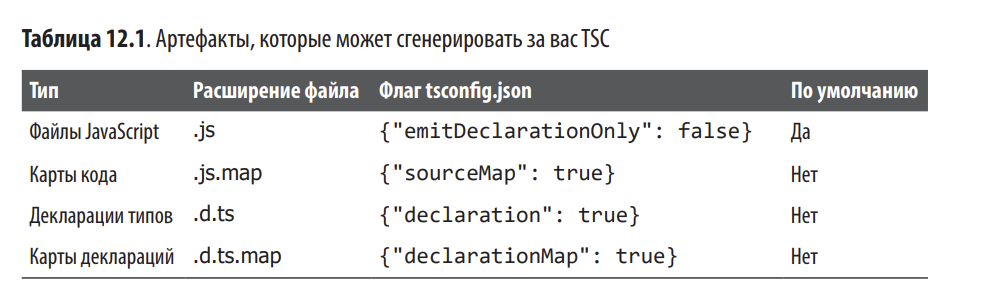

# Глава 12. Создание и запуск TypeScript

1. Что необходимо для создания любого приложения в TS
2. Создание и запуск приложений на сервере
3. Создание и запуска приложений в браузере
4. Создание приложений для NPM и их публикацию

## Создание проекта в TS

При компиляции TS программы в JS TSC может произвести различные артефакты.



.js.map - карты кода, являющиеся особыми файлами, связывающими каждый элемент сгенерированого кода JS с конкретной колонкой или строкой в изначальном файле TS. Это помогает отладке кода (Chrome DevTools показывают код TS вместо итогового JS), а также позволяет делать отображение строк и колонок в трассировках стека исключений JS обратно в код TS (инструменты вроде упомянутых в подразделе "Мониторинг ошибок" сделают поиск автоматическим, если вы предоставите им карты кода).


.d.ts.map - карты деклараций, которые используются для ускорения процесса компиляции проекта.

Лучше что можно сделать для своего браузерного приложения, чтобы сделать совместимость - это определить минимальный набор функций, которые должны поддерживать браузеры пользователей для запуска приложения, отдельно представить использование полифилов для максимального числа этих функций и попытаться определить пользователей действительно старых браузеров, на которых приложение точно не запустится, чтобы показать им сообщение о том, что необходимо обновление.

Не каждая среда JS изначально поддерживает все возможности языка, но тем не менее вы должны стараться писать код в последних версиях языка. Это можно делать двумя способами:
1. транспиляция (автоматическая конвертация) приложений из последней версии JS в более старую, которая поддерживается целевой платформой. Это нужно для async И await и цикло for ... of, которые могут быть автоматически преобразованы в вызовы .then и циклы for соответственно
2. использование полифилов (предоставление реализации) для новейших возможностей, отсутствующих в среде выполнения JS, где вы запускаете приложение. Это нужно для поддержки возможностей представляемых стандартной библиотекой JS (вроде Promise, Map и Set), а также для методов прототипов (вроде Array.prototype.includes и Function.prototype.bind)


TSC будет транспилировать большинство возможностей JS в более старые среды, но он не предоставит реализации для отсутствующих.

В TSC есть три регулятора целевых сред:

1. target устанавливает версию, в которую нужно транспилироавть: es5, es2015 и тд
2. module устанавливает целевую систему модулей: модули es2015, commonjs, systemjs и тд
3. lib сообщает TS, какие возможности JS Доступны в целевой среде: возможности es5, es2015, dom и тд. для реализации возможностей необходимы полифилы, но lib указывает TS на доступные возможности (по умолчанию или посредством полифилов)

Как только вы добавили полифилы в код, настало время сообщить TSC,
что целевая среда гарантированно поддерживает полизаполненные
функции, указав это в поле lib файла tsconfig.json. Например, если бы вы внесли с помощью полифилов весь функционал ES2015 и дополненили его Array.prototype.includes из ES2016, то могли бы использовать следующую конфигурацию:

```
{
 "compilerOptions": {
 "lib": ["es2015", "es2016.array.includes"]
 }
}
```

Если вы запускаете код в браузере, то также активируйте декларации
типов DOM для window, document и всех других API, появляющихся при
запуске JavaScript в браузере:

```
{
 "compilerOptions": {
 "lib": ["es2015", "es2016.array.include", "dom"]
 }
}
```

## Проектные ссылки

Проект - просто каталог, содержащий tsconfig.json и код TS.
1. Попробуйте разделить код так, чтобы части, требующий одновременного обновления, находились в одном каталоге
2. В каждом каталоге проекта создайте tsconfig.json, содержающий по меньшей мере следующее:
```
{
 "compilerOptions": {
 "composite": true,
 "declaration": true,
 "declarationMap": true,
 "rootDir": "."
 },
 "include": [
 "./**/*.ts"
 ],
 "references": [
 {
 "path": "../myReferencedProject",
 "prepend": true
 }
 ],
}
```

Основное здесь:
1. composite, сообщающий TSC, что этот каталог является продпроектом более крупного проекта
2. declaration, побуждающий TSC создать для этого проекта файлы деклараций .d.ts. Принципе работы проектных ссылок подразумевает, что у проекто есть доступ к файлам деклараций типов и сгенерированным JS-кодам друг друга, но не к исходным файлам TS. Это создает границу, за которой TSC не будет перепроверять или перекомпилировать код: если вы обновите строку кода в подпроекте A, TSC не будет проверять другой подпроект B. Все, что ему нужно проверить на предмет ошибок типов - декларации типов B. Это делает проектные ссылки эффективным при повторной сборке больших проектов
3. declarationMap, сообщающий TSC, что нужно создать карты кода для сгенерированных деклараций типов;
4. references — массив подпроектов, от которых зависит текущий подпроект.

## Мониторинг ошибок

Используйте инструменты для мониторинга ошибок
вроде Sentry (https://sentry.io/welcome/) или Bugsnag (https://www.bugsnag.com/) для регистрации и сопоставления ошибок среды выполнения.


ИСПОЛЬЗОВАНИЕ РАСШИРЕНИЯ ДЛЯ УМЕНЬШЕНИЯ РУТИННОГО КОДА
В TSCONFIG.JSON

Скорее всего, вы захотите, чтобы все ваши подпроекты разделяли одни и те же настройки компиляции, поэтому создайте базовый tsconfig.json в корневом каталоге, который смогут расширить файлы tsconfig.json  подпроектов:
```
{
 "compilerOptions": {
 "composite": true,
 "declaration": true,
 "declarationMap": true,
 "lib": ["es2015", "es2016.array.include"],
 "rootDir": ".", "sourceMap": true,
 "strict": true,
 "target": "es5",
 }
}
```

## Запуск TypeScript на сервере

Для запуска TypeScript-кода в среде NodeJS нужно просто скомпилировать его в ES2015 JavaScript (или ES5, если вы планируете запуск на устаревшей версии NodeJS) и указать commonjs в пункте module файла tsconfig.json:

```
{
 "compilerOptions": {
 "target": "es2015",
 "module": "commonjs"
 }
}
```

В ES2015 вызовы import и export будут скомпилированы в require и module.exports соответственно и ваш код будет запускаться на NodeJS, не нуждаясь в дополнительных связках.

Если вы используете карты кода (рекомендуется), то вам нужно предоставить их и в NodeJS. Для этого просто возьмите пакет source-mapsupport (https://www.npmjs.com/package/source-map-support) из NPM и следуйте инструкциям при его установке. Большинство инструментов вроде PM2 (https://www.npmjs.com/package/pm2), Winston (https://www.npmjs.com/package/winston) и Sentry (https://sentry.io/welcome/), предназначенных для мониторинга процессов, журналирования и регистрации ошибок, имеют встроенную поддержку карт кода.

## Публикация TypeScript-кода на NPM

{
 "name": "my-awesome-typescript-project",
 "version": "1.0.0",
 "main": "dist/index.js",
 "types": "dist/index.d.ts",
 "scripts": {
 "prepublishOnly": "tsc -d"
 }
}