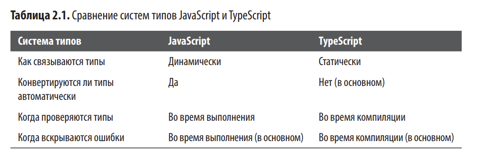

# TypeScript с высоты птичьего полета

Для большинства ЯПов процесс компиляции и запуска следующий:
1. Программа преобразуется в AST
2. AST компилируется в байт код
3. Байт код считывается средой выполнения

TypeScript же компилируется не прямо в байт-код, а в код JavaScript. Затем этот код просто запускается в браузере, с NodeJs или вручную.
После создания AST компилятор проверяет типы с помощью модуля проверки типов (специальная программа, определяющая типобезопасность кода). В проверке типов заключается магия TypeScript. С ее помощью он убеждается. что программа работает так, как вы ожидаете.


Часть TS:
1. Код на TS -> TS AST
2. AST проверяется проверкой типов
3. TypeScript AST -> код на JS

Часть JS:
1. Код на JS -> JS AST
2. AST -> базовый (неотмизированный) машинный код (JIT, "Ignition" в V8)
3. Профилирование и оптимизация ("TurboFan" в V8).
4. Исполнение

Когда TSC компилирует код в JS, он не будет смотреть на типы. Это означает, что типы никогда не смогут повлиять на сгенерированный вывод и будут использованы только для проверки типов.


## Система типов

Система типов - набор правил, используемых модулем проверки типов для присвоения типов программе.



## Базовые настройки

1. TSC - приложение командной строки, написаное на TypeScript (=> это self-hosted компилятор)

2. NodeJs - среда выполнения Js вне браузера (на сервере или для локальных инструментов)

3. npm (node package manager) - стандартный менеджер пакетов для Js/Ts
позволяет устанавливать библиотеки (например, Ts, React, Express) из репозитория npm.js.com
управляет зависимостями проекта в файле package.json
запускает скрипты (например, сборку проекта)

4. tsconfig.json - настройка компиляции
каждый ts проект должен содержать в корневой директории файл tsconfig.json. по нему ts ориентируется, какие файлы и в какую директорию компилировать, а также выясняет, какая версия Js требуется на выходе
нужно сздать файл в корневом каталоге
```
{
 "compilerOptions": {
 "lib": ["es2015"],
 "module": "commonjs",
 "outDir": "dist",
 "sourceMap": true,
  "strict": true,
 "target": "es2015"
 },
 "include": [
 "src"
 ]
}
```


5. NodeJs поставляется с NPM - пакетным менеджером, который нужен для управления зависимостями проекта и сборкой. 
Мы начнем с его использования для установки TSC и TSLint (линтер для TypeScript). 

6. TSLint - линтер для TypeScript
инструмент проверки стиля кода и поиска потенциальных ошибок в TS
Аналогичен EsLint, но заточен именно под TS (сейчас рекомендуется переходить на ESLint + @typescript-eslint)

```
# Установка в проект (локально) [deprecated]
npm install tslint --save-dev

[TypeScript + EsLint] https://typescript-eslint.io/
npm install eslint @typescript-eslint/parser @typescript-eslint/eslint-plugin --save-dev
и 
создание файла tslint.json

# Инициализация конфига
npx tslint --init
```

### Опции tsconfig.json

include: в каких каталогах TSC должен искать файлы TypeScript
lib: наличие каких API в вашей среде разработки должен предполагать TSC? это касается также таких элементов как Function.prototype.bind в ES5, Object.assign в document.DOM.querySelector?
module: в какую модульную систему должен производить компиляцию TSC (CommonJs, SystemJs, ES2015 и пр)?
outDir: в какой каталог TSC должен помещать сгенерированный JavaScript код?
strict: как производить максимально строгую проверку кода и соблюдать правильную типизацию? мы будем испльзовать ее во всех примерах
target: в какую версию Js нужно компилировать код (ES3, ES5, ES2015 и тд)

## tslint.json, .eslintrc.js