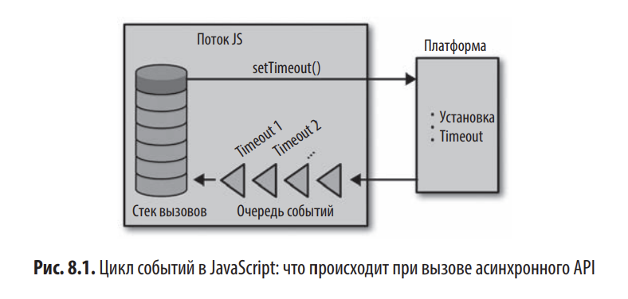

# Глава 8. Асинхронное программирование, конкурентность и параллельная обработка

```
setTimeout(() => console.info('A'), 1)
setTimeout(() => console.info('B'), 2)
console.info('C')
```

Здесь используется не та модель конкуренции, какую использовала бы команда sleep в C или планирование работы в другом потоке Java.

На высоком уровне виртуальная машина JS симулирует конкуренцию так:
1. Главный поток делает вызов внутренних асинхронных API вроде XMLHTTPRequest (для запросов AJAX), setTimeout (для приостановки), readFile (для чтения файлов с диска) и тд. Эти API представлены в платформе JavaScript, и вы не можете создавать их сами.
2. как только вы делаете вызов внутреннего асинхронного API, контроль возвращается главному потоку и выполнение продолжается, как если бы API и не был вызван
3. после завершения асинхронной операции платформа помещает задачу в очередь событий. каждый поток имеет свою очередь, которая используется для перенаправления результататов асинхронных операций обратно в главный поток. Задача включает в себя метаинформацию вызова и ссылку на функцию обратного вызова из главного потока
4. как только стек вызовов главного потока пустеет, платформа проверяет наличие ожидающих задач в очереди событий. если такая задача обнаружена, платформа ее запускает. эта активирует вызов функции, и управление возвращается функции главного потока. когда стек вызовов, полученный в результатате этого вызова, снова опустеет, платформа опять проверит очередь событий на предмет ожидающих задач. этот цикл повторяет, пока не опустеют стек вызовов и очередь событий и не завершатся все внутренние асинхронные вызовы API.



Пример с setTimeout:
1. мы вызываем setTimeout, который вызывает внутренний API таймаута со ссылкой на переданными нами обратный вызов и аргументом 1.
2. снова вызываем setTimeout, который снова вызвает внутренний апи таймаута со ссылкой на второй переданный нами обратный вызов и аргументом 2.
3. выводим C в консполь
4. на заднем платне мпустя по меньшей мере одну миллисекунду, наша платформа JS добавляет в очередь событий задачу, сигнализируя о том, что первый setTimeout прошел и его обратный вызов может быть вызван
5. спустя еще одну миллисекунду платформа добавляет в очередь вторую задачу для второго обратного вызова setTimeout
6. поскольку после завершения шага 3 стек вызовов пуст, платформа обращается к очереди событий в поиске ожидающих задач, которые она обнаружит, если шаги 4 и 5 были завершены. затем для каждой задачи она производит вызов соответствующей функции обратного вызова.
7. когда только оба таймера истекут и очередь событий псо стеком опустеет, программа завершится

при этом после вывода C JS будет ожидать все pending таймеры, или другие асинхронные операции и не завершит программму. это поведение гарантировано стандартом (ECMAScript)
Движок JS (например, V8) следит за активными таймерами через Web API.
Пока есть хотя бы один незавершённый таймер — программа не завершится.

Call Stack (стек вызовов) - выполняет синхронный код
Task Queue (очередь задач) - хранит callback'и таймеров
Event Loop - проверяет, когда стек пуст, и переносит задачи из очереди в стек
MicroTask Queue - очередь микрозадач
MacroTask Queue - очередь макрозадач

1. Пока Call Stack не пуст, задачи из Task Queue не будут перемещены в Call Stack

2. Приоритеты задач

Микрозадачи
Promise.then/catch/finally, queueMicrotask, MutationObserver
выполняются сразу после текущей синхронной задачи, даже если Call Stack не полностью пуст (между шагами макрозадач)

Макрозадачи
setTimeout, setInterval, setImeediate, I/O операции
ждут полной очистик Call Stack и MisrotaskQueue

3. Таймеры - нет гарантии точного времени

setTimeout(callback, 1000) Означает:
выполни callback не раньше чем через 1000 мс
фактическое время зависит от загруженности Call Stack и Event Loop

