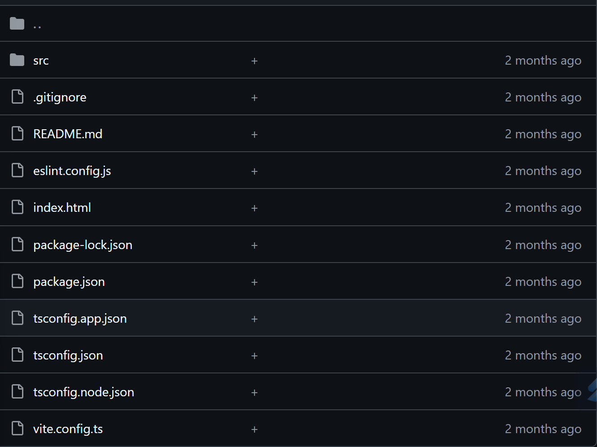

# tsconfig.json
noImplicitAny -> автоматом при tsconfig.json
"preserveConstEnums": true

# tsconfig.json

# .eslintrc.js

# package.json

# package-lock.json

# .prettierrc

# .editorconfig

# vite.config.ts

# Последовательность
1. пишем код -> Prettier форматирует
2. ESLint проверяет ошибки
3. Хуки git блокируют плохой код
```
Блокировка коммитов (рекомендуется)
Добавьте pre-commit хук через Husky:

bash
npx husky add .husky/pre-commit "npm run lint"
```
блокировка сборки в package.json
```
"scripts": {
  "build": "npm run lint && tsc",
  "start": "npm run lint && node dist/index.js"
}
```

4. сборщик (Vite, webpack) создает бандл
5. Тесты тестируются в CI/на локали
6. собирается Docker контейнер и разворачивается

Начать необходимо с ESLint + Prettier + Vite


# Структура на момент 01.08.2025

