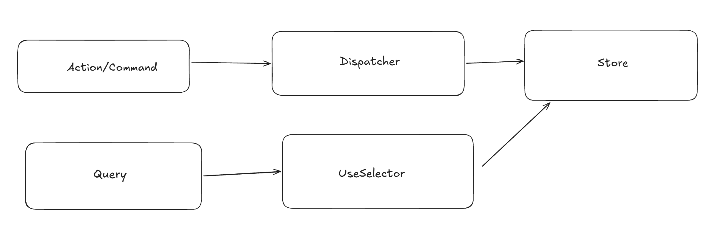

# UI architecture playground

opencode -s ses_fd78f7f58ffeBIyrPmT2Guqg1v

Архитектурные паттерны и подходы для frontend-разработки.  
От фундаментальных (MVC/MVP/MVVM) до современных (FSD, SDUI, Micro Frontends, Islands).

---

## Реализации канбан-доски в этом репозитории

Одна и та же доменка (`BoardApp.Core` + сценарии `app-gherkin.md`) на восьми архитектурах:

| Папка | Стек | Паттерн | Запуск |
|-------|------|---------|--------|
| `mvc-aspnet-PageController/` | ASP.NET Core Razor Pages | Page Controller (+ MVC внутри) | `dotnet run --project mvc-aspnet-PageController\PageController` |
| `mvc-aspnet/` | ASP.NET Core MVC (Controllers + Razor) | Front Controller / MVC | `dotnet run --project mvc-aspnet\MVC` |
| `mvp-winforms/` | WinForms (.NET 9) | MVP, пассивная View с интерфейсами | `dotnet run --project mvp-winforms\BoardApp` |
| `mvp-vanillajs/` | Чистый JS без сборки | MVP, контракт View = duck typing | открыть `mvp-vanillajs/index.html` |
| `mvvm-wpf/` | WPF (.NET 9) | MVVM, Data Binding + IDialogService | `dotnet run --project mvvm-wpf\MvvmBoard` |
| `mvvm-vue/` | Vue 3 + Vite | MVVM, ref/computed + promise-диалоги | `npm run dev` (порт 5199) |
| `mvvm-angular/` | Angular 20 (standalone) | MVVM, signals/computed + DI-сервисы | `npx ng serve --port 5201` |
| `fsd-react/` | React 19 + TS + Vite | FSD (Feature-Sliced Design) | `npm run dev` (порт 5197) |

Подробности и сравнение слоёв — в README каждой папки
(`mvp-vanillajs`, `mvvm-wpf`, `mvvm-vue`, `mvvm-angular`).

---

## Server-Driven UI

`sdui/` — ASP.NET Core (net9) minimal API + React 19/TS: экраны приходят с
бэкенда JSON-схемами (`view`/`sections`/`actions`), клиент только рисует их и
исполняет присланные действия. Запуск, контракт и 9-шаговый e2e — в `sdui/README.md`.

---

## Часть 1. Фундаментальные паттерны презентационного слоя

### MVC, MVP, MVVM

Все три решают одну задачу: **разделение ответственности** между данными, логикой и интерфейсом.  
Разница — в направлении связей и в том, кто управляет View.

---

### 1. MVC (Model-View-Controller)

**Главная идея:** Controller — точка входа. Он обрабатывает действия пользователя, получает данные или меняет Model. После формирует View и отдает

Паттерн тянется с далеких времен веба, когда бэкенд отдавал view для браузера в виде целиковой страницы html. Чтобы обновить один блок на странице нужно было тянуть всю страницу по новой.

**Связи:**

```
Controller
    - получить данные с Model
    - сформировать View
-> отправить View (html/json/xml) клиенту (браузер/M2M)
```

| Компонент | Роль |
|-----------|------|
| **Model** | Данные, бизнес-логика. |
| **View** | Отображение из шаблона и данных. |
| **Controller** | Обрабатывает действия пользователя, изменяет Model. Генерирует View. |

**Где применялся:**
- Десктоп: Smalltalk, Cocoa
- Веб: Spring MVC, ASP.NET Core MVC, Django (адаптированная версия)

**Слабость:** View можно обновлять только целиком. Чтобы этого избежать все равно нужен JS (MVP). Фактически MVC и рассматривается как генерация контента на сервер и отправка целиком браузеру (фактически это является концептуальным ограничением - View находится в браузере, а Controller на сервере)

---

### 2. MVP (Model-View-Presenter)

**Главная идея:** Presenter — дирижер. Он полностью управляет View. При этом сама View уведомляет Presenter о действиях пользователя

**Связи:**

```
View <-> Presenter -> Model

View уведомляет Presenter о user actions
Presenter изменяет View
```

| Компонент | Роль |
|-----------|------|
| **Model** | Данные, бизнес-логика. |
| **View** | Только отображение. **Не знает о Model.** Предоставляет интерфейс для Presenter. |
| **Presenter** | Логика. **Знает о View** (через интерфейс). Обновляет View через его методы. |

**Где применялся:**
- WinForms (у Presenter есть возможность влиять на View. сама View обновляет внутреннее состояние после вызовов: ListBox-Datasource,TextBox-Text,Checkbox-Checked)
- Java Swing
- Vanilla JS (интерфейс View для Presenter - document, DOM)
- Android (ранние версии)

**Сильная сторона:** View изолирована. Легко тестировать Presenter без UI.
**Слабость:** Много кода-связки. При сложном UI Presenter перегружается.

---

### 3. MVVM (Model-View-ViewModel)

**Главная идея:** ViewModel содержит состояние и логику, но **не знает о View**.  
Обновление View происходит автоматически через **Data Binding**.

**Связи:**

```
User Action → View → (вызов метода)    →     ViewModel → (меняет состояние) → Model
                ↑                                 |
                └─ Data Binding (автообновление) ─┘
```

| Компонент | Роль |
|-----------|------|
| **Model** | Данные, бизнес-логика. |
| **View** | Отображение. **Не знает о Model.** Привязывается к свойствам ViewModel. |
| **ViewModel** | Состояние и логика. **Не знает о View.** |

**Ключевое отличие от MVP:**
- MVP: Presenter знает о View и командует ей.
- MVVM: ViewModel не знает о View. View подписывается на изменения.

**Где применяется:**
- WPF, Xamarin
- React, Vue, Angular (через хуки/реактивность)
- Android (Jetpack Compose)
- SwiftUI

**Сильная сторона:** Минимум кода-связки. ViewModel не зависит от UI.
**Слабость:** Требуется механизм Data Binding (фреймворк берет это на себя).

MVVM - логическое продолжение от MVP. И там и там есть связность между Model и View через слой-прослойку. Вопрос остается только в том, как View обновляется - ручными инструкциями либо автоматически.

В современных фреймворках (на примере React) MVVM является основным паттерном. 
Данные автоматически прокидываются во View (реактивно) и им не надо никак управлять. Такой подход заложен во Vue, Angular.

#### Data Binding - привязка данные

###### Односторонняя

изменения в ViewModel -> обновление View

На примере React:
1. Изменение VirtualDOM
2. Reconciliation (согласование) - изенение state -> сравнение old и new vdom
3. diffing алгоритм
4. commit phase - применение diff к реальном DOM

##### Двухсторонняя

изменения во View -> изменения в ViewModel и наоборот (Angular, Vue v-model)

---

### Сравнительная таблица: MVC vs MVP vs MVVM

| Критерий | MVC | MVP | MVVM |
|----------|-----|-----|------|
| **Кто главный?** | Controller | Presenter | ViewModel |
| **View знает о Model?** | Нет | Нет | Нет |
| **Presenter/ViewModel знает о View?** | Controller знает (в веб-версии) | Да (через интерфейс) | Нет |
| **Как обновляется View?** | Исключительно обновлением целиком View | Presenter вызывает методы View | Data Binding c View Model |
| **Связь View и Controller/Presenter** | Сильная - Controller знает про View и управляет ее рендерингом | Жесткая (интерфейс) | Слабая (биндинг) |
| **Тестируемость Controller/Presenter** | Средняя | Высокая | Высокая |
| **Код-связка** | Средне - шаблонизаторы | Много | Минимум |
| **Где применяется** | Веб-фреймворки | WinForms, Vanilla JS | React, Vue, Angular, WPF |

---

### Эволюционная цепочка

```
MVC (1970-е)
  │
  ├── Проблема: View знает о Model → жесткая связь
  ▼
MVP (1990-е, WinForms)
  │
  ├── Проблема: Presenter знает о View → много кода-связки
  ▼
MVVM (2005, WPF)
  │
  ├── Решение: Data Binding → автоматическое обновление View
  ▼
Современные реализации:
  React (hooks), Vue (composition API), Angular, Jetpack Compose, SwiftUI
```

---

## Часть 2. Организация кода и компонентов

### 4. Component-Based Architecture

Базовый подход в React, Vue, Angular.

Компоненты — строительные блоки UI.

- **Props down** — данные от родителя к ребенку
- **Events up** — события от ребенка к родителю

---

### 5. Container/Presentational Pattern

Разделение на "умные" и "глупые" компоненты.

| Тип | Ответственность |
|-----|------------------|
| **Container** (Smart) | Логика, состояние, side effects, работа с данными |
| **Presentational** (Dumb) | Только отображение, получает всё через props |

---

### 6. Atomic Design

Системный подход к композиции UI.

```
Atoms → Molecules → Organisms → Templates → Pages
```

| Уровень | Пример |
|---------|--------|
| **Atoms** | Кнопка, инпут, лейбл |
| **Molecules** | Поисковая строка (инпут + кнопка) |
| **Organisms** | Шапка, карточка товара |
| **Templates** | Сетка страницы |
| **Pages** | Конкретная страница с данными |

---

### 7. Feature-Sliced Design (FSD)

Слоистая архитектура с четкими правилами импортов.

```
app/
  ├── pages/        # Страницы приложения
  ├── widgets/      # Крупные блоки (шапка, сайдбар)
  ├── features/     # Сценарии пользователя (авторизация, поиск)
  ├── entities/     # Бизнес-сущности (пользователь, товар)
  └── shared/       # UI-кирпичики, утилиты
```

**Правило:** импорты только сверху вниз.  
`pages → widgets → features → entities → shared`

Популярен в русскоязычном комьюнити.

---

## Часть 3. Управление состоянием

### 8. Flux / Redux

Однонаправленный поток данных.

```
                ┌─────────────┐
                │   Action    │
                │  (Command)  │
                └──────┬──────┘
                       │ dispatch()
                       ▼
                ┌─────────────┐
                │  Dispatcher │
                │  (Reducer)  │
                └──────┬──────┘
                       │
                       ▼
                ┌─────────────┐
                │    Store    │
                │   (State)   │
                └──────┬──────┘
                       │
          ┌────────────┼────────────┐
          │            │            │
          ▼            ▼            ▼
      useSelector  useSelector  useSelector
          │            │            │
          ▼            ▼            ▼
       View 1       View 2       View 3
```



- Единый источник истины (Single Source of Truth)
- Состояние меняется через чистые функции (reducers)
- Предсказуемость и time-travel debugging

**Реализации:**
- Redux (React) - store, action, reducer, selector
- NgRx (Angular)
- Vuex / Pinia (Vue)

---

### 9. MobX

Реактивное программирование.

- Автоматическое отслеживание зависимостей
- Минимум бойлерплейта
- Подходит для сложных доменных моделей

---

### 10. Context API + useReducer (React)

Встроенная альтернатива Redux для средних приложений.

- Context — провайдер состояния
- useReducer — управление сложной логикой
- Без внешних зависимостей

---

## Часть 4. Современные архитектурные подходы

### 11. Micro Frontends

Аналог микросервисов для фронтенда.

**Способы интеграции:**
- Module Federation (Webpack 5) — runtime-сборка
- iframe-based — полная изоляция
- Runtime integration — динамическая загрузка

**Преимущества:**
- Независимые деплои команд
- Разные технологии на разных частях
- Изолированные тесты и сборки

---

### 12. Islands Architecture

Гибридный подход (Astro, Fresh).

```
+-----------------------------+
|  Статический HTML           |
|  +---------+  +---------+  |
|  | Остров  |  | Остров  |  | ← интерактивные компоненты
|  | (React) |  | (Vue)   |  |
|  +---------+  +---------+  |
|  Статический контент        |
+-----------------------------+
```

- Весь HTML генерируется на сервере
- Интерактивность только в "островках"
- Для контентных сайтов (блоги, лендинги)

---

### 13. Server-Driven UI

Он же Backend-Driven UI

UI описывается сервером в формате JSON.

```
Сервер → JSON-схема → Клиент рендерит UI по схеме
```

- Динамическое обновление UI без деплоя
- Популярно в мобильных приложениях
- Используется в некоторых веб-фреймворках

---

### 14. React Server Components

- Компоненты рендерятся на сервере
- Отправляют клиенту готовый HTML + минимум JS
- Перенос логики на сервер
- Уменьшение размера бандла

---

## Часть 5. Диспетчеризация запросов

### 15. Page Controller

Паттерн из книги Мартина Фаулера **PoEAA** (2002).

**Суть:** одна страница = один класс-обработчик. URL выводится из структуры папок.

**Реализации:**

| Подход | Описание | Примеры |
|--------|----------|---------|
| **Page Controller** | Каждая страница — отдельный обработчик | ASP.NET Core Razor Pages |
| **Front Controller** | Единая точка входа, роутинг на контроллеры | ASP.NET Core MVC, Spring MVC |

**Пример:**

```
Page Controller:
  /products     → ProductsPage.cshtml → OnGet()
  /products/1   → ProductPage.cshtml  → OnGet(id)
  /checkout     → CheckoutPage.cshtml → OnPost()

Front Controller:
  /products     → ProductsController.Index()
  /products/1   → ProductsController.Details(id)
  /checkout     → CheckoutController.Index()
```

**Важно:** не путать с паттернами организации кода внутри страницы. Здесь речь о **диспетчеризации запросов**.

---

## Сводная таблица по всем подходам

| Подход | Уровень | Основная задача | Когда использовать |
|--------|---------|----------------|---------------------|
| **MVC** | Экран | Разделение Model/View/Controller | Веб-фреймворки с серверным рендерингом |
| **MVP** | Экран | Полный контроль View через Presenter | WinForms, Vanilla JS |
| **MVVM** | Экран | Data Binding, реактивность | React, Vue, Angular, WPF |
| **Component-Based** | Компонент | Переиспользуемые кирпичики | Любой современный фреймворк |
| **Container/Presentational** | Компонент | Разделение логики и отображения | React-компоненты |
| **Atomic Design** | Системный | Организация UI-библиотеки | Дизайн-системы |
| **FSD** | Проектный | Масштабирование кода | Крупные проекты, команды |
| **Redux/Flux** | Проектный | Глобальное состояние | Сложное взаимодействие данных |
| **MobX** | Проектный | Реактивное состояние | Доменные модели |
| **Micro Frontends** | Проектный | Распределенные команды | Крупные организации |
| **Islands** | Проектный | Минимум JS на клиенте | Контентные сайты |
| **Server-Driven UI** | Проектный | Динамический UI без деплоя | Мобильные приложения |
| **Server Components** | Компонент | Серверный рендеринг | React-приложения |
| **Page Controller** | Запрос | Диспетчеризация URL | Простые сайты, Razor Pages |

---

## Итог: как всё связано

```
Фундамент (MVC → MVP → MVVM)
        │
        ├── Организация кода (Atomic Design, FSD)
        ├── Управление состоянием (Redux, MobX)
        ├── Масштабирование (Micro Frontends)
        └── Оптимизация рендеринга (Islands, Server Components)
```

Все подходы **не исключают друг друга**.  
Например, можно использовать:
- **MVVM** внутри компонентов (хуки)
- **Redux** для глобального состояния
- **Atomic Design** для организации UI-библиотеки
- **FSD** для структуры проекта
- **Micro Frontends** для разделения команд

Выбор зависит от размера проекта, команды и требований к производительности.