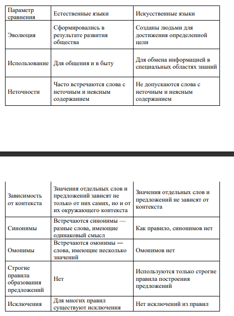
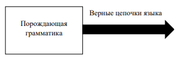
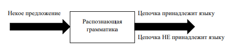

#Составление формальных грамматик

1) Формальные и естественные языки
Естественные языки - на которых говорят люди, они развиваются естественно
Формальные языки - разрабатываются людьми для определенных целей. Например, математические символы представляют собой формальный языки, который особенно хорошо для обозначения отношений между числами и символами, языки программирования - формальные языки, предназначенные для выражения вычислений

Формальные языки, как правило, имеют строгие синтаксические правила, которым подчиняется структура кода. 



2) Синтаксический разбор
Синтаксические правила бывают двух типов: относящиеся к токенами и к структуре. 
Токены - основные элементы языка, такие как слова, числа и химические элементы.
Второй тип правил синтаксиса относится к способу объединения токенов. Операция 3 += 3 недопустима, поскольку хотя символы + и = являются допустимыми токенами, их нельзя использовать сразу за другим (в математике). Точно так же в химической формуле нижний индекс указывается после имени элемента, а не перед. 
Предложение может быть правильно структурировано, но содержать недопустимые токены и наоборот, предложение может быть неверно структурировано, несмотрят на допустимые токены.
Когда мы читаем предложение на естественном языке или утверждение на формальном языке, вы должны понять структуру. Этот процесс называется синтаксическим разбором. 
- Выделение лексем. Лексемы можно выделить в отдельные группы.

Порождающая грамматика - формальная грамматика, которая определяет набор правил для генерации строк в языке. Эти правила описывают, как из начального символа грамматики можно получить конечную строку в языке, используя последовательность шагов замены символов
Порождающая грамматика состоит из следующих компонентов:
- множество терминальных символов - символы, из которых состоят строки в языке
- множество нетерминальных символов - вспомогательные символы, которые используются для построения промежуточных строк в процессе генерации конечной строки
- начальный символ - специальный нетерминальный символ, из которого начинается процесс генерации строки
- множество правил замены - набор правил, которые описывают, как нетерминальные символв могут быть заменены другими символами

3) Синтаксис, семантика и лексика

Синтаксис языка - набор правил, формирующий допустимые конструкции языка, те синтаксис определяет "форму языка" - задает набор цепочек символов, которые принадлежат языку.

Семантика языка - раздел языка, определяющий значения предложений языка. Семантика языка определяет "содержание языка" - задает смысл для всех допустимых цепочек языка. Семантика для большинства языков определяется неформальными методами. Отношения между знаками, и тем, что они обозначают, изучаются семиотикой. Число формальные языки лишены какого-дибо смысла. 

Лексика - совокупность слов, словарный запас языка. Слово, или лексическая единица языка (лексема) языка - это инструкция языка, которая состоит из элементов алфавита и не содержит в себе других конструкций. Такис образом, лексема может содержать только терминальные символы. Лексемами русского языка являются слова русского языка, а знаки препинания и проблемы представляют собой разделители, не образующие лексем.

Процедура - конечная последовательность инструкций, которые могут быть автоматически выполнены. Примером может служить машинная программа. Процедура, которая всегда заканчивается, называется алгоритмом.

Один из способов представления языка - задать алгоритм, определяющий принадлежность цепочки языку. Более общий способ сосоит в том, чтобы определить процедуру, которая останавливается с ответом "да", для цепочек, принадлежащих языку, и либо останавливается с ответом "нет", либо вообще не останавливается для цепочек, не принадлежающих языку. Говорят, что такая процедура или алгоритм распознает язык.

Этот метод представляет язык с точки зрения распознавателя. Язык можно также представить методом порождения, а именно, можно задать процедуру, которая систематически порождает в определенном порядке цепочки языка.

4) Порождающая и распознающая грамматики

Два способа задать язык:
1. Определить конечное множество правил порождения за конечное число шагов правильных цепочек, причем эти правила не позволяют построить никакую цепочку, не принадлежащую языку. 
2. Задать механизм распознавания, который, получив в качестве аргумента любую конечную цепочку лексем из словаря, за конечное число шагов дает ответ, принадлежит ли эта цепочка определяемому языку или нет.

Под порождающей грамматикой языка понимается конечный набор правил, позволяющий строить все "правильные" предложения этого языка, применение которых не даст ни одного "неправильного" предложения. 



Распознающая грамматика задает критерий принадлежности произвольной цепочки данному языку. Это фактически некоторый алгоритм, принимающий в качестве входа символ за символом произвольную цепочку и дающий на выходе один из двух возможных ответов: либо "цепочка принадлежит языку", либо "цепочка не принадлежит языку". Этот алгоритм должен разделить все возможные входные цепочки на два класса: один класс - принадлежающие языку цепочки, другой класс - не принадлежащие языку цепочки.



Задачу по определению принадлежности цепочки языку может решать, например, распознаватель

5) Модель распознавателя
Распознаватель - специальный автомат, который позволяет определить принадлежность цепочки символов некоторому языку. Задача распознавателя заключается в том, чтобы на основании исходной цепочки дать ответ на вопрос о принадлежности ее заданному языку. В общем виде распознаватель можно представить в следующей схеме:


Распознаватель состоит из следующих основных компонентов:
- лента, содержащая входную цепочку символов, и считывающей головки, обозревающей очередной символ этой цепочки
- устройство управления (УУ), которое координирует работу распознавателя и имеет некоторый набор состояний и конечную память для хранения своего состояния и некоторой промежуточной информации
- внешняя (рабочая память), которая может хранит ьнекоторую информацию в процессе работе распозавателя, и, в отличие от памяти УУ, имеет неограниченный объем

Проектируемый распознаватель является конечным автоматом, те количество состояний, в которых он может находиться, известно заранее

Распознаватель будет называться детерминированным в том случае, если для каждой допустимой конфигурации распознавателя, которая возникла на некотором шаге его работы, существует единственно возможная конфигурация, в которую распознаватель перейдет на следующем шаге работы. 

Для того, чтобы написать распознаватель, требуется составить таблицу переходов на основе порождающей грамматики. Процесс составление таблицы переходом разберем на примере задачи:

Напишите программу конечного автомата, который распознает 
следующие цепочки как верные:
• предложения состоят из слов, разделенных точкой с запятой;
• первая буква слова может состоять только из букв {a,b,c,d,e};
• остальная часть слова может состоять из букв a-f, а также цифр 0-4

```
<предложение> -> <слово> <разделитель> <предложение> | <слово>
<слово> -> <первая буква> <остальные буквы>
<первая буква> -> a-e
<остальные буквы> -> (a-f | 0-4) <остальные буквы> | ∅
<разделитель> -> ;
```

У распознавателя шесть состояний (5 из них - возьмем правила порождающей грамматики), а именно:
- предложение 
- слово
- первая буква
- разделитель
- НЕТ - состояние, в которое переходит распознаватель, если встречает неизвестный символ или известный символ, который стоит на неверном месте

При построении переходов состояний коневчного детерминированного автомата основное внимание уделяется терминальным символам и тому, можно ли из некоторого правила перейти по нему в другое или нет

Основные типы таблиц, используемых в компиляторах для моделирования конечных автоматов, включают:

- Таблицы переходов (Transition tables): Эти таблицы содержат информацию о переходах между состояниями конечного автомата в зависимости от текущего символа во входной последовательности.
- Таблицы состояний (State tables): Эти таблицы содержат информацию о допустимых состояниях конечного автомата и о том, является ли каждое состояние конечным (акцептирующим) или нет.
- Таблицы действий (Action tables): Эти таблицы определяют действия, которые должны быть выполнены при достижении определенных состояний или переходов конечного автомата, например, создание токенов или обработка ошибок.