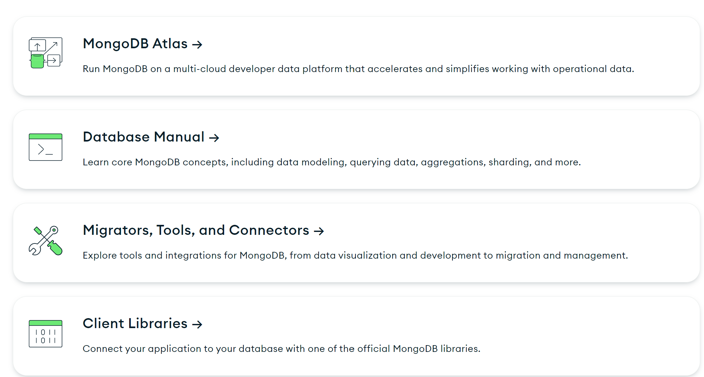

# mongodb-learning

MongoDb - NoSql документоориентированная система управления базами данных.

## Цели данного репозитория:
1) Выделить для себя самые главные неочевидные концепции
2) Показать свои компетенции в использовании mongodb для реальных проектов

Документация mongodb предполагает следующие модули:

## MongoDb Atlas
MongoDb Atlas - инструмент для удобного хостинга и управления данными в облаке. С помощью него можно управлять и мониторить деплои, создавать бэкапы, ресторы

## Database Manual
Концепции mongodb: модели данных, запрос данных, аггрегации, шардинг и много другое

## Migrations, Tools and Connectors
Инструменты для визуализации данных, миграций и управления.

## Client libraries
Документация для библиотек для различных языков программирования.

В первую очередь меня как разработчика интересуют: управление базой данных, создание и валидации схемы, написание запросов на языке C# с использованием .Net Driver и LINQ, а также администрирование, а именно визуализация и анализ данных, разворачивание в k8s-кластере

Инструментарий, который использую:
1) MongoDb .Net Driver
2) MongoDb Compass, где можно видеть данные, анализировать их с помощью графиков и графов, взаимодействовать с гео данными, но в нем нельзя никак управлять кластером, мониторить производительность

# Основные материалы:
1) [MongoDb Official Doc](https://www.mongodb.com/docs)