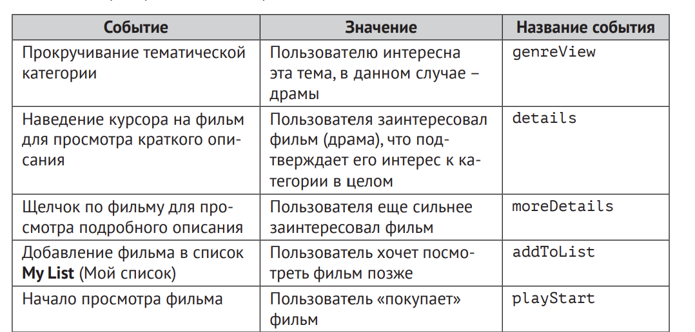

# Глава 2. Поведение пользователя, и как собирать о нем данные

Факты - данные, отражающие вкусы пользователя.

Явные (оценки и лайки), неявные (активно фиксируется в процессе наблюдения за пользователем).

## 2.1. Как Netflix собинает факты, пока вы пользуетесь сервисом

Если вы начали прокручивать контент в категории Драма - возможно вы любите драмы и хотите посмотреть, что еще есть в этой категории.

Если я вижу фильм, который кажется мне интересным, я могу навести на него курсор и прочитать описание. Более того, если это описанием меня заинтриговало, я могу щелкнуть по нему и перейти на страницу фильма. Если и сейчас все понравилось, я могу добавить это в "Смотреть позже"

Если человек начал просмотр, но не досмотрел до конца, это плохой знак для фильма. Если же он досмотрел фильм, и при этом потом еще раз посмотрел фильм, то это очень хорошо для фильма!

**Часто оказывается, что задача совсем в другом**

Иногда сайты хотят заставить людей купить товары, даже если это не совсем те товары, которые им нужны. Тут все зависит от того, насколько тесно товар связан с сайтом. Если это допустим Amazon, который выставляет от других производителей футболки, то никто не обвинит Amazon, в том, что пришла плохая футболка.

Сайте, которые зарабатывают на подписке, работают иначе. 
Mofibo (mofibo.com), книжный стриминговый сервис на датском, шведском и голландском языках, предлагает рекомендации как источник вдохновения и новых открытий, но с описанием – для Mofibo важно, чтобы читатель знал, что это за книга, прежде чем начнет ее читать. Дело в том, что Mofibo выплачивает отчисления каждый раз, когда читатель открывает новую книгу (не за страницу, а за всю книгу в целом), и, хотя сервис Mofibo заинтересован в том, чтобы вы читали как можно больше, он также стремится сократить количество книг, за которые ему придется платить.

### 2.1.1. Какие факты собирает Netflix

Воспроизведем события действий пользователя:

1. Прокрутил контекнт в категории с драмами (ИД 2)

2. Навел курсов на один из фильмов (ИД 41335), чтобы прочитать описание

3. Щелкнул курсором на фильм, чтобы получить более подробное описание (ИД 41335)

4. Начал смотреть фильм (ИД 41335)

Оценим события: 

Каждое событие воспринимается, как опорный факт, поскольку они помогают выяснить интересы пользователя.

Таблица показывает, в каком виде эти факты мог зафиксировать Netflix.

Вероятно еще были бы другие столбцы: тип устройства, место, погода, время - вся эта информация может стать ключом к пониманию того, какой контент окружает пользователя.

**Сборщик фактов** применяется, для того чтобы собирать данные. 

**Рассмотрим другой возможный сценарий: сайт по продаже садового инвентаря**

Есть коллега, которые все свое свободное время тратил на то, чтобы найти в интернете какой-нибудь садовый трактор или еще что-нибудь, работающее на бензине и пригодное для работы в саду. Представим, что он открывает сайт и делает следующее:

1. Выбрал категорию Садовый трактор

2. Щелкнул по зеленому монстру, который способен перетаскивать деревья

3. Щелкнул по перечню характеристик, чтобы посмотреть, деревья какого размера эта штука может перетаскивать

4. Купил монстра

Эти события аналогичны процессу выбора фильма. Пусть даже покупка дорогого товара - это более значительное действие, чем просмотр фильма, но я надеюсь, вы уловили суть.

## 2.2. Поиск полезных данных о поведении пользователя

В идеале рекомендательная система должна собирать все данные о пользователе в момент, когда тот взаимодействует с контентом – вплоть до оценки мыслительной активности, уровня адреналина в  крови при изучении того или иного объекта, а также того, насколько сильно потеют ладони человека.
Чем больше растет наше присутствие в интернете, тем более реалистичным становится этот сценарий.

**Влияние контента на отношение к системе в целом**

Задача важна, поскольку она определяет возможную стратегнию формирования рекомендаций, а также список объектов, которые вы будете рекомендовать.

Возьмем, **к примеру**, фильм: если вы посмотрели плохой фильм на Netflix, вы делаете определенный вывод о качестве контента на нем, и соотствественно, недовольны самой площадкой. Если на Amazon вы покупаете плохой товар, вы плохо думаете о производителе, а не о сайте. А вот если вы ищете там этот диск с фильмом и не находите, тогда, вероятно, ваше мнение об Amazon станет хуже.

Задача Netflix заключается в том, чтобы показывать хорошие фильмы, которые вам понравятся. Amazon показывает товары, которые можно купить, а понравились они вам или нет – это не так важно. Amazon тратит много ресурсов на то, чтобы побудить покупателей написать отзыв и оценить товар, поэтому не совсем честно будет сказать, что ему все равно. Но для большей наглядности я скажу именно так.

### 2.2.1. Как узнать мнение посетителя

Этапы взаимодействия покупателя с товаром:

1. Покупатель смотрит. Как и в обычном магазине, покупатель осматривается, чтобы понять, что тут есть, без какой-либо конкретной цели. На этом этапе нужно обращать внимание на то, где останавливается покупатель и у чему проявляет интерес.

2. Покупатель заинтересовался одним или несколькими товарами. Может быть он знал с самого начала, что ему нужно, и искал именно это, а может быть товар ему понравился случайно.

3. Покупатель добвляет товар в корзину или список, намереваясь купить его

4. Покупатель приобретает товар

5. Покупатель пользуется товаром. Например, смотрит фильм или читает книгу. Если это путешествие, отправляется.

6. Покупатель оценивает товар. Иногда покупатели возвращаются в магазин/на сайт, чтобы оценить товар

7. Покупатель перепродает товар или избавляется от него другим способом. 

### 2.2.2. Что нужно узнать по поведению обозревателя в магазине

**Обозреватель**  – это посетитель, который просматривает контент.

Как я  уже сказал ранее, обозревателю нужно показать как можно 
больше товаров, и  рекомендации должны отражать эту задачу.
Если вам удалось установить, что посетитель является обозревателем, вы можете, держа в уме эту информацию, формировать такие рекомендации, которые соответствуют «обозревательскому» настроению человека.

Также есть смысл отслеживать, к чему из увиденного обозреватель не проявил никакого интереса. Но можете ли вы быть уверены на 100%, что просмотр страницы (товара) – это всегда хороший знак?

**Просмотр страницы**

Просмотр страницы на коммерческом сайте может означать многое. Это может быть сигналом о том, что посетитель (или обозреватель) заинтересовался. Но  может быть и  так, что человек не  может найти нужную ему страницу или просто щелкает по всем ссылкам подряд без разбору. В последнем случае большое количество щелчков  – это не  хорошо. Потерявшийся пользователь проявляет себя большим количеством кликов и отсутствием конверсий.

**Длительность просмотра страницы**

**Щелчки по ссылкам с подробностями**

На интернет-сайтах часто присутствуют ссылки на подробную информацию. Это удобно посетителям, которые получают возможность быстро просмотреть контент или, в случае заинтересованности, развернуть описание. Еще вариант – пользователь может прокрутить страницу вниз, чтобы прочитать отзывы или технические характеристики. Если пользователь совершает одно из этих действий, это говорит о его заинтересованности

**Ссылки на социальные сети**

Также можно разместить кнопку перехода в  социальные сети для тех людей, которым что-нибудь понравилось настолько, что они решили поделиться своими впечатлениями с  остальными. Контролировать 
происходящее на Facebook, в Twitter или в других социальных сетях не получится, но вы сможете зафиксировать сам факт того, что посетитель поделился информацией о том или ином контенте.

**Сохранить на потом**

Возможность сохранить что-то на потом, когда пользователь добавляет объекты в свой список, – это мощный ресурс. Если посетитель нашел для себя что-то интересное, очень уместно предоставить ему возможность сохранить эту вещь на потом.

А еще лучше создать список желаний, раздел Избранное или Посмотреть позже – в зависимости от типа контента. К другим признакам заинтересованности относятся скачивание брошюры, просмотр видео о каком-то элементе контента или подписка на новостную рассылку по определенной тематике.

**Поисковые запросы**

