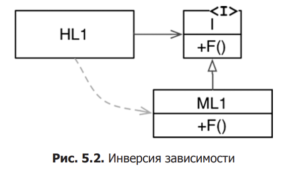
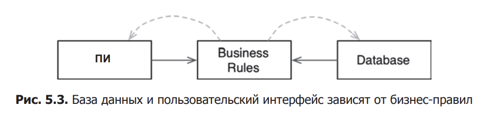

ООП

Инкапсуляция - возможность очертить круг связанных данных функций и данных. За пределелами этого круга эти данные невидимы и доступны только некоторые функции. 

Наследование - всего лишь повторное объявление группы переменных и функций в ограниченной области видимости.

Полиморфизм - разные объекты могут реагировать на один и тот же запрос, проявляя разное поведение в зависимости от своего типа.

Инверсия зависимости - направление зависимости в исходном коде (отношение наследования) между реализацией и интерфейсом поменялось на противоположное к потоку управления.

Нас интересует в большей мере именно эта возможность, потому что теперь мы можем как хотим задавать направления управления потока, не задумываясь о зависимостях

Модуль бизнес правил никак не зависит от остальных модулей.

Как результат, появляется возможность развертывать бизнес-правила независимо от ПИ и базы данных. Изменения в ПИ или в базе данных не должны оказывать никакого влияния на бизнес-правила. То есть компоненты можно развертывать отдельно и независимо.

Проще говоря, когда реализация компонента изменится, достаточно повторно развернуть только этот компонент. Это независимость развертывания.Если система состоит из модулей, которые можно развертывать независимо, их можно разрабатывать независимо, разными командами. Это независимость разработки

# Заключение

Для архитектора ПО, ответ на вопрос, что такое ОО очевиден: ОО дает, посредством поддержки полиморфизма, абсолютный контроль над всеми зависимостями в исходном коде. Это позволяет архитектору создать архитектуру со сменными модулями (плагинами), в которой модули верхнего уровня не зависят от модулей нижнего уровня. 

Низкоуровневые детали не выходят за рамки модулей плагинов, которые можно развертывать и разрабатывать независимо от модулей верхнего уровня.