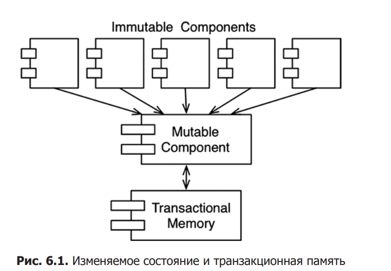

# Функциональное программирование

Плюсом функционального программирования является отсутствие изменяемых переменных => отсутствие состояния гонки и взаимных блокировок, тк они возникают только когда разные потоки попытаются изменить переменные

## Ограничение изменяемости

Один из самых общих компромиссов, на которые приходится идти ради 
неизменяемости, — деление приложения или служб внутри приложения 
на изменяемые и неизменяемые компоненты. Неизменяемые компоненты 
решают свои задачи исключительно функциональным способом, без использования изменяемых переменных. Они взаимодействуют с другими компонентами, не являющимися чисто функциональными и допускающими изменение состояний переменных (рис. 6.1).

В изменяемых компонентах мы используемыем **транзакционную память**  для защиты изменяемых переменных от конкурирующих обновлений и состояния гонки

Транзакционная память интерпретирует переменные в оперативной памяти подобно тому, как БД интерпретирует записи на диске. Она защищает переменные, применяя механизм транзакций с повторениями

## Регистрация событий

Представим ситуацию, когда мы не сохраняем состояние на счете, а сохраняем лишь операции по счету, и каждый раз, когда нам надо узнать состояние счета, мы должны посчитать заново все операции. Такой подход абсурден.

Эта идея положена в основу технологии **Event Sourcing (регистрация событий).**

Регистраций события - стратегия, согласно которой сохраняются транзакции, а не состояние. Когда требуется получить состояние, мы просто применяем транзакции с самого начала.

Такая стратегия устаняет любые проблемы конкурирующих обновлений.

Обладая хранилищем достаточного объема и достаточной вычислительной мощностью, мы можем сделать свои приложения полностью неизменяемыми — и, как следствие, полностью функциональными.
